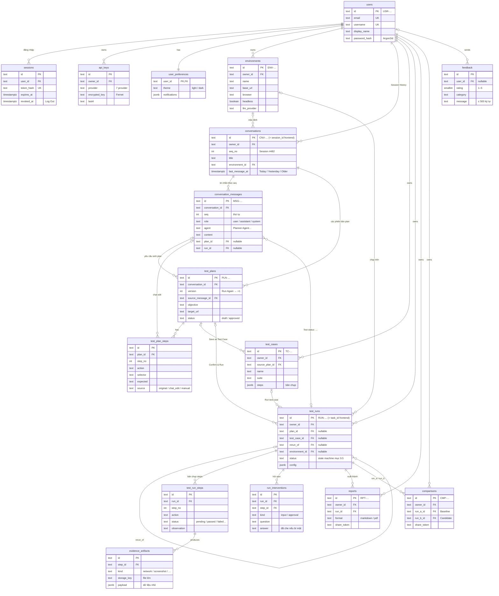
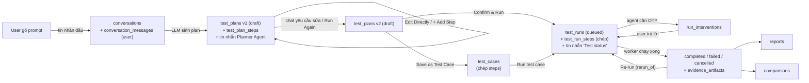
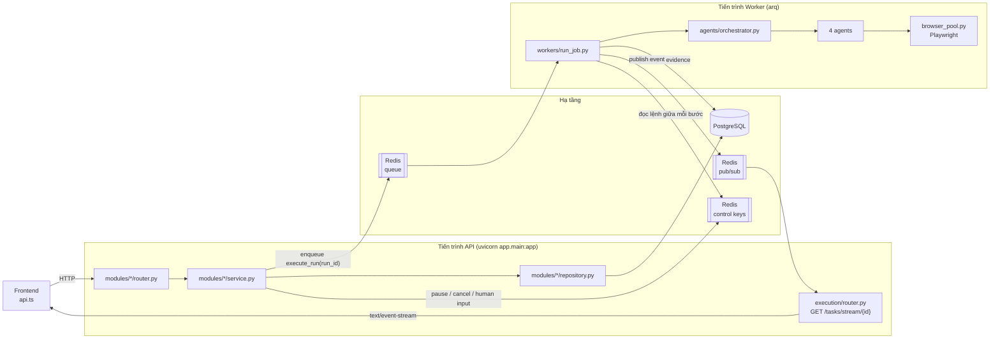
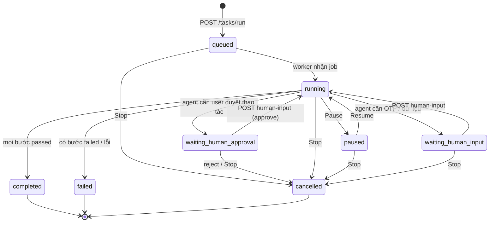

# 🏗️ Kế hoạch Cấu trúc Thư mục Backend — AI Agent Tester

> Suy ra trực tiếp từ các trang/chức năng đang hiển thị ở frontend (`frontend/src/api.ts`, `pages/*`, xem thêm `IMPLEMENTATION_PLAN.md`).
> Mục tiêu: mỗi module frontend có đúng 1 domain backend tương ứng, dễ mở rộng, dễ test, tách được Playwright/LLM khỏi tiến trình HTTP khi cần scale.
>
> **Phiên bản 2 (27/09/2026)**: đã rà soát toàn diện, sửa 12 điểm — xem mục 2. Mục 9 viết chi tiết module mẫu `execution`.

**Mục lục**
0. Trạng thái hiện tại
1. Bảng ánh xạ Module Frontend → Domain Backend
2. Kết quả rà soát plan (những gì đã sửa so với bản 1)
3. Nguyên tắc thiết kế
4. Cây thư mục đề xuất
5. Mô hình dữ liệu
6. Luồng chạy dữ liệu
7. Hợp đồng chung (response, lỗi, tương thích frontend)
8. Lộ trình triển khai
9. **Chi tiết module mẫu: `execution`**
10. **Thiết kế Database chi tiết (PostgreSQL)** — toàn bộ bảng, cột, ràng buộc, index, CRUD

---

## 0. Trạng thái hiện tại (đọc trước khi áp dụng plan)

Thư mục `backend/app/` **đã bị xoá khỏi working tree**. Code chỉ còn trong lịch sử git ở commit `4aa4499`, và `git status` báo `D` cho cả 17 file. Hiện `backend/` chỉ còn `README.md`, `requirements.txt` và `.env*`.

Code cũ (trong git) là bản **demo in-memory**:
- `POST /tasks/generate-plan` trả về plan **rỗng** (`steps: []`). Frontend thấy rỗng nên dùng `FallbackPlanSteps` thay thế.
- `POST /tasks/run` chỉ tạo bản ghi `status="running"`. Không có agent hay Playwright nào chạy, nên task **không bao giờ tự chuyển sang `completed`**.
- `POST /feedback` không lưu gì (`# TODO: persist`).
- `GET /tasks/history/runs` trả `duration: "0.0s"`, `passed_steps: 0` cố định.

Muốn tiếp tục thì có 2 cách: khôi phục bằng `git checkout HEAD -- backend/app` để tái cấu trúc dần, hoặc dựng mới theo cây thư mục ở mục 4. Code cũ khá nhỏ (~300 dòng), nên dựng mới rồi chép các schema cần dùng sang cũng không tốn nhiều công.

---

## 1. Bảng ánh xạ Module Frontend → Domain Backend

| # | Chức năng frontend | File frontend | Domain backend | Endpoint | Code cũ |
|:-:|---|---|---|---|:-:|
| 0 | Landing Page | `pages/LandingPage.tsx` | — | — | N/A |
| 1 | Auth Modal (đăng nhập/đăng ký) | `components/AuthModal.tsx` | `auth` | `POST /auth/login`, `POST /auth/register`, `GET /auth/me` | ❌ |
| 2 | Dashboard — 5 thẻ metrics, biểu đồ pass rate | `pages/DashboardPage.tsx` | `dashboard` | `GET /dashboard/metrics`, `GET /dashboard/pass-rate-trend?days=7` | ❌ |
| 2b | Dashboard — form Feedback | `pages/DashboardPage.tsx` | `feedback` | `POST /feedback` | 🟡 không lưu |
| 3a | New Test — sinh plan | `pages/NewTestPage.tsx` | `test_planning` | `POST /tasks/generate-plan` | 🟡 plan rỗng |
| 3b | New Test — Conversation + Session History sidebar | `pages/NewTestPage.tsx` | `test_planning` | `GET /conversations?q=`, `GET /conversations/{id}/messages`, `POST /conversations/{id}/messages`, `PATCH /conversations/{id}` (đổi tên/archive) | ❌ (đang mock `InitialChatHistory`) |
| 3c | New Test — chạy, pause/resume/stop, human input, SSE | `pages/NewTestPage.tsx`, `App.tsx` | `execution` | xem mục 9 | 🟡 không chạy thật |
| 3d | New Test — nút "Save as Test Case" | `pages/NewTestPage.tsx` | `test_cases` | `POST /test-cases` | ❌ |
| 4 | Test Runs — bảng lịch sử, filter, phân trang | `pages/TestRunsPage.tsx` | `test_runs` | `GET /test-runs?status=&suite=&env=&browser=&date=&q=&page=` | 🟡 (`/tasks/history/runs`) |
| 4b | Test Runs — nút Re-run | `pages/TestRunsPage.tsx` | `execution` | `POST /test-runs/{id}/rerun` | ❌ |
| 4c | RunDetailModal — timeline + evidence | `pages/TestRunsPage.tsx` | `test_runs` + `evidence` | `GET /test-runs/{id}`, `GET /evidence/{run_id}/steps/{step_no}` | ❌ |
| 5 | Test Cases | *(chưa có trang)* | `test_cases` | `GET/POST/PUT/DELETE /test-cases`, `POST /test-cases/{id}/run` | ❌ |
| 6 | Comparisons | `pages/ExtraModules.tsx` | `comparisons` | `GET /comparisons/diff?run_a=&run_b=` (tính diff, không ghi DB), `GET/POST/DELETE /comparisons`, `POST /comparisons/{id}/share` | ❌ |
| 7 | Reports | `pages/ExtraModules.tsx` | `reports` | `GET/POST /reports`, `GET /reports/{id}/download?format=md\|pdf`, `POST /reports/{id}/share` | ❌ |
| 8 | Environments | `pages/ExtraModules.tsx` | `environments` | `GET/POST/PUT/DELETE /environments`, `POST /environments/{id}/test-connection` | ❌ |
| 9 | Settings (6 tab) | `pages/ExtraModules.tsx` | `user_settings` | `GET/PUT /settings/profile`, `GET/PUT /settings/api-keys`, `/settings/team`, `/settings/notifications`, `/settings/appearance`, `/settings/integrations` | ❌ |
| — | Health check (dùng cho Docker/monitoring) | — | `core` | `GET /health` | 🟢 |

---

## 2. Kết quả rà soát plan (những gì đã sửa so với bản 1)

| # | Vấn đề ở bản 1 | Mức độ | Đã sửa thành |
|:-:|---|:-:|---|
| 1 | Sơ đồ vẽ worker đẩy trạng thái thẳng vào `execution/sse.py`. Nhưng worker và FastAPI là **2 tiến trình khác nhau**, không dùng chung bộ nhớ, nên pub/sub in-memory không bao giờ tới được trình duyệt. | 🔴 Lỗi thiết kế | Worker publish lên **Redis Pub/Sub** channel `run:{id}:events`, endpoint SSE subscribe channel đó (mục 6, 9). |
| 2 | Pause/Resume/Cancel/Human-input chỉ đổi `status` trong DB. Worker đang chạy Playwright không biết để dừng. | 🔴 Lỗi thiết kế | Thêm **control channel**: API ghi lệnh vào Redis, worker kiểm tra **giữa mỗi bước** (mục 9.6). |
| 3 | Có 2 entity `Task` (execution) và `TestRun` (test_runs) cho cùng một lần chạy. Phải đồng bộ 2 bảng, dễ lệch dữ liệu. | 🟠 | Gộp thành 1 bảng `test_runs`. `execution` sở hữu (ghi), `test_runs` chỉ đọc/lọc. `task_id` mà frontend dùng = `run_id`. |
| 4 | Frontend cho sửa plan nhưng `runTest()` chỉ gửi `promptText`, nên backend chạy plan **khác** với plan user đã duyệt. Bản 1 không nhắc. | 🟠 | `POST /tasks/run` nhận thêm `plan_id` hoặc `plan` (đã sửa). Frontend cần gửi thêm trường này (mục 9.3). |
| 5 | Nút Re-run ở Test Runs chạy lại bằng prompt hiện tại (bug đã ghi trong IMPLEMENTATION_PLAN), backend không có endpoint để sửa. | 🟠 | Thêm `POST /test-runs/{id}/rerun`: backend tự lấy plan gốc của run đó. |
| 6 | Thiếu Session History sidebar (New Test) và nút "Save as Test Case". | 🟡 | Thêm `GET /tasks/sessions` và `POST /test-cases` vào bảng ánh xạ. |
| 7 | Thiếu `/health`, dù code cũ có và Docker healthcheck cần. | 🟡 | Đặt trong `core/health.py`. |
| 8 | Module tên `settings` trùng tên với class `Settings` (cấu hình app trong `core/config.py`), dễ import nhầm. | 🟡 | Đổi thành `user_settings`. URL vẫn giữ `/settings/*`. |
| 9 | API key LLM (Settings tab) được đề xuất lưu như dữ liệu thường. | 🔴 Bảo mật | Mã hoá khi lưu (Fernet, key lấy từ biến môi trường), API chỉ trả về dạng `sk-…abcd` hoặc `configured: true`. |
| 10 | Đề xuất Celery. Nhưng Celery chạy đồng bộ, còn Playwright và LLM SDK chủ yếu là async, nên sẽ phải bọc `asyncio.run()` trong mỗi task. | 🟡 | Đổi sang **arq** (hàng đợi async dùng Redis). Celery vẫn dùng được nếu team quen. |
| 11 | Model không có chủ sở hữu. Khi có auth, user A vẫn xem được run của user B. | 🟠 | Mọi bảng nghiệp vụ có `owner_id`, và repository luôn lọc theo user hiện tại. |
| 12 | `feedback` không có `models.py` trong khi mọi module khác có, nên không thể lưu DB. | 🟡 | Thêm `models.py`. |

Những điểm của bản 1 vẫn **giữ nguyên** vì hợp lý: chia module theo chiều dọc, tách `agents/` khỏi `modules/`, `evidence` là domain dùng chung, và lộ trình đi từ domain đã có sẵn tới domain chưa có.

---

## 3. Nguyên tắc thiết kế

1. **1 domain = 1 thư mục** `app/modules/<domain>/`, gồm `router.py`, `schemas.py`, `service.py`, `repository.py`, `models.py`. Domain chỉ tổng hợp dữ liệu (`dashboard`, `comparisons`) thì không cần `repository.py` và `models.py`.
2. **Router mỏng**: chỉ nhận request, gọi service, rồi trả về `{ "data": ... }`. Không chứa nghiệp vụ.
3. **Service không import FastAPI**, nên test được bằng pytest thuần. Lỗi nghiệp vụ được ném ra dưới dạng `DomainError`, và `core/exceptions.py` đổi nó thành HTTP status.
4. **Repository che giấu DB**. Service không viết câu truy vấn SQLAlchemy trực tiếp.
5. **Module không import `repository` của module khác**. Muốn lấy dữ liệu của module khác thì gọi `service` của module đó. Nhờ vậy ranh giới giữa các module không bị phá vỡ.
6. **Tác vụ nặng (LLM, Playwright) không chạy trong request HTTP**. Router đưa việc vào hàng đợi rồi trả kết quả ngay. Việc nặng do tiến trình worker đảm nhận.
7. **Giữ tương thích frontend hiện tại**: các URL `/tasks/*` và `/tasks/history/runs` mà `api.ts` đang gọi vẫn phải hoạt động (xem mục 7.3).

---

## 4. Cây thư mục đề xuất

```text
backend/
├── app/
│   ├── main.py                        # Tạo FastAPI, CORS, lifespan (mở/đóng DB + Redis), gắn router
│   │
│   ├── core/                          # Hạ tầng dùng chung — KHÔNG có nghiệp vụ
│   │   ├── config.py                  # Settings (pydantic-settings, đọc .env)
│   │   ├── security.py                # Hash mật khẩu (bcrypt), JWT, mã hoá API key (Fernet)
│   │   ├── dependencies.py            # get_db(), get_redis(), get_current_user()
│   │   ├── exceptions.py              # DomainError, NotFound, Conflict... → HTTP status
│   │   ├── redis.py                   # Kết nối Redis dùng chung (queue + pub/sub + control)
│   │   ├── logging.py                 # Logger có request_id
│   │   ├── response.py                # Envelope {data, error}
│   │   └── health.py                  # GET /health (kiểm tra DB + Redis)
│   │
│   ├── db/
│   │   ├── base.py                    # SQLAlchemy DeclarativeBase + mixin id/created_at/owner_id
│   │   ├── session.py                 # async engine + AsyncSession
│   │   └── migrations/                # Alembic: env.py, versions/
│   │
│   ├── modules/
│   │   ├── auth/                      # router, schemas, service, repository, models(User)
│   │   ├── dashboard/                 # router, schemas, service      ← chỉ tổng hợp từ test_runs
│   │   ├── feedback/                  # router, schemas, service, repository, models(Feedback)
│   │   ├── test_planning/             # router, schemas, service, repository, models(Conversation, ConversationMessage, TestPlan, TestPlanStep)
│   │   ├── execution/                 # ⭐ xem chi tiết mục 9
│   │   │   ├── router.py
│   │   │   ├── schemas.py
│   │   │   ├── service.py
│   │   │   ├── repository.py
│   │   │   ├── models.py              # TestRun, TestRunStep
│   │   │   ├── state_machine.py       # Bảng chuyển trạng thái hợp lệ
│   │   │   ├── control.py             # Ghi/đọc lệnh pause/resume/cancel/human-input qua Redis
│   │   │   └── events.py              # Publish/subscribe sự kiện realtime qua Redis Pub/Sub
│   │   ├── test_runs/                 # router, schemas, service, repository   ← chỉ ĐỌC bảng test_runs
│   │   ├── test_cases/                # router, schemas, service, repository, models(TestCase, Tag)
│   │   ├── comparisons/               # router, schemas, service, repository, models(Comparison) ← diff tính khi đọc
│   │   ├── reports/                   # router, schemas, service, repository, models(Report)
│   │   │   └── exporters/             # markdown.py, pdf.py
│   │   ├── environments/              # router, schemas, service, repository, models(Environment)
│   │   ├── user_settings/             # router, schemas, service, repository, models(Profile, ApiKey, TeamMember...)
│   │   └── evidence/                  # router, schemas, service, repository, models(EvidenceArtifact)
│   │       └── storage.py             # LocalStorage (dev) / S3Storage (prod), cùng 1 interface
│   │
│   ├── agents/                        # Multi-Agent engine — dùng bởi test_planning và execution
│   │   ├── orchestrator.py            # Vòng lặp: lấy bước → thực thi → quan sát → đánh giá
│   │   ├── planner_agent.py           # Prompt → TestPlan (JSON steps)
│   │   ├── browser_executor_agent.py  # 1 step → hành động Playwright
│   │   ├── user_simulator_agent.py    # Điền dữ liệu, xin human input khi cần
│   │   ├── evaluator_agent.py         # So kết quả thật với expected → pass/fail
│   │   ├── protocol.py                # AgentMessage, StepResult
│   │   └── llm/
│   │       ├── base.py                # interface LLMProvider.complete()
│   │       ├── gemini.py
│   │       ├── openai.py
│   │       ├── anthropic.py
│   │       └── factory.py             # Chọn provider theo Environment / user_settings
│   │
│   ├── workers/                       # Tiến trình RIÊNG: `arq app.workers.main.WorkerSettings`
│   │   ├── main.py                    # Khai báo job functions, số job chạy song song
│   │   ├── run_job.py                 # Job "execute_run": gọi orchestrator, ghi step, publish event
│   │   └── browser_pool.py            # Quản lý Playwright browser/context, headless theo Environment
│   │
│   └── shared/                        # Hàm tiện ích thuần: phân trang, thời gian, format duration
│       ├── pagination.py
│       └── time_utils.py
│
├── tests/
│   ├── conftest.py                    # DB SQLite tạm, Redis giả (fakeredis), client test
│   ├── unit/modules/<domain>/         # Test service + state machine, không cần HTTP
│   └── integration/                   # Test qua HTTP: router → service → DB
│
├── scripts/
│   ├── seed_demo_data.py              # Nạp dữ liệu mẫu (thay mockData.ts khi backend sẵn sàng)
│   └── create_admin.py                # Tạo tài khoản admin123 thật (hash mật khẩu)
│
├── alembic.ini
├── pyproject.toml                     # ruff, mypy, pytest config
├── requirements.txt                   # fastapi, uvicorn, pydantic-settings, sqlalchemy[asyncio], asyncpg,
│                                      # alembic, redis, arq, playwright, httpx, pyjwt, bcrypt, cryptography
├── requirements-dev.txt               # pytest, pytest-asyncio, fakeredis, ruff, mypy
├── Dockerfile
├── docker-compose.yml                 # 4 service: api, worker, postgres, redis
├── .env.example
└── README.md
```

**Tại sao cần Redis?** Có 3 việc, cả 3 đều là giao tiếp giữa tiến trình API và tiến trình worker:
1. **Hàng đợi job**: API gửi "hãy chạy run X", worker nhận.
2. **Pub/Sub sự kiện**: worker báo "đang ở bước 3", API nhận rồi đẩy xuống trình duyệt qua SSE.
3. **Control**: API ghi "pause run X", worker đọc được giữa 2 bước.

Nếu mới chỉ chạy demo 1 tiến trình thì có thể tạm bỏ Redis (xem giai đoạn 1 ở mục 8).

---

## 5. Mô hình dữ liệu

> Mục này mô tả **mô hình khái niệm**: có những thực thể nào, chúng liên kết với nhau ra sao, và dữ liệu đi qua các trạng thái nào. Định nghĩa bảng đầy đủ (cột, kiểu, ràng buộc, index) và bảng đối chiếu từng màn hình frontend nằm ở **mục 10**. Hai mục dùng chung tên bảng. Khi đổi thiết kế, sửa mục 10 trước rồi cập nhật sơ đồ ở đây.

### 5.1 Chia 17 thực thể theo 5 nhóm

| Nhóm | Thực thể | Vai trò |
|---|---|---|
| **A. Danh tính** | `users`, `sessions`, `api_keys`, `user_preferences` | Ai đang dùng hệ thống, và cấu hình riêng của từng người |
| **B. Cấu hình** | `environments` | Chạy test ở đâu: URL, trình duyệt, LLM, viewport |
| **C. Hội thoại & thiết kế test** | `conversations`, `conversation_messages`, `test_plans`, `test_plan_steps`, `test_cases` | User chat với LLM để tạo và chỉnh test. Dữ liệu này **sửa được** (riêng tin nhắn chỉ ghi thêm) |
| **D. Thực thi** | `test_runs`, `test_run_steps`, `run_interventions`, `evidence_artifacts` | Test **đã thực sự chạy ra sao**. Dữ liệu này **bất biến** sau khi chạy xong |
| **E. Đầu ra** | `reports`, `comparisons`, `feedback` | Kết quả tổng hợp hoặc chia sẻ từ nhóm D, và góp ý của người dùng |

Hai ranh giới quan trọng:
1. **Phiên chat (`conversations`) là gốc của nhóm C.** Mỗi mục trong Session History là 1 phiên, thuộc về đúng 1 user. Một phiên chứa nhiều tin nhắn và có thể sinh **nhiều phiên bản plan** (sửa qua chat, bấm "Run Again"). Trước đây thiết kế chỉ có `plan_messages` gắn vào từng plan, nên không biểu diễn được một phiên chat có nhiều plan và nhiều lần chạy.
2. **C (bản thiết kế, sửa được) tách khỏi D (lịch sử, không sửa).** Khi bấm Run, các bước được **chép** từ C sang D. Nhờ vậy user sửa plan hay test case sau đó thì lịch sử run cũ vẫn giữ nguyên. Đây cũng là cách sửa gốc lỗi "confirm làm mất plan" và "Re-run chạy theo prompt hiện tại".

### 5.2 Sơ đồ quan hệ



Sơ đồ có đủ **17 bảng**, mỗi bảng chỉ hiện khoá chính (PK), khoá ngoại (FK) và vài cột quan trọng để dễ nhìn. Danh sách cột đầy đủ nằm ở mục 10.4.

### 5.3 Vòng đời dữ liệu của một phiên New Test



Mỗi mũi tên là một thao tác ghi DB. Không có mũi tên nào đi ngược từ D về C: kết quả chạy không bao giờ sửa lại plan.

### 5.4 Quy tắc của mô hình

1. **Lịch sử chat thuộc về từng user.** `conversations.owner_id` quyết định ai thấy phiên nào. Tin nhắn, plan và run của phiên đó đều truy về cùng user này. Mở lại một phiên cũ thì đọc `conversation_messages` theo `seq` và chat tiếp được với đúng ngữ cảnh.
2. **Tin nhắn chỉ ghi thêm.** Không sửa hay xoá từng tin nhắn. Muốn ẩn cả phiên thì đặt `archived_at`. Tin nhắn do LLM sinh lưu kèm provider, model, token và độ trễ.
3. **Plan có phiên bản.** Mỗi lần sinh lại, `version` tăng 1. Phiên bản cũ giữ nguyên để biết run nào chạy theo bản nào.
4. **Chỉ có 1 thực thể cho 1 lần chạy.** `test_runs.id` chính là `task_id` mà frontend đang dùng. Frontend hiện đang dùng `task_id` cho cả plan lẫn run, và bước 5 của mục 10.7 sẽ tách ra thành `plan_id` và `run_id`.
5. **Bản chụp khi chạy.** `test_run_steps` chép bước từ plan hoặc test case. `test_runs` chụp lại `name`, `suite`, `environment_name`, `browser` và `config` (max_steps, LLM, simulator, headless). Sau này environment có đổi hay bị xoá thì run cũ vẫn hiện đúng.
6. **Một run có 3 nguồn gốc.** Run đến từ plan (`plan_id`), từ test case (`test_case_id`), hoặc từ việc chạy lại (`rerun_of`). Cả 3 cột đều nullable.
7. **Không lưu giá trị tính được.** Duration, Steps P/F, số liệu Dashboard, trạng thái của mục Session History, câu hỏi đang chờ, Report Detail và toàn bộ diff của Comparisons đều tính khi đọc (xem bảng cuối mục 10.4).
8. **Xoá theo chiều sở hữu.** Xoá phiên chat thì tin nhắn và plan bị xoá theo, còn **run vẫn giữ lại** (`plan_id` thành NULL). Xoá run thì steps, interventions, evidence, reports và comparisons liên quan bị xoá theo.
9. **Evidence lớn không nằm trong DB.** Ảnh và video lưu qua `storage.py`, DB chỉ giữ `storage_key`. Dữ liệu nhỏ lưu vào `payload JSONB` theo cấu trúc riêng từng loại (mục 10.4).

---

## 6. Luồng chạy dữ liệu



---

## 7. Hợp đồng chung

### 7.1 Envelope response
```json
// Thành công
{ "data": { ... } }
// Lỗi (HTTP 4xx/5xx)
{ "detail": "Run not found", "code": "RUN_NOT_FOUND" }
```
Frontend đang đọc `data.data` khi thành công và `responseData.detail` khi lỗi (xem `submitFeedback` trong `api.ts`), nên giữ đúng 2 tên trường này.

### 7.2 Mã lỗi HTTP
| Tình huống | HTTP |
|---|:-:|
| Dữ liệu gửi lên sai (Pydantic) | 422 |
| Chưa đăng nhập / token hết hạn | 401 |
| Truy cập run của người khác | 404 (không dùng 403, tránh lộ việc run đó có tồn tại) |
| Chuyển trạng thái không hợp lệ (vd: pause một run đã completed) | 409 |
| LLM/Playwright lỗi | 502 (ghi log chi tiết, chỉ trả thông báo ngắn) |

### 7.3 Tương thích với frontend hiện tại
| `api.ts` đang gọi | Backend mới | Cách xử lý |
|---|---|---|
| `GET /tasks/history/runs` | `GET /test-runs` | Giữ route cũ làm **alias** gọi cùng service. Xoá khi frontend đổi xong. |
| `POST /tasks/run` → đọc `data.message` dạng `"… ID: RUN-XXXX"` | trả thêm `data.task_id` | Trả **cả hai** trường. Frontend nên chuyển sang đọc `task_id`. |
| Chưa gửi token | Có auth | Giai đoạn chuyển tiếp: bật `AUTH_REQUIRED=false` trong `.env`. |

---

## 8. Lộ trình triển khai

| Giai đoạn | Việc cần làm | Kết quả kiểm chứng |
|---|---|---|
| **0. Quyết định baseline** | Khôi phục `backend/app` từ git hoặc dựng mới theo mục 4 | `uvicorn` chạy được, `GET /health` trả `ok` |
| **1. Khung + tái cấu trúc** | Tạo `core/`, `modules/{test_planning,execution,test_runs,feedback}`. Chưa có DB và Redis: repository in-memory, job chạy bằng `asyncio.create_task` trong cùng tiến trình | Frontend chạy nguyên luồng New Test như hiện tại, không sửa `api.ts` |
| **2. DB thật** | SQLAlchemy + Alembic, bảng `test_plans`, `test_runs`, `test_run_steps`, `feedback` | Restart server mà lịch sử run vẫn còn |
| **3. Agent thật** | `agents/` + `planner_agent` gọi LLM thật. `browser_executor_agent` chạy Playwright | Generate plan trả steps thật, run chạy trình duyệt thật |
| **4. Tách worker + Redis** | arq worker, Redis pub/sub + control | Chạy 3 test song song, API vẫn phản hồi nhanh. Pause dừng được trình duyệt thật |
| **5. Auth** | `auth` + `owner_id` trên mọi bảng. Frontend bỏ hardcode `admin123/123` | User A không thấy run của user B |
| **6. Evidence → Reports → Comparisons** | Lưu evidence thật. Reports/Comparisons chỉ đọc lại | Evidence Viewer và RunDetailModal hiện dữ liệu thật |
| **7. Environments, Settings, Test Cases, Dashboard** | CRUD + dashboard tính từ `test_runs` | Frontend bỏ được `mockData.ts` tương ứng |

---

## 9. Chi tiết module mẫu: `execution`

Chọn `execution` làm mẫu vì đây là module **quan trọng nhất và phức tạp nhất**: nó đi qua đủ mọi lớp (router → service → repository → DB), có máy trạng thái, có worker chạy nền và có realtime. Hiểu module này thì các module còn lại (phần lớn chỉ là CRUD) sẽ dễ hơn nhiều.

### 9.1 Module này làm gì (nhìn từ phía người dùng)

Trên trang **New Test**, sau khi đã có plan:

| Người dùng làm gì trên UI | Hàm trong `api.ts` | Endpoint của `execution` |
|---|---|---|
| Bấm **▶ Confirm & Run Test** | `runTest()` | `POST /tasks/run` |
| Màn hình tự cập nhật từng bước | `openTaskStream()` + `getTask()` | `GET /tasks/stream/{id}` (SSE), `GET /tasks/{id}` (poll 2s) |
| Bấm **⏸ Pause** / **Resume** | `pauseTask()` / `resumeTask()` | `POST /tasks/{id}/pause`, `POST /tasks/{id}/resume` |
| Bấm **⏹ Stop** | `cancelTask()` | `POST /tasks/{id}/cancel` |
| Nhập OTP vào khung vàng "Human Intervention" | `sendHumanInput()` | `POST /tasks/{id}/human-input` |
| Bấm **Re-run** ở trang Test Runs | *(chưa có)* | `POST /test-runs/{id}/rerun` |

`execution` **không** sinh plan (việc của `test_planning`) và **không** lo phần lọc/phân trang lịch sử (việc của `test_runs`). Module này chỉ lo **một lần chạy, từ lúc bắt đầu tới lúc kết thúc**.

### 9.2 Vai trò từng file

```text
modules/execution/
├── router.py          # "Lễ tân": nhận HTTP request, kiểm tra dữ liệu, gọi service, trả JSON
├── schemas.py         # "Mẫu đơn": định nghĩa request/response trông như thế nào (Pydantic)
├── service.py         # "Người xử lý": toàn bộ nghiệp vụ — tạo run, kiểm tra trạng thái, gửi lệnh
├── repository.py      # "Thủ kho": đọc/ghi bảng test_runs, test_run_steps — chỉ file này biết SQL
├── models.py          # "Bản vẽ bảng": định nghĩa cột của test_runs, test_run_steps (SQLAlchemy)
├── state_machine.py   # "Luật": trạng thái nào được phép chuyển sang trạng thái nào
├── control.py         # "Bộ đàm tới worker": gửi lệnh pause/cancel/human-input qua Redis
└── events.py          # "Loa phát thanh": publish/subscribe sự kiện realtime qua Redis
```

Một request **luôn đi một chiều**: `router → service → (repository | control | events)`. Router không bao giờ gọi thẳng repository, và repository không bao giờ biết tới HTTP.

### 9.3 `schemas.py` — định dạng dữ liệu vào/ra

```python
from datetime import datetime
from typing import Literal
from pydantic import BaseModel, Field, ConfigDict

RunStatus = Literal["queued", "running", "paused", "waiting_human_input",
                    "waiting_human_approval", "completed", "failed", "cancelled"]

class PlanStepIn(BaseModel):
    action: str
    selector: str
    expected: str

class RunRequest(BaseModel):
    # Frontend hiện gửi prompt trong tasks[0].prompt → vẫn nhận để tương thích
    prompt: str | None = None
    tasks: list[dict] = Field(default_factory=list)
    # MỚI: plan user đã duyệt/sửa. Có 1 trong 2 thì chạy đúng plan đó (sửa vấn đề #4)
    plan_id: str | None = None
    steps: list[PlanStepIn] | None = None
    environment_id: str | None = None
    model_config = ConfigDict(extra="ignore")   # bỏ qua simulator_*, browser_config… frontend đang gửi

class RunStarted(BaseModel):
    task_id: str        # frontend nên đọc trường này
    message: str        # "Task started. ID: RUN-XXXX" — giữ cho api.ts hiện tại

class RunStepOut(BaseModel):
    step_no: int
    action: str
    selector: str
    expected: str
    status: Literal["pending", "running", "passed", "failed", "skipped"]
    observation: str | None = None

class RunOut(BaseModel):
    id: str
    status: RunStatus
    current_step: int
    total_steps: int
    human_prompt: str | None = None     # câu hỏi hiện trong khung vàng Human Intervention
    started_at: datetime | None
    finished_at: datetime | None
    steps: list[RunStepOut]

class HumanInputIn(BaseModel):
    action: Literal["provide_input", "approve", "reject"] = "provide_input"
    input_text: str = Field(min_length=1, max_length=2000)
```

**Vì sao phải có file này?** FastAPI dùng các class này để tự **kiểm tra dữ liệu gửi lên**. Ví dụ `input_text` rỗng thì FastAPI tự trả 422, service không cần tự kiểm tra. Các class này cũng **tự sinh tài liệu** ở `http://localhost:8081/docs`.

### 9.4 `models.py` — bảng trong database

```python
class TestRun(Base):
    __tablename__ = "test_runs"
    id:             Mapped[str] = mapped_column(primary_key=True)        # "RUN-9F3A21C4"
    owner_id:       Mapped[str] = mapped_column(ForeignKey("users.id", ondelete="CASCADE"), index=True)
    # 3 nguồn gốc của 1 run (mục 5.4, quy tắc 3) — đều nullable
    plan_id:        Mapped[str | None] = mapped_column(ForeignKey("test_plans.id", ondelete="SET NULL"))
    test_case_id:   Mapped[str | None] = mapped_column(ForeignKey("test_cases.id", ondelete="SET NULL"))
    rerun_of:       Mapped[str | None] = mapped_column(ForeignKey("test_runs.id", ondelete="SET NULL"))
    environment_id: Mapped[str | None] = mapped_column(ForeignKey("environments.id", ondelete="SET NULL"))
    # Bản chụp lúc chạy (mục 5.4, quy tắc 2)
    name:             Mapped[str]
    suite:            Mapped[str] = mapped_column(default="Default")
    environment_name: Mapped[str | None]
    browser:          Mapped[str]
    config:           Mapped[dict] = mapped_column(JSONB, default=dict)   # max_steps, llm_*, simulator_*, headless
    status:           Mapped[str] = mapped_column(index=True, default="queued")
    current_step:     Mapped[int] = mapped_column(default=0)
    # Câu hỏi đang chờ user KHÔNG lưu ở đây mà ở bảng run_interventions (mục 10.4)
    error_message:  Mapped[str | None]
    created_at:     Mapped[datetime] = mapped_column(default=utcnow)
    started_at:     Mapped[datetime | None]
    finished_at:    Mapped[datetime | None]
    steps: Mapped[list["TestRunStep"]] = relationship(order_by="TestRunStep.step_no")

class TestRunStep(Base):
    __tablename__ = "test_run_steps"
    id:          Mapped[str] = mapped_column(primary_key=True)
    run_id:      Mapped[str] = mapped_column(ForeignKey("test_runs.id", ondelete="CASCADE"), index=True)
    step_no:     Mapped[int]
    action:      Mapped[str]
    selector:    Mapped[str]
    expected:    Mapped[str]
    status:      Mapped[str] = mapped_column(default="pending")
    observation: Mapped[str | None]
    started_at:  Mapped[datetime | None]
    duration_ms: Mapped[int | None]
```

`schemas.py` là định dạng dữ liệu **gửi qua mạng**, còn `models.py` là định dạng **lưu trong DB**. Tách riêng 2 file để có thể đổi DB (thêm cột, đổi tên cột) mà frontend không bị ảnh hưởng.

### 9.5 `state_machine.py` — luật chuyển trạng thái



```python
ALLOWED: dict[str, set[str]] = {
    "queued":              {"running", "cancelled"},
    "running":             {"paused", "waiting_human_input", "waiting_human_approval",
                            "completed", "failed", "cancelled"},
    "paused":              {"running", "cancelled"},
    "waiting_human_input": {"running", "cancelled"},
    "waiting_human_approval": {"running", "cancelled"},
    "completed": set(), "failed": set(), "cancelled": set(),   # trạng thái cuối
}
TERMINAL = {"completed", "failed", "cancelled"}

def ensure_transition(current: str, target: str) -> None:
    if target not in ALLOWED[current]:
        raise InvalidTransition(f"Cannot go from '{current}' to '{target}'")   # → HTTP 409
```

**Vì sao cần file này?** Nếu không có nó, user bấm Pause trên một run đã `completed` thì run sẽ bị chuyển sang `paused` và kẹt ở đó mãi. Tất cả quy tắc gom vào **một chỗ**, nên dễ đọc, dễ test và không bị viết lặp lại ở nhiều nơi.

### 9.6 `service.py` — nghiệp vụ

```python
class ExecutionService:
    def __init__(self, repo: RunRepository, planning: PlanningService,
                 control: RunControl, events: RunEvents, queue: JobQueue):
        ...

    async def start(self, user: User, req: RunRequest, rerun_of: str | None = None) -> RunStarted:
        # 1. Xác định plan sẽ chạy: plan đã duyệt > steps gửi kèm > sinh mới từ prompt
        steps = await self._resolve_steps(user, req)
        env = await self._resolve_environment(user, req.environment_id)
        # 2. Tạo run + bản chụp các bước (status "queued"); plan chuyển draft → approved
        run = await self.repo.create(owner_id=user.id, name=..., suite=..., browser=env.browser,
                                     steps=steps, plan_id=req.plan_id, rerun_of=rerun_of,
                                     environment_id=req.environment_id)
        # 3. Giao cho worker. KHÔNG chạy Playwright ở đây → request trả về sau vài ms
        await self.queue.enqueue("execute_run", run.id)
        return RunStarted(task_id=run.id, message=f"Task started. ID: {run.id}")

    async def get(self, user: User, run_id: str) -> RunOut:
        run = await self.repo.get_owned(run_id, user.id)      # không phải của mình → NotFound
        return RunOut.from_model(run)

    async def pause(self, user, run_id):   return await self._command(user, run_id, "pause",  "paused")
    async def resume(self, user, run_id):  return await self._command(user, run_id, "resume", "running")
    async def cancel(self, user, run_id):  return await self._command(user, run_id, "cancel", "cancelled")

    async def provide_human_input(self, user, run_id, body: HumanInputIn) -> RunOut:
        run = await self.repo.get_owned(run_id, user.id)
        if run.status != "waiting_human_input":
            raise InvalidTransition("Run is not waiting for input")
        await self.control.send(run_id, "human_input", body.input_text)   # worker đang chờ sẽ nhận
        return RunOut.from_model(run)

    async def rerun(self, user, run_id) -> RunStarted:
        old = await self.repo.get_owned(run_id, user.id)
        # Chạy lại ĐÚNG các bước của run cũ (sửa bug Re-run dùng prompt hiện tại)
        return await self.start(user, RunRequest(steps=old.steps_as_input(),
                                                 environment_id=old.environment_id),
                                rerun_of=old.id)

    async def _command(self, user, run_id, command, target_status) -> RunOut:
        run = await self.repo.get_owned(run_id, user.id)
        ensure_transition(run.status, target_status)            # sai luật → 409
        await self.control.send(run_id, command)                 # báo worker
        run = await self.repo.set_status(run_id, target_status)  # UI thấy ngay
        await self.events.publish(run_id, {"type": "status", "status": target_status})
        return RunOut.from_model(run)
```

Điểm cần chú ý: `start()` trả kết quả **ngay lập tức**. Frontend nhận `task_id` rồi tự mở SSE để theo dõi, và việc chạy thật diễn ra ở worker (mục 9.8).

### 9.7 `router.py` — các endpoint

```python
router = APIRouter(prefix="/tasks", tags=["execution"])

@router.post("/run", status_code=202)
async def run(req: RunRequest, user=Depends(get_current_user),
              svc: ExecutionService = Depends(get_execution_service)):
    return {"data": await svc.start(user, req)}

@router.get("/{run_id}")
async def get_run(run_id: str, user=Depends(get_current_user), svc=Depends(get_execution_service)):
    return {"data": await svc.get(user, run_id)}

@router.post("/{run_id}/pause")
async def pause(run_id: str, user=Depends(get_current_user), svc=Depends(get_execution_service)):
    return {"data": await svc.pause(user, run_id)}
# resume / cancel viết giống hệt pause

@router.post("/{run_id}/human-input")
async def human_input(run_id: str, body: HumanInputIn, user=Depends(get_current_user),
                      svc=Depends(get_execution_service)):
    return {"data": await svc.provide_human_input(user, run_id, body)}

@router.get("/stream/{run_id}")
async def stream(run_id: str, user=Depends(get_current_user), svc=Depends(get_execution_service),
                 events: RunEvents = Depends(get_run_events)):
    run = await svc.get(user, run_id)                    # kiểm tra quyền + tồn tại trước

    async def gen():
        yield sse({"type": "snapshot", **run.model_dump(mode="json")})   # gửi trạng thái hiện tại trước
        if run.status in TERMINAL:
            return
        async for event in events.subscribe(run_id):     # sau đó chờ sự kiện mới từ worker
            yield sse(event)
            if event.get("status") in TERMINAL:
                break

    return StreamingResponse(gen(), media_type="text/event-stream",
                             headers={"Cache-Control": "no-cache", "X-Accel-Buffering": "no"})
```

Lưu ý thứ tự khai báo route: `GET /stream/{run_id}` và `GET /{run_id}` không đụng nhau vì khác số đoạn URL. Còn `/history/runs` (alias cũ) phải khai báo **trước** `/{run_id}`, nếu không FastAPI sẽ hiểu `history` là một `run_id`.

Mỗi endpoint chỉ có 1 dòng thật sự làm việc. Đó chính là ý nghĩa của "router mỏng".

### 9.8 Phía worker — chỗ test thật sự được chạy

File `workers/run_job.py` nằm **ngoài** module, nhưng đây là nửa còn lại của `execution`:

```python
async def execute_run(ctx, run_id: str):
    repo, events, control = ctx["repo"], ctx["events"], ctx["control"]
    run = await repo.get(run_id)
    if run.status != "queued":                       # đã bị cancel trước khi worker kịp nhận
        return
    await repo.set_status(run_id, "running", started_at=utcnow())
    await events.publish(run_id, {"type": "status", "status": "running"})

    async with browser_pool.context(run.environment) as page:
        for step in run.steps:
            # ── Kiểm tra lệnh từ API giữa MỖI bước ──
            cmd = await control.wait_while_paused(run_id)     # đang pause → đứng chờ ở đây
            if cmd == "cancel":
                await finish(run_id, "cancelled"); return

            await repo.update_step(step.id, status="running")
            await events.publish(run_id, {"type": "step", "step_no": step.step_no, "status": "running"})

            result = await orchestrator.execute_step(page, step)   # agents + Playwright

            if result.needs_human_input:                           # vd: trang yêu cầu OTP
                await repo.add_intervention(run_id, step.id, kind="input", question=result.question)
                await repo.set_status(run_id, "waiting_human_input")
                await events.publish(run_id, {"type": "status", "status": "waiting_human_input",
                                              "human_prompt": result.question})
                answer = await control.wait_for_human_input(run_id, timeout=600)
                result = await orchestrator.execute_step(page, step, human_input=answer)
                await repo.set_status(run_id, "running")

            await evidence_service.save(step.id, result.artifacts)   # screenshot, log, console...
            await repo.update_step(step.id, status=result.status, observation=result.observation,
                                   duration_ms=result.duration_ms)
            await events.publish(run_id, {"type": "step", "step_no": step.step_no,
                                          "status": result.status, "observation": result.observation})
            if result.status == "failed":
                await finish(run_id, "failed"); return

    await finish(run_id, "completed")
```

### 9.9 Một vòng đời hoàn chỉnh (đọc từ trên xuống)

```mermaid
sequenceDiagram
    autonumber
    participant UI as NewTestPage
    participant R as execution/router
    participant S as execution/service
    participant DB as PostgreSQL
    participant RD as Redis
    participant W as Worker

    UI->>R: POST /tasks/run {prompt, steps}
    R->>S: start(user, req)
    S->>DB: INSERT test_runs (queued) + 6 test_run_steps
    S->>RD: enqueue execute_run(RUN-9F3A)
    S-->>UI: 202 {task_id: "RUN-9F3A"}
    UI->>R: GET /tasks/stream/RUN-9F3A (mở SSE)
    R-->>UI: snapshot {status: queued}
    RD->>W: job execute_run
    W->>DB: status = running
    W->>RD: publish {status: running}
    RD-->>UI: SSE: running
    loop mỗi step
        W->>W: Playwright thực thi step
        W->>DB: step passed + evidence
        W->>RD: publish {step 1 passed}
        RD-->>UI: SSE → viewport highlight, timeline ✓
    end
    UI->>R: POST /tasks/RUN-9F3A/pause
    R->>S: pause()
    S->>RD: control = pause
    S->>DB: status = paused
    S-->>UI: 200 {status: paused}
    Note over W: đọc control trước bước tiếp theo → đứng chờ
    W->>DB: status = completed
    W->>RD: publish {status: completed}
    RD-->>UI: SSE: completed → đóng stream, reload Test Runs
```



### 9.10 Frontend cần sửa gì để khớp module này

| Chỗ ở frontend | Hiện tại | Nên đổi |
|---|---|---|
| `api.ts › runTest()` | Chỉ gửi `promptText` | Gửi thêm `steps: testPlan.steps` (hoặc `plan_id`), đọc `data.task_id` thay vì tách chuỗi `message` |
| `App.tsx` effect SSE | Chỉ xử lý `completed`/`failed`. Thêm vào đó mỗi 2s poll 1 lần, và effect bị tạo lại mỗi khi `executionStatus` đổi | Xử lý thêm sự kiện `step` (cập nhật `currentStepIdx`) và `waiting_human_input`. Có SSE rồi thì bỏ poll hoặc giãn ra 10s |
| Nút Re-run (`TestRunsPage.tsx`) | Gọi `handleConfirmAndRun()` với prompt hiện tại | Gọi `POST /test-runs/{id}/rerun` |

### 9.11 Test cho module này

| Loại | Kiểm tra gì | Ví dụ |
|---|---|---|
| Unit — `state_machine` | Mọi cặp chuyển trạng thái đúng/sai | `ensure_transition("completed", "paused")` ném `InvalidTransition` |
| Unit — `service` | Dùng repository/queue giả, không cần DB | `start()` tạo run `queued` và enqueue đúng 1 job |
| Unit — `service` | Quyền sở hữu | User B gọi `pause` lên run của user A thì bị `NotFound` |
| Integration — `router` | Qua HTTP thật, DB SQLite tạm | `POST /tasks/run` trả 202 kèm `task_id`. Pause run đã completed trả 409 |
| Integration — worker | `fakeredis` + agent giả (không gọi LLM thật) | Pause giữa bước 2 thì bước 3 không chạy cho tới khi resume |

---

*Các module còn lại làm theo đúng khuôn này. Module CRUD như `environments`, `test_cases` chỉ cần `router`, `schemas`, `service`, `repository`, `models`, không cần `state_machine`, `control`, `events` hay worker, nên đơn giản hơn nhiều.*

---

## 10. Thiết kế Database chi tiết (PostgreSQL)

> **Mục tiêu:** dữ liệu **không mất khi tắt server**. Toàn bộ dữ liệu nghiệp vụ lưu trong PostgreSQL, và mọi thay đổi cấu trúc bảng đi qua Alembic migration. Hiện `task_repository.py` vẫn lưu trong RAM, còn `feedback_repository.py` ghi ra file `.jsonl`. Cả hai sẽ được thay bằng repository dùng PostgreSQL ở giai đoạn 2 (mục 8).

### 10.1 CRUD là gì, và cách dùng trong tài liệu này

**CRUD** là 4 thao tác cơ bản trên một bảng dữ liệu:

| Chữ | Nghĩa | SQL | HTTP thường dùng |
|:-:|---|---|---|
| **C** | Create: tạo mới | `INSERT` | `POST /resources` |
| **R** | Read: đọc (1 bản ghi hoặc danh sách) | `SELECT` | `GET /resources`, `GET /resources/{id}` |
| **U** | Update: sửa | `UPDATE` | `PUT` / `PATCH /resources/{id}` |
| **D** | Delete: xoá | `DELETE` | `DELETE /resources/{id}` |

Có 2 loại bảng:
- **Bảng CRUD thuần** như `environments`, `test_cases`, `api_keys`: người dùng tạo, xem, sửa, xoá trực tiếp trên UI.
- **Bảng có vòng đời/nghiệp vụ** như `test_runs`: không cho "Update" tự do. Bảng này chỉ đổi trạng thái qua các hành động nghiệp vụ (`run`, `pause`, `resume`, `cancel`, `human-input`) và phải theo state machine ở mục 9.5. Vì vậy `tasks` có các route như `/pause` mà không có `PUT /tasks/{id}`.

### 10.2 Đối chiếu toàn bộ frontend → dữ liệu cần lưu

Bảng dưới rà **mọi file** trong `frontend/src/` (`App.tsx`, `api.ts`, `api/contract.ts`, `mockData.ts`, `components/AuthModal.tsx`, `pages/*`). Mỗi thứ hiện trên UI được xếp vào 1 trong 3 loại:
- **Lưu**: phải có bảng/cột.
- **Tính**: suy ra từ dữ liệu đã lưu, không có cột riêng.
- **UI**: trạng thái giao diện tạm thời, không lưu server.

| Trang / thành phần | Thứ hiển thị hoặc thao tác | Loại | Lưu ở đâu / tính từ đâu |
|---|---|:-:|---|
| **AuthModal** | Sign In (username hoặc email, password) | Lưu | `users`, `sessions` |
| | Sign Up (Full Name, Work Email, Password) | Lưu | `users.display_name`, `email`, `password_hash` |
| **Header** | "User: admin123", Edit Profile, Log Out | Lưu | `users`, `sessions.revoked_at` |
| | Nút đổi theme sáng/tối | Lưu | `user_preferences.theme` |
| **Dashboard** | 5 thẻ số liệu (Total, Passed, Failed, In Progress, Avg Duration, "+12% this week") | Tính | `test_runs` + `test_run_steps`, nhóm theo tuần |
| | Recent Test Runs (4 dòng) | Tính | `test_runs ORDER BY created_at DESC LIMIT 4` |
| | System & Agent Activity (4 agent Active/Idle) | Tính | Trạng thái run đang chạy của user |
| | Pass Rate Trend (7 days) | Tính | `test_runs` nhóm theo ngày |
| | Quick Start (ô prompt) | UI | Chuyển sang New Test |
| | Feedback form (rating, category, message ≤ 500 ký tự) | Lưu | `feedback` |
| **New Test › Conversation** | "Session #482", tin nhắn user, tin nhắn "Planner Agent", thẻ "📋 Created: …", "Test status: …" | Lưu | `conversations`, `conversation_messages` |
| | Ô chat "Describe a change or type 'run test'" | Lưu | `conversation_messages` (role `user`) |
| | Nút "Run Again" (sinh lại plan) | Lưu | `test_plans` phiên bản mới (`version + 1`) |
| **New Test › Session History** | Danh sách phiên theo Today/Yesterday/Older, tìm theo name/prompt/URL | Lưu + Tính | `conversations` (lọc theo `owner_id`, sắp theo `last_message_at`) |
| | Trạng thái Passed/Failed và "N steps" của mỗi phiên | Tính | Run mới nhất và plan mới nhất của phiên |
| **New Test › Plan** | Objective, Target URL, preconditions, test data | Lưu | `test_plans` |
| | Bảng bước (#, Action, Selector, Expected) | Lưu | `test_plan_steps` |
| | Cột "Source" (Original / Chat edit) | Lưu | `test_plan_steps.source`, `source_message_id` |
| | Edit Directly, + Add Step, xoá step | Lưu | `UPDATE/INSERT/DELETE test_plan_steps` |
| | Save as Test Case | Lưu | `test_cases` |
| | Confirm & Run Test | Lưu | `test_runs` + `test_run_steps` (chép từ plan) |
| **New Test › Execution** | Trạng thái, timer, "Executing Step 3 of 6", bước hiện tại, bước tiếp theo | Lưu + Tính | `test_runs.status`, `current_step`, `started_at` |
| | Cấu hình gửi kèm khi run (`max_steps`, LLM, simulator, `headless`) | Lưu | `test_runs.config` (JSONB) |
| | "Agent Observation" | Lưu | `test_run_steps.observation` |
| | Khung vàng "Human Intervention" (câu hỏi và câu trả lời) | Lưu | `run_interventions` |
| | Pause / Resume / Stop | Lưu | `test_runs.status` (state machine mục 9.5) |
| **Evidence Inspector** (New Test + RunDetailModal) | API Validation (method, URL, status, thời gian, expected vs actual, body) | Lưu | `evidence_artifacts` kind `network` |
| | Screenshot (kèm selector được highlight) | Lưu | kind `screenshot` (file qua `storage_key`) |
| | Agent Log (dòng có thời gian và mức INFO/TRACE/ACTION/SUCCESS) | Lưu | kind `agent_log` |
| | Console | Lưu | kind `console` |
| | Visual Diff (baseline vs actual, % khác biệt) | Lưu | kind `visual_diff` |
| **Test Runs** | Bảng: Run ID, Name, Suite, Env, Browser, Status, Duration, Steps P/F, Started | Lưu + Tính | `test_runs` (tên env chụp lại lúc chạy); Duration và P/F là Tính |
| | Lọc theo status/suite/env/browser/date, tìm theo ID/tên, phân trang 8 dòng | Tính | Query có index (10.4) |
| | Re-run | Lưu | `test_runs` mới với `rerun_of` |
| | Checkbox chọn nhiều run | UI | Chưa có hành động nào dùng tới |
| **Test Cases** | Menu có nhưng trang chưa làm ("Coming Soon") | Lưu | `test_cases` (đã có từ nút Save as Test Case) |
| **Comparisons** | Chọn Run A và Run B, nút Compare | Tính | Đọc 2 `test_runs` |
| | Result, Time Difference, Changed Steps, Visual Difference, Step Differences, API Response Diff | Tính | `test_run_steps`, `evidence_artifacts` của 2 run |
| | (Khi cần) lưu hoặc chia sẻ một lần so sánh | Lưu | `comparisons` |
| **Reports** | Report ID, Linked Run, Format, Created; Download; Share | Lưu | `reports` |
| | Lọc theo Suite | Tính | Join `test_runs.suite` |
| | Report Detail: Result, Duration, Failed Step | Tính | Từ run được liên kết |
| **Environments** | Name, Base URL, Browser (Chromium/Firefox/WebKit/Headless Node), Headless, Default LLM (7 provider), Status, Test Connection | Lưu | `environments` |
| **Settings › Profile** | Username, Email, New/Confirm Password | Lưu | `users` |
| **Settings › API Keys** | Configured / Not configured cho từng provider | Lưu | `api_keys` (chỉ trả `configured` và `last4`) |
| **Settings › Notifications, Appearance** | Mới là chữ "ready to configure" | Lưu | `user_preferences` |
| **Settings › Team & Members, Integrations** | Mới là chữ "ready to configure" | — | Hoãn (10.6) |
| **Landing Page** | Giới thiệu, logo GitHub/GitLab/Jira/Jenkins, không có form | — | Không cần lưu |
| **Khắp nơi** | Tab đang chọn, bộ lọc, trang hiện tại, sidebar đóng/mở, thông báo tạm | UI | Không lưu |

### 10.3 Danh sách bảng (17 bảng)

| # | Bảng | Đại diện cho | Giai đoạn |
|:-:|---|---|:-:|
| 1 | `users` | Tài khoản | 5 |
| 2 | `sessions` | Phiên đăng nhập | 5 |
| 3 | `api_keys` | API key LLM đã mã hoá, mỗi provider 1 key | 5 |
| 4 | `user_preferences` | Theme, thông báo | 7 |
| 5 | `environments` | Môi trường chạy test | 7 |
| 6 | `conversations` | **1 phiên chat với LLM** (= 1 mục Session History, "Session #482") | 2 |
| 7 | `conversation_messages` | **Từng tin nhắn** trong phiên (user, Planner Agent, hệ thống) | 2 |
| 8 | `test_plans` | 1 phiên bản plan do LLM sinh trong 1 phiên chat | 2 |
| 9 | `test_plan_steps` | Các bước của 1 phiên bản plan | 2 |
| 10 | `test_cases` | Plan được lưu để chạy lại nhiều lần | 7 |
| 11 | `test_runs` | 1 lần chạy (= `task_id` frontend) | 2 |
| 12 | `test_run_steps` | Bản chụp các bước lúc chạy, kèm kết quả | 2 |
| 13 | `run_interventions` | Lịch sử hỏi–đáp Human Intervention trong 1 run | 3 |
| 14 | `evidence_artifacts` | Bằng chứng từng bước (5 loại) | 6 |
| 15 | `reports` | Báo cáo xuất từ 1 run | 6 |
| 16 | `comparisons` | Cặp run đã lưu để so sánh/chia sẻ | 6 |
| 17 | `feedback` | Góp ý người dùng | 2 |

Sơ đồ quan hệ ở **mục 5.2**.

### 10.4 Định nghĩa bảng (DDL PostgreSQL)

Quy ước chung:
- **Khoá chính** là `TEXT` có tiền tố, sinh ở tầng service: `USR-`, `CNV-`, `MSG-`, `PLN-`, `TC-`, `RUN-`, `RPT-`, `CMP-`… Frontend đang hiển thị trực tiếp ID dạng `RUN-9421`, `RPT-2201`.
- **Thời gian** dùng `TIMESTAMPTZ` (lưu UTC). Bảng sửa được thì có `updated_at`.
- **Enum** dùng `TEXT` + `CHECK`, không dùng `CREATE TYPE`, để thêm giá trị mới chỉ cần sửa `CHECK`.
- **Dữ liệu cấu trúc linh hoạt** dùng `JSONB`.
- **Quyền sở hữu:** mọi bảng nghiệp vụ có `owner_id`, hoặc thuộc về một bảng có `owner_id` qua khoá ngoại `CASCADE`. Repository luôn lọc theo user hiện tại.

#### Nhóm A — Người dùng & xác thực

```sql
CREATE TABLE users (
    id             TEXT PRIMARY KEY,                      -- USR-xxxxxxxx
    email          TEXT NOT NULL UNIQUE,                  -- lưu dạng lowercase
    username       TEXT UNIQUE,                           -- alias đăng nhập (admin123)
    display_name   TEXT NOT NULL,                         -- "Full Name" ở form Sign Up
    password_hash  TEXT NOT NULL,                         -- Argon2id, KHÔNG lưu mật khẩu gốc
    is_active      BOOLEAN NOT NULL DEFAULT TRUE,
    created_at     TIMESTAMPTZ NOT NULL DEFAULT now(),
    updated_at     TIMESTAMPTZ NOT NULL DEFAULT now()
);

CREATE TABLE sessions (
    id             TEXT PRIMARY KEY,
    user_id        TEXT NOT NULL REFERENCES users(id) ON DELETE CASCADE,
    token_hash     TEXT NOT NULL UNIQUE,                  -- chỉ lưu hash của cookie token
    expires_at     TIMESTAMPTZ NOT NULL,
    revoked_at     TIMESTAMPTZ,                           -- Log Out → set thời điểm
    user_agent     TEXT,
    created_at     TIMESTAMPTZ NOT NULL DEFAULT now()
);
CREATE INDEX ix_sessions_user ON sessions(user_id);

CREATE TABLE api_keys (
    id             TEXT PRIMARY KEY,
    owner_id       TEXT NOT NULL REFERENCES users(id) ON DELETE CASCADE,
    provider       TEXT NOT NULL CHECK (provider IN
                   ('google','openai','anthropic','openrouter','deepseek','azure','hub1')),
    encrypted_key  TEXT NOT NULL,                         -- Fernet, key giải mã nằm trong biến môi trường
    last4          TEXT NOT NULL,                         -- để UI hiện "sk-…abcd"
    config         JSONB NOT NULL DEFAULT '{}'::jsonb,    -- VD Azure: {"endpoint": ..., "deployment": ...}
    is_active      BOOLEAN NOT NULL DEFAULT TRUE,
    created_at     TIMESTAMPTZ NOT NULL DEFAULT now(),
    updated_at     TIMESTAMPTZ NOT NULL DEFAULT now(),
    UNIQUE (owner_id, provider)
);

CREATE TABLE user_preferences (
    user_id        TEXT PRIMARY KEY REFERENCES users(id) ON DELETE CASCADE,
    theme          TEXT NOT NULL DEFAULT 'light' CHECK (theme IN ('light','dark')),  -- App.tsx mặc định 'light'
    notifications  JSONB NOT NULL DEFAULT '{}'::jsonb,    -- {"email_on_fail": true, ...}
    updated_at     TIMESTAMPTZ NOT NULL DEFAULT now()
);
```

#### Nhóm B — Cấu hình chạy test

```sql
CREATE TABLE environments (
    id             TEXT PRIMARY KEY,                      -- ENV-xxxxxxxx
    owner_id       TEXT NOT NULL REFERENCES users(id) ON DELETE CASCADE,
    name           TEXT NOT NULL,                         -- "Staging"
    base_url       TEXT NOT NULL,                         -- "https://test.com"
    browser        TEXT NOT NULL DEFAULT 'chromium'
                   CHECK (browser IN ('chromium','firefox','webkit','headless_node')),
    headless       BOOLEAN NOT NULL DEFAULT TRUE,
    viewport_width  INT NOT NULL DEFAULT 1920,
    viewport_height INT NOT NULL DEFAULT 1080,
    llm_provider   TEXT NOT NULL DEFAULT 'google' CHECK (llm_provider IN
                   ('google','openai','anthropic','openrouter','deepseek','azure','hub1')),
    llm_model      TEXT NOT NULL DEFAULT 'gemini-2.0-flash',
    last_check_status TEXT CHECK (last_check_status IN ('connected','error')),  -- nút Test Connection
    last_checked_at   TIMESTAMPTZ,
    created_at     TIMESTAMPTZ NOT NULL DEFAULT now(),
    updated_at     TIMESTAMPTZ NOT NULL DEFAULT now(),
    UNIQUE (owner_id, name)
);
```

#### Nhóm C — Hội thoại với LLM & thiết kế test (New Test)

```sql
-- 1 phiên chat = 1 mục trong Session History
CREATE TABLE conversations (
    id              TEXT PRIMARY KEY,                     -- CNV-xxxxxxxx (frontend đang gửi session_id)
    owner_id        TEXT NOT NULL REFERENCES users(id) ON DELETE CASCADE,
    seq_no          INT  NOT NULL,                        -- "Session #482", đánh số riêng cho từng user
    title           TEXT NOT NULL,                        -- LLM tự đặt từ prompt đầu, user sửa được
    environment_id  TEXT REFERENCES environments(id) ON DELETE SET NULL,
    llm_provider    TEXT NOT NULL,                        -- mặc định cho các lần gọi LLM trong phiên
    llm_model       TEXT NOT NULL,
    last_message_at TIMESTAMPTZ NOT NULL DEFAULT now(),   -- sắp xếp Today / Yesterday / Older
    archived_at     TIMESTAMPTZ,                          -- "xoá" khỏi sidebar nhưng vẫn giữ lịch sử
    created_at      TIMESTAMPTZ NOT NULL DEFAULT now(),
    updated_at      TIMESTAMPTZ NOT NULL DEFAULT now(),
    UNIQUE (owner_id, seq_no)
);
CREATE INDEX ix_conversations_sidebar ON conversations(owner_id, last_message_at DESC)
    WHERE archived_at IS NULL;

-- Từng tin nhắn trong phiên, theo đúng thứ tự
CREATE TABLE conversation_messages (
    id              TEXT PRIMARY KEY,                     -- MSG-xxxxxxxx
    conversation_id TEXT NOT NULL REFERENCES conversations(id) ON DELETE CASCADE,
    seq             INT  NOT NULL,                        -- thứ tự trong phiên (1, 2, 3...)
    role            TEXT NOT NULL CHECK (role IN ('user','assistant','system')),
    agent           TEXT CHECK (agent IN ('planner','browser_executor','user_simulator','evaluator')),
                                                          -- nhãn "Planner Agent" trên UI; NULL nếu role='user'
    kind            TEXT NOT NULL DEFAULT 'text' CHECK (kind IN
                    ('text','plan_created','plan_updated','run_started','run_status')),
    content         TEXT NOT NULL,
    plan_id         TEXT,                                 -- tin nhắn sinh ra/nói về plan nào (FK thêm bên dưới)
    run_id          TEXT,                                 -- tin nhắn nói về run nào (FK thêm bên dưới)
    -- Thông tin cuộc gọi LLM (chỉ có ở tin nhắn do LLM sinh)
    llm_provider    TEXT,
    llm_model       TEXT,
    prompt_tokens   INT,
    completion_tokens INT,
    latency_ms      INT,
    created_at      TIMESTAMPTZ NOT NULL DEFAULT now(),
    UNIQUE (conversation_id, seq)
);

CREATE TABLE test_plans (
    id              TEXT PRIMARY KEY,                     -- PLN-xxxxxxxx
    owner_id        TEXT NOT NULL REFERENCES users(id) ON DELETE CASCADE,
    conversation_id TEXT NOT NULL REFERENCES conversations(id) ON DELETE CASCADE,
    version         INT  NOT NULL,                        -- "Run Again" / sửa qua chat → version + 1
    source_message_id TEXT REFERENCES conversation_messages(id) ON DELETE SET NULL,  -- tin nhắn user đã yêu cầu
    environment_id  TEXT REFERENCES environments(id) ON DELETE SET NULL,
    objective       TEXT NOT NULL,
    target_url      TEXT,
    preconditions   JSONB NOT NULL DEFAULT '[]'::jsonb,
    test_data       JSONB NOT NULL DEFAULT '{}'::jsonb,
    llm_provider    TEXT NOT NULL,
    llm_model       TEXT NOT NULL,
    status          TEXT NOT NULL DEFAULT 'draft' CHECK (status IN ('draft','approved')),
    created_at      TIMESTAMPTZ NOT NULL DEFAULT now(),
    updated_at      TIMESTAMPTZ NOT NULL DEFAULT now(),
    UNIQUE (conversation_id, version)
);

CREATE TABLE test_plan_steps (
    id              TEXT PRIMARY KEY,
    plan_id         TEXT NOT NULL REFERENCES test_plans(id) ON DELETE CASCADE,
    step_no         INT  NOT NULL,
    action          TEXT NOT NULL,
    selector        TEXT NOT NULL,
    expected        TEXT NOT NULL,
    source          TEXT NOT NULL DEFAULT 'original'
                    CHECK (source IN ('original','chat_edit','manual')),   -- cột "Source" trên UI
    source_message_id TEXT REFERENCES conversation_messages(id) ON DELETE SET NULL,  -- tin nhắn chat đã sửa bước này
    UNIQUE (plan_id, step_no)
);

CREATE TABLE test_cases (
    id              TEXT PRIMARY KEY,                     -- TC-xxxxxxxx
    owner_id        TEXT NOT NULL REFERENCES users(id) ON DELETE CASCADE,
    source_plan_id  TEXT REFERENCES test_plans(id) ON DELETE SET NULL,
    name            TEXT NOT NULL,
    suite           TEXT NOT NULL DEFAULT 'Default',      -- "Authentication", "E-Commerce"...
    tags            TEXT[] NOT NULL DEFAULT '{}',
    steps           JSONB NOT NULL,                       -- bản chụp steps lúc Save as Test Case
    created_at      TIMESTAMPTZ NOT NULL DEFAULT now(),
    updated_at      TIMESTAMPTZ NOT NULL DEFAULT now()
);
```

**LLM nhận ngữ cảnh gì khi chat tiếp?** Backend đọc `conversation_messages` của phiên theo `seq`, lấy các tin `user` và `assistant` gần nhất, cộng thêm plan phiên bản mới nhất (`test_plans` có `version` lớn nhất), rồi gửi cho LLM. System prompt nằm trong code (`agents/planner_agent.py`), không lưu DB. Vì vậy mỗi user chỉ thấy và tiếp tục được các phiên của chính mình (`conversations.owner_id`).

**Plan được lưu khi nào?** `INSERT` ngay khi LLM sinh xong (`status='draft'`). Sửa step thì `UPDATE test_plan_steps` trên đúng phiên bản đó. Bấm "Run Again" hoặc yêu cầu thay đổi lớn qua chat thì tạo phiên bản mới (`version + 1`), phiên bản cũ giữ nguyên để đối chiếu. Confirm & Run thì plan chuyển `approved`, các bước được chép sang `test_run_steps`.

#### Nhóm D — Thực thi & bằng chứng

```sql
CREATE TABLE test_runs (
    id              TEXT PRIMARY KEY,                     -- RUN-xxxxxxxx (= task_id frontend)
    owner_id        TEXT NOT NULL REFERENCES users(id) ON DELETE CASCADE,
    -- 3 nguồn gốc (mục 5.4), đều nullable
    plan_id         TEXT REFERENCES test_plans(id) ON DELETE SET NULL,
    test_case_id    TEXT REFERENCES test_cases(id) ON DELETE SET NULL,
    rerun_of        TEXT REFERENCES test_runs(id) ON DELETE SET NULL,
    environment_id  TEXT REFERENCES environments(id) ON DELETE SET NULL,
    -- Bản chụp lúc chạy: env có đổi/xoá sau này thì bảng Test Runs vẫn hiện đúng
    name            TEXT NOT NULL,
    suite           TEXT NOT NULL DEFAULT 'Default',
    environment_name TEXT,                                -- cột ENV
    browser         TEXT NOT NULL,                        -- cột BROWSER
    config          JSONB NOT NULL DEFAULT '{}'::jsonb,   -- max_steps, headless, viewport, llm_*, simulator_*
    status          TEXT NOT NULL DEFAULT 'queued' CHECK (status IN
                    ('queued','running','paused','waiting_human_input','waiting_human_approval',
                     'completed','failed','cancelled')),
    current_step    INT  NOT NULL DEFAULT 0,
    error_message   TEXT,
    created_at      TIMESTAMPTZ NOT NULL DEFAULT now(),
    started_at      TIMESTAMPTZ,
    finished_at     TIMESTAMPTZ
);
CREATE INDEX ix_test_runs_owner_created ON test_runs(owner_id, created_at DESC);  -- danh sách, lọc theo ngày
CREATE INDEX ix_test_runs_owner_status  ON test_runs(owner_id, status);           -- lọc status, Dashboard
CREATE INDEX ix_test_runs_plan          ON test_runs(plan_id);                    -- Session History: run mới nhất của phiên

CREATE TABLE test_run_steps (
    id              TEXT PRIMARY KEY,
    run_id          TEXT NOT NULL REFERENCES test_runs(id) ON DELETE CASCADE,
    step_no         INT  NOT NULL,
    action          TEXT NOT NULL,
    selector        TEXT NOT NULL,
    expected        TEXT NOT NULL,
    status          TEXT NOT NULL DEFAULT 'pending'
                    CHECK (status IN ('pending','running','passed','failed','skipped')),
    observation     TEXT,                                 -- "AGENT OBSERVATION"
    started_at      TIMESTAMPTZ,
    duration_ms     INT,
    UNIQUE (run_id, step_no)
);

-- Mỗi lần agent dừng lại hỏi user (OTP, xác nhận...) là 1 dòng
CREATE TABLE run_interventions (
    id              TEXT PRIMARY KEY,
    run_id          TEXT NOT NULL REFERENCES test_runs(id) ON DELETE CASCADE,
    step_id         TEXT REFERENCES test_run_steps(id) ON DELETE SET NULL,
    kind            TEXT NOT NULL CHECK (kind IN ('input','approval')),  -- ↔ waiting_human_input / _approval
    question        TEXT NOT NULL,                        -- câu hỏi hiện trong khung vàng
    answer          TEXT,                                 -- đã che nếu là bí mật (OTP → "••••56")
    decision        TEXT CHECK (decision IN ('approved','rejected')),    -- chỉ dùng cho kind='approval'
    answered_by     TEXT REFERENCES users(id) ON DELETE SET NULL,
    asked_at        TIMESTAMPTZ NOT NULL DEFAULT now(),
    answered_at     TIMESTAMPTZ
);
CREATE UNIQUE INDEX ux_run_interventions_open ON run_interventions(run_id)
    WHERE answered_at IS NULL;                            -- mỗi run chỉ chờ 1 câu hỏi tại 1 thời điểm

CREATE TABLE evidence_artifacts (
    id              TEXT PRIMARY KEY,
    step_id         TEXT NOT NULL REFERENCES test_run_steps(id) ON DELETE CASCADE,
    kind            TEXT NOT NULL CHECK (kind IN ('network','screenshot','agent_log','console','visual_diff')),
    storage_key     TEXT,                                 -- file lớn (ảnh/video) → disk/S3
    payload         JSONB,                                -- dữ liệu nhỏ, cấu trúc theo kind (bảng dưới)
    created_at      TIMESTAMPTZ NOT NULL DEFAULT now(),
    CHECK (storage_key IS NOT NULL OR payload IS NOT NULL)
);
CREATE INDEX ix_evidence_step ON evidence_artifacts(step_id);

-- FK vòng (tin nhắn ↔ plan/run) khai báo sau khi đã có đủ bảng
ALTER TABLE conversation_messages
    ADD CONSTRAINT fk_msg_plan FOREIGN KEY (plan_id) REFERENCES test_plans(id) ON DELETE SET NULL,
    ADD CONSTRAINT fk_msg_run  FOREIGN KEY (run_id)  REFERENCES test_runs(id)  ON DELETE SET NULL;
```

Cấu trúc `payload` cho từng loại evidence, khớp với 5 tab của Evidence Inspector:

| `kind` | `payload` | `storage_key` |
|---|---|---|
| `network` | `{"method","url","status_code","response_ms","expected":{"status_code","schema"},"response_body"}` | — |
| `screenshot` | `{"highlight_selector":"#send-reset-btn"}` | ảnh PNG |
| `agent_log` | `{"lines":[{"t_ms":1200,"level":"INFO","agent":"planner","message":"…"}]}` | — |
| `console` | `{"lines":[{"level":"log","text":"POST … 200 (OK)"}]}` | — |
| `visual_diff` | `{"baseline_run_id":"RUN-…","diff_percent":0.01,"regions":[…]}` | ảnh diff |

#### Nhóm E — Đầu ra & phản hồi

```sql
CREATE TABLE reports (
    id              TEXT PRIMARY KEY,                     -- RPT-xxxx
    owner_id        TEXT NOT NULL REFERENCES users(id) ON DELETE CASCADE,
    run_id          TEXT NOT NULL REFERENCES test_runs(id) ON DELETE CASCADE,
    name            TEXT NOT NULL,
    format          TEXT NOT NULL CHECK (format IN ('markdown','pdf')),
    storage_key     TEXT NOT NULL,                        -- file đã xuất
    share_token     TEXT UNIQUE,                          -- NULL = chưa chia sẻ
    created_at      TIMESTAMPTZ NOT NULL DEFAULT now()
);

CREATE TABLE comparisons (
    id              TEXT PRIMARY KEY,                     -- CMP-xxxxxxxx
    owner_id        TEXT NOT NULL REFERENCES users(id) ON DELETE CASCADE,
    run_a_id        TEXT NOT NULL REFERENCES test_runs(id) ON DELETE CASCADE,  -- Run A (Baseline)
    run_b_id        TEXT NOT NULL REFERENCES test_runs(id) ON DELETE CASCADE,  -- Run B (Candidate)
    name            TEXT,
    share_token     TEXT UNIQUE,
    created_at      TIMESTAMPTZ NOT NULL DEFAULT now(),
    CHECK (run_a_id <> run_b_id),
    UNIQUE (owner_id, run_a_id, run_b_id)
);

CREATE TABLE feedback (
    id              TEXT PRIMARY KEY,
    user_id         TEXT REFERENCES users(id) ON DELETE SET NULL,  -- NULL khi chưa có auth
    rating          SMALLINT NOT NULL CHECK (rating BETWEEN 1 AND 5),
    category        TEXT NOT NULL CHECK (category IN
                    ('Product experience','Bug report','Feature request','Other')),
    message         TEXT NOT NULL CHECK (length(message) BETWEEN 1 AND 500),  -- textarea maxLength=500
    created_at      TIMESTAMPTZ NOT NULL DEFAULT now()
);
```

**Những giá trị KHÔNG lưu mà tính khi đọc** (tránh dữ liệu lệch nhau):

| Giá trị trên UI | Cách tính |
|---|---|
| Duration của run | `finished_at - started_at` (đang chạy: `now() - started_at`) |
| Steps P/F | `COUNT(*) FILTER (WHERE status='passed' / 'failed')` trên `test_run_steps` |
| 5 thẻ Dashboard, "+12% this week", Pass Rate Trend | Nhóm `test_runs` theo tuần/ngày |
| Trạng thái và số bước của một mục Session History | Run mới nhất và plan `version` lớn nhất của phiên |
| Câu hỏi đang chờ trong khung Human Intervention | `run_interventions` có `answered_at IS NULL` |
| Report Detail (Result, Duration, Failed Step) | Từ run được liên kết |
| Toàn bộ kết quả Comparisons | Từ `test_run_steps` và `evidence_artifacts` của 2 run |

### 10.5 Ma trận CRUD — bảng nào có thao tác nào

| Bảng | C | R | U | D | Ghi chú |
|---|:-:|:-:|:-:|:-:|---|
| `users` | ✅ register | ✅ `/auth/me` | ✅ Profile | ⛔ | Chỉ vô hiệu hoá (`is_active=false`) |
| `sessions` | ✅ login | ✅ | ✅ logout (`revoked_at`) | ⛔ | Dọn định kỳ phiên hết hạn |
| `api_keys` | ✅ | ✅ (chỉ `last4`) | ✅ | ✅ | Không bao giờ trả key gốc |
| `user_preferences` | tự tạo | ✅ | ✅ | ⛔ | 1–1 với user |
| `environments` | ✅ | ✅ | ✅ | ✅ | CRUD thuần |
| `conversations` | ✅ tin nhắn đầu | ✅ sidebar, tìm kiếm | ✅ đổi tên | ✅ archive | Archive = ẩn khỏi sidebar |
| `conversation_messages` | ✅ gửi chat | ✅ | ⛔ | ⛔ | Chỉ ghi thêm, giữ nguyên lịch sử |
| `test_plans` | ✅ generate / Run Again | ✅ | ✅ approve | ⛔ | Xoá theo phiên chat |
| `test_plan_steps` | ✅ + Add Step | ✅ | ✅ Edit Directly | ✅ xoá step | Chỉ khi plan còn `draft` |
| `test_cases` | ✅ Save as Test Case | ✅ | ✅ | ✅ | CRUD thuần |
| `test_runs` | ✅ run / rerun | ✅ | ⚠️ pause/resume/cancel | ⛔ | Theo state machine mục 9.5 |
| `test_run_steps` | ✅ chép từ plan | ✅ | ⚠️ worker ghi kết quả | ⛔ | User không sửa |
| `run_interventions` | ✅ worker hỏi | ✅ | ⚠️ user trả lời 1 lần | ⛔ | |
| `evidence_artifacts` | ✅ worker | ✅ | ⛔ | ⛔ | Chỉ ghi thêm |
| `reports` | ✅ Generate | ✅ | ✅ share | ✅ | |
| `comparisons` | ✅ Lưu/Chia sẻ | ✅ | ✅ đổi tên / share | ✅ | Bấm Compare không ghi DB |
| `feedback` | ✅ | ✅ (admin) | ⛔ | ⛔ | Chỉ ghi thêm |

⛔ = không cung cấp qua API. ⚠️ = chỉ đổi qua hành động nghiệp vụ, không có `PUT` tự do.

### 10.6 Hoãn lại

| Chức năng | Lý do hoãn | Khi nào làm |
|---|---|---|
| Settings › Team & Members | Chưa rõ mô hình quyền (org? role?) | Khi cần chia sẻ run giữa nhiều user → thêm `teams`, `team_members(role)`, đổi `owner_id` thành `team_id` |
| Settings › Integrations | UI mới là chữ; Landing có logo GitHub/GitLab/Jira/Jenkins nhưng chưa chốt tích hợp nào | Khi chốt tích hợp đầu tiên → `integrations(owner_id, kind, config JSONB)` |
| `llm_calls` (log mọi lần gọi LLM của agent khi chạy) | Tin nhắn chat đã lưu token; lời gọi LLM trong lúc chạy nằm trong evidence `agent_log` | Khi cần thống kê chi phí/token theo user |
| Tìm kiếm Session History nhanh | Quy mô nhỏ dùng `ILIKE` là đủ | Khi mỗi user có hàng nghìn phiên → `pg_trgm` + GIN index trên `conversations.title` |
| Bảng thống kê Dashboard theo ngày | Tính trực tiếp từ `test_runs` vẫn nhanh | Khi `test_runs` lớn → materialized view `daily_run_stats` |
| `auth_events` (audit log) | Không bắt buộc cho MVP | Khi cần theo dõi đăng nhập bất thường |

### 10.7 Kế hoạch triển khai phần database

| Bước | Việc | Kiểm chứng |
|:-:|---|---|
| 1 | Thêm `sqlalchemy[asyncio]`, `asyncpg`, `alembic` vào `requirements.txt`; `DATABASE_URL=postgresql+asyncpg://…` vào `.env.example`; service `postgres` vào `docker-compose.yml` | `docker compose up postgres` chạy, kết nối được |
| 2 | Tạo `db/base.py`, `db/session.py`, `alembic init` | `alembic upgrade head` chạy trên DB trống |
| 3 | Migration 001: `conversations`, `conversation_messages`, `test_plans`, `test_plan_steps`, `test_runs`, `test_run_steps`, `feedback`. **Chưa có `users`**, nên `owner_id` tạm cho phép NULL | Bảng xuất hiện trong `psql \dt` |
| 4 | Viết `PgTaskRepository` / `PgFeedbackRepository` **giữ nguyên tên hàm** (`create`, `get`, `update_status`, `list`) rồi thay vào service | `pytest` hiện có vẫn pass. **Tắt server, bật lại, dữ liệu vẫn còn** |
| 5 | Nối hội thoại: `session_id` mà `api.ts` đang gửi trở thành `conversation_id`. `generate-plan` ghi tin nhắn user và tin nhắn Planner Agent vào `conversation_messages`. Tách `task_id` hiện tại thành `plan_id` (generate-plan) và `run_id` (run) | Mở lại một phiên trong Session History thì thấy đủ tin nhắn cũ; test "generate → run → plan vẫn còn" pass |
| 6 | Migration 002: `users`, `sessions`, `api_keys`, rồi thêm `NOT NULL` cho `owner_id` | User A không thấy phiên chat và run của user B |
| 7 | Migration 003+: `run_interventions`, `environments`, `test_cases`, `evidence_artifacts`, `reports`, `comparisons`, `user_preferences`, theo thứ tự trang nào cần dữ liệu thật trước | Frontend bỏ được mock tương ứng trong `mockData.ts` (`InitialChatHistory`, `InitialEnvironments`, `InitialReports`, `InitialRecentRuns`) |
