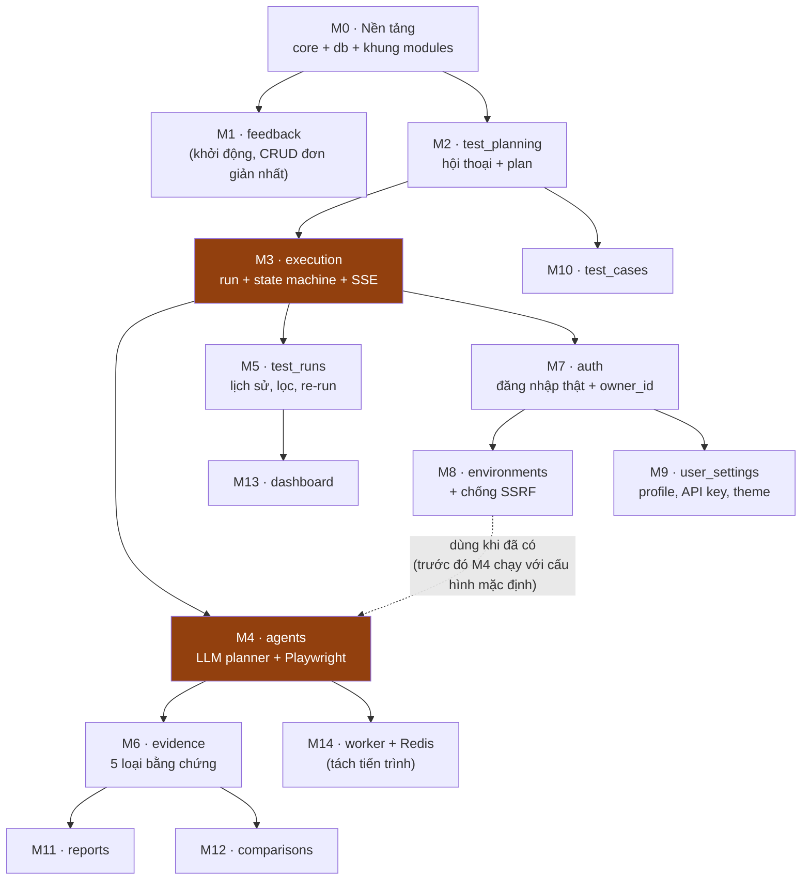

# 🛠️ Kế hoạch Build Backend theo Module & Function — AI Agent Tester

> **Dựa trên:** `BACKEND_STRUCTURE_PLAN.md` (kiến trúc, mục 9 module mẫu `execution`, mục 10 database) và `DATABASE_TABLES.md` (giải thích 17 bảng).
> **Điểm xuất phát (30/09/2026):** `backend/app/` đã khôi phục, vẫn là cấu trúc phân lớp cũ (`api/routes`, `services`, `repositories`), task lưu trong RAM, feedback ghi ra file `.jsonl`, 5 test pass. Chưa có database, agent hay Playwright.
>
> **Cách dùng tài liệu:** build **từ trên xuống**. Mỗi module ghi rõ: phụ thuộc vào module nào, cần viết những function nào ở từng file, endpoint nào, test gì, frontend phải sửa gì, và **thế nào là xong**. Xong module nào thì tick ✅ vào bảng tiến độ ở mục 2.

**Mục lục**
1. Thứ tự build và phụ thuộc
2. Bảng tiến độ tổng
3. Quy ước chung cho mọi module
4. Chi tiết từng module (M0 → M14)
5. Lịch gợi ý theo tuần
6. Rủi ro và cách giảm

---

## 1. Thứ tự build và phụ thuộc



**Vì sao theo thứ tự này?**
- **M1 feedback làm trước tiên** tuy không quan trọng, vì đây là module đơn giản nhất (1 bảng, 1 endpoint). Làm nó để kiểm chứng cả "đường ống" router → service → repository → PostgreSQL → Alembic → test. Đường ống chạy đúng rồi thì các module sau chỉ việc lặp lại.
- **M2 → M3 → M4 là xương sống của đề tài** (prompt → plan → chạy test). Làm sớm để có thứ demo, và để tên đề tài "kiểm thử web tự động bằng AI" có cơ sở thật.
- **M3 chạy giả lập trước, M4 mới thay bằng agent thật.** Nhờ vậy frontend có luồng hoàn chỉnh ngay từ M3, không phải chờ phần khó nhất.
- **M7 auth đặt sau luồng chính.** Trước M7, các bảng để `owner_id` được phép trống. M7 thêm bảng `users` rồi bật ràng buộc `NOT NULL` (theo mục 10.7 của plan).
- **M14 tách worker để cuối.** Chỉ cần khi chạy nhiều test song song. Khi demo đồ án, chạy trong cùng tiến trình vẫn đủ.

---

## 2. Bảng tiến độ tổng

| Mã | Module | Bảng DB | Số endpoint | Ước lượng | Phụ thuộc | Trạng thái | Kết quả cần đạt |
|:-:|---|---|:-:|:-:|---|:-:|---|
| M0 | Nền tảng (`core`, `db`) | — | 1 (`/health`) | 3–4 ngày | — | 🟡 **một phần (30/09)**: config, `db/` async + Alembic, `core/exceptions`, `core/ids`, `core/response`, `/health` kiểm tra DB, test chạy trên DB thật. **Đã thêm ở M2:** `OwnedRepository`, `CurrentUser` (user demo), `test_ownership.py`, `agents/fakes.py`. **Đã thêm ở M3:** bỏ hẳn code `tasks` cũ lưu RAM (`api/`, `services/`, `repositories/`, `schemas/`). **Còn:** `CrudService` (làm ở M8) | ✅ `uvicorn` chạy, `GET /health` trả `"database": "ok"`; tắt PostgreSQL thì trả 503.<br>✅ Alembic dựng và huỷ bảng được hai chiều (`upgrade head` ↔ `downgrade base`), `alembic check` báo sạch.<br>✅ Mọi lỗi nghiệp vụ trả JSON thống nhất `{detail, code}`; lỗi 422 có `detail` là chuỗi đọc được.<br>✅ Có `OwnedRepository`, `CurrentUser` (user demo) và `test_ownership.py` để module sau chỉ việc thêm endpoint.<br>✅ Code cũ lưu RAM (`api/`, `services/`, `repositories/`, `schemas/`) đã bỏ hẳn, backend chỉ còn `core/`, `db/`, `modules/`, `agents/`, `workers/`.<br>✅ `CrudService` dùng chung: viết ở M8 (`environments`, module CRUD đầu tiên cần tới), dùng lại từ M9 trở đi. |
| M1 | `feedback` | `feedback` | 1 | 0.5 ngày | M0 | ✅ **xong (30/09)**: lưu PostgreSQL, migration `0001`, 11 test | ✅ Gửi form Feedback trên Dashboard → có 1 dòng trong bảng `feedback`; tắt/bật lại server vẫn còn.<br>✅ Nhập sai (rating 0, message rỗng hoặc quá 500 ký tự) → form hiện lỗi đọc được (422, `detail` là chuỗi).<br>✅ Bỏ file `feedback.jsonl` cũ.<br>✅ Test tự động pass (11 test). |
| M2 | `test_planning` | `conversations`, `conversation_messages`, `test_plans`, `test_plan_steps` | 6 | 4–5 ngày | M0 | ✅ **xong (30/09)**: M2a + M2b cùng lúc — Planner gọi OpenAI `gpt-4o-mini` thật, 4 bảng, migration `0002`, frontend nối Session History/chat/sửa plan | ✅ Gõ yêu cầu bằng tiếng Việt/Anh → OpenAI `gpt-4o-mini` sinh plan 3–12 bước, lưu DB (version 1).<br>✅ Chat tiếp trong cùng phiên → plan version mới; bước do chat đổi đánh dấu `chat_edit`, bước sửa tay đánh dấu `manual`.<br>✅ Session History: liệt kê, tìm kiếm, mở lại phiên cũ với đủ tin nhắn và plan mới nhất.<br>✅ Plan đã chạy bị khoá (409 `PLAN_LOCKED`), muốn đổi thì chat để tạo version mới.<br>✅ OpenAI lỗi → 502, thiếu key → 503, không để lại phiên/tin nhắn dở dang.<br>✅ Test chạy bằng `FakePlanner` (không tốn tiền) + 1 test gọi OpenAI thật (opt-in `RUN_LIVE_LLM=1`). |
| M3 | `execution` | `test_runs`, `test_run_steps`, `run_interventions` | 8 | 4–5 ngày | M2 | ✅ **M3a xong (01/10)**: run lưu PostgreSQL, migration `0003`, state machine, `SimulatedRunner` chạy nền (`asyncio`), pause/resume/stop, OTP → Human Intervention, SSE, Re-run, `/tasks/history/runs` đọc DB. Frontend: timeline/observation/khung vàng theo SSE, bỏ poll 2s và mô phỏng offline, nút Re-run. **M3b xong cùng M4 (01/10)**: `AGENT_MODE=real` chạy `Orchestrator` (Playwright thật) thay `SimulatedRunner`, cùng chữ ký `run()` nên router/service không đổi gì | ✅ Bấm Confirm & Run → tạo run `RUN-…` trong DB, API trả 202 ngay; màn hình cập nhật từng bước qua SSE, không còn poll 2 giây.<br>✅ Pause / Resume / Stop hoạt động đúng state machine; thao tác sai trạng thái → 409.<br>✅ Bước cần OTP → khung vàng hiện câu hỏi; nhập xong run chạy tiếp; DB chỉ lưu bản đã che (`••••56`).<br>✅ Re-run chạy lại đúng các bước của run cũ; trang Test Runs đọc lịch sử từ DB.<br>✅ Restart server không để run kẹt ở `running` (tự đánh dấu `failed` lúc khởi động).<br>✅ Test: state machine đủ mọi cặp trạng thái (68), luồng run/pause/cancel/OTP/SSE/rerun (22). |
| M4 | `agents` | (ghi vào bảng của M3, M6) | 0 | 7–10 ngày | M3 | ✅ **xong (01/10)**: Browser Executor + Evaluator + User Simulator + Orchestrator thay `SimulatedRunner` thật. Planner (OpenAI) đã có từ M2. **Còn:** evidence (ảnh chụp, console, network) để M6 | ✅ `AGENT_MODE=real`: bấm Run → Chromium thật mở trang, click / điền / kiểm tra; bước sai → run `failed` kèm lý do cụ thể.<br>✅ Bước OTP dừng lại hỏi người, nhập xong trình duyệt điền đúng mã và đi tiếp tới cuối.<br>✅ Evaluator so `expected` với quan sát thật (văn bản, URL, mã HTTP) bằng code, không tốn lượt gọi LLM.<br>✅ Trang demo cục bộ `tests/fixtures/site/index.html`; 2 test Playwright thật pass (quên mật khẩu, đăng nhập + OTP).<br>✅ Một bước bị treo không làm treo cả run (chốt chặn 25 giây/bước).<br>⬜ Chạy trọn luồng "LLM sinh plan → Chromium chạy" trên trang demo (hiện mới kiểm chứng executor với các bước viết tay).<br>⬜ Chụp màn hình, thu console/network cho từng bước (việc của M6). |
| M5 | `test_runs` | (đọc `test_runs`) | 3 | 2 ngày | M3 | ✅ **xong (01/10)**: `GET /test-runs` (lọc AND, tìm kiếm, phân trang ở server, đếm P/F bằng `COUNT … FILTER`), `/test-runs/filters`, `/test-runs/{id}` (bước + OTP đã hỏi); `/tasks/history/runs` chuyển sang đây làm alias. Frontend: bảng Test Runs gọi API, RunDetailModal hiện bước/observation thật, Dashboard Recent Runs thật, bỏ `InitialRecentRuns` | ✅ Trang Test Runs lọc theo status, suite, env, browser, khoảng thời gian, tìm kiếm và phân trang (8 dòng/trang) **ở server**.<br>✅ Dropdown bộ lọc chỉ hiện giá trị có thật trong DB.<br>✅ RunDetailModal hiện đúng các bước, observation, câu hỏi/trả lời OTP của run đó.<br>✅ Recent Runs trên Dashboard là dữ liệu thật; bỏ `InitialRecentRuns` và cột STEPS P/F đếm đúng.<br>✅ Test: nhiều bộ lọc cùng lúc (AND), trang 2 đúng số dòng, đếm passed/failed đúng. |
| M6 | `evidence` | `evidence_artifacts` | 2 | 2–3 ngày | M4 | ✅ **xong (01/10)**: migration `0004`, `LocalStorage` (file ngoài DB), che bí mật trước khi lưu, orchestrator thu ảnh chụp / request mạng / console / agent log mỗi bước, Visual Diff (Pillow) khi Re-run, `GET /evidence/{run}/steps/{n}`, `GET /evidence/files/{id}`. Frontend: `EvidencePanel` dùng chung cho New Test và RunDetailModal | ✅ Mỗi bước có ảnh chụp màn hình thật; 5 tab Evidence Inspector hiện dữ liệu thật của bước đang chọn (New Test và RunDetailModal). Visual Diff có khi Re-run.<br>✅ Mật khẩu, token, OTP trong log/network/observation bị che **trước khi** lưu.<br>✅ File lớn nằm ngoài DB (DB chỉ giữ `storage_key`); xoá run thì dòng evidence bị xoá theo (CASCADE).<br>⬜ Xoá file ảnh trên đĩa khi xoá run: đã có `LocalStorage.delete_prefix`, chưa có API xoá run để gọi nó.<br>✅ Test: lưu screenshot có file trên đĩa; body chứa mật khẩu bị che; 3 test Playwright thật (ảnh, network qua HTTP, không lộ OTP). |
| M7 | `auth` | `users`, `sessions` | 4 | 3 ngày | M3 | ✅ **xong (01/10)**: migration `0005` (tạo user demo `USR-DEMO0001` cho dữ liệu cũ, khoá ngoại `owner_id`/`user_id`/`answered_by` → `users`), Argon2id, phiên = token ngẫu nhiên trong cookie HttpOnly (DB giữ SHA-256), `/auth/register|login|logout|me`, `get_current_user` đọc cookie (`AUTH_REQUIRED=false` chỉ cho test), `scripts/create_admin.py`. Frontend: AuthModal gọi API, giữ đăng nhập qua reload, 401 → về màn hình đăng nhập | ✅ Đăng ký / đăng nhập / đăng xuất thật; reload trang vẫn giữ đăng nhập (`GET /auth/me`).<br>✅ Mật khẩu băm Argon2id, phiên dùng cookie HttpOnly (DB chỉ giữ SHA-256 của token); bỏ kiểm tra cứng `admin123/123` ở frontend.<br>✅ Mỗi user chỉ thấy dữ liệu của mình (`test_auth.py` đăng ký 2 user thật; `test_ownership.py` phủ mọi endpoint có chủ).<br>✅ Dữ liệu đã tạo bằng user demo không bị mất chủ sau migration (migration tạo `USR-DEMO0001`).<br>✅ Test: email trùng 409, sai mật khẩu 401 (cùng thông báo với tài khoản không tồn tại), token hết hiệu lực sau log out / hết hạn / bị sửa.<br>⬜ Giới hạn số lần đăng nhập sai (chống dò mật khẩu): chưa làm. |
| M8 | `environments` | `environments` | 6 | 2 ngày | M7 | ✅ **xong (01/10)**: migration `0006` (bảng `environments` + FK `environment_id` của `execution`/`test_planning`), `core/crud_service.py` + `core/url_guard.py` viết lần đầu ở đây (dùng chung cho M9+), `httpx` cho Test Connection. **Chưa làm:** cột `is_system`/môi trường hệ thống — mục 3.8 của plan này còn để "cần bạn quyết", nên chưa có khái niệm môi trường không xoá được | ✅ Trang Environments thêm / sửa / xoá môi trường, dữ liệu lưu DB.<br>✅ Nút Test Connection trả trạng thái kết nối thật (`GET base_url`, không theo redirect, timeout 5s).<br>✅ Chặn SSRF: URL nội bộ / metadata bị từ chối cả lúc tạo môi trường lẫn khi trang redirect trong Playwright (`page.route` gọi lại `url_guard`).<br>✅ Run chép tên môi trường và browser lúc chạy; đổi/xoá môi trường sau đó lịch sử vẫn đúng (test `test_run_copies_environment_name_and_browser_as_a_snapshot`).<br>✅ Test: `127.0.0.1`, `169.254.169.254`, IPv6 loopback, scheme lạ đều bị chặn (11 test `test_url_guard.py` + 13 test `test_environments.py`).<br>⬜ "Không xoá được môi trường hệ thống": chưa áp dụng vì `is_system` chưa chốt (xem mục 3.8). |
| M9 | `user_settings` | `api_keys`, `user_preferences` | 8 | 2–3 ngày | M7 | ❌ | ⬜ Hồ sơ, đổi mật khẩu, theme, thông báo lưu DB; đổi trình duyệt/máy vẫn giữ.<br>⬜ API key lưu **đã mã hoá**, giao diện chỉ thấy 4 ký tự cuối; agents dùng key của user thay cho key trong `.env`.<br>⬜ Test: DB không chứa key gốc; `GET` chỉ trả `last4`. |
| M10 | `test_cases` | `test_cases` | 7 | 1.5 ngày | M2, M7 | ❌ | ⬜ Nút Save as Test Case lưu plan hiện tại thành test case; trang Test Cases xem / sửa / xoá / lọc.<br>⬜ Chạy test case tạo run mới có `test_case_id`; sửa plan gốc không ảnh hưởng test case đã lưu.<br>⬜ Test cho hai ý trên. |
| M11 | `reports` | `reports` | 8 | 3 ngày | M6 | ❌ | ⬜ Tạo báo cáo Markdown / PDF cho run đã kết thúc; tải về đúng file; phần Preview hiện nội dung thật.<br>⬜ Link chia sẻ xem được không cần đăng nhập; unshare thì link hết hiệu lực.<br>⬜ Test: run chưa xong → 409; đúng loại file; link hết hạn sau unshare. |
| M12 | `comparisons` | `comparisons` | 5 | 2–3 ngày | M6 | ❌ | ⬜ Chọn 2 run → thấy khác biệt thật: kết quả, chênh lệch thời gian, bước thay đổi, diff API response.<br>⬜ Không còn số liệu viết cứng trên trang Comparisons.<br>⬜ Test: 2 run giống nhau → "No change" mọi bước; khác ở bước 5 → đánh dấu đúng bước 5. |
| M13 | `dashboard` | (tính từ `test_runs`) | 2 | 1–2 ngày | M5 | ❌ | ⬜ 5 thẻ số liệu, biểu đồ Pass Rate Trend 7 ngày và Recent Runs đều tính từ DB.<br>⬜ Không còn số viết cứng (`1,284`, `92.8%`…) trên Dashboard.<br>⬜ Test: 3 run passed + 1 failed → pass rate 75%. |
| M14 | Worker + Redis | — | 0 | 3–4 ngày | M4 | ❌ | ⬜ Run chạy ở worker riêng (arq + Redis); API vẫn nhanh khi nhiều test chạy song song.<br>⬜ Pause / Stop / trả lời OTP hoạt động xuyên tiến trình qua Redis.<br>⬜ Restart API không làm mất run đang chạy trên worker.<br>⬜ Test: 3 run song song, `/health` < 100ms; pause từ API dừng được worker. |
| | **Tổng** | **17 bảng** | **~61** | **~45–55 ngày làm việc** | | | |

Cột **Kết quả cần đạt**: ✅ = đã đạt và đã kiểm chứng (demo trên giao diện hoặc test), ⬜ = chưa làm hoặc dời sang module khác (ghi rõ trong dòng). Module chỉ tính là xong khi mọi mục đều ✅.

Ước lượng tính cho **1 người**, đã gồm viết test. Khi thiếu thời gian, xem mục 5 để biết module nào cắt được.

---

## 3. Quy ước chung cho mọi module (bản 2, đã tối ưu)

### 3.0 Bản 1 dư thừa ở đâu

Bản 1 bắt **mọi** module có đủ 5 file, và **tự viết lại** 5 hàm CRUD ở cả repository lẫn service. Rà lại thì thấy 7 chỗ dư thừa:

| # | Dư thừa ở bản 1 | Hậu quả | Bản 2 sửa thành |
|:-:|---|---|---|
| 1 | 5 hàm CRUD (`create`, `get_owned`, `list_owned`, `update`, `delete`) viết lại ở `repository.py` của **từng** module | ~8 module × 5 hàm = **~40 hàm gần giống hệt nhau**. Chỉ cần quên `WHERE owner_id = …` ở một chỗ là lộ dữ liệu của người khác | **1 lớp dùng chung** `OwnedRepository[Model]` (mục 3.2). Lọc theo chủ sở hữu nằm ở **một chỗ duy nhất** |
| 2 | Service có 5 hàm chỉ gọi thẳng repository rồi đổi `None` thành `NotFound` | Thêm **~40 hàm chuyển tiếp** không có nghiệp vụ gì | **1 lớp dùng chung** `CrudService`. Service của module chỉ viết hàm **có nghiệp vụ thật** |
| 3 | Mỗi tài nguyên 3 schema `XxxCreate`, `XxxUpdate`, `XxxOut` lặp lại cùng các trường | Sửa một trường phải sửa ở 3 chỗ | 2 schema: `XxxIn` (dùng cho cả tạo mới lẫn sửa, sửa từng phần bằng `exclude_unset`) và `XxxOut` |
| 4 | Test service **và** test HTTP cho cùng một hành vi | Mỗi hành vi test 2 lần, sửa code phải sửa 2 bộ test | Test HTTP cho mọi endpoint. Unit test **chỉ** cho logic khó (mục 3.4) |
| 5 | Test "không xem được dữ liệu người khác" viết lại ở từng module | 12 bản test gần giống nhau | **1 file** `tests/test_ownership.py` chạy lặp qua danh sách endpoint |
| 6 | 3 bản giả lập viết rải rác: `SamplePlanner` (trong M2), `SimulatedRunner` (trong M3), `FakeLLMProvider` (trong M4 + mục rủi ro) | Viết 3 lần, mỗi bản chỉ dùng một chỗ | Gom vào **1 file** `agents/fakes.py`, dùng chung cho 3 việc: chạy khi chưa có M4, test tự động, demo dự phòng khi mất mạng |
| 7 | `BUILD_PLAN.md` chép lại một phần mục 9 và 10.4 của `BACKEND_STRUCTURE_PLAN.md` | Hai tài liệu dễ lệch nhau | Mỗi chủ đề chỉ có **1 nguồn chuẩn** (mục 3.6). File này chỉ ghi tên hàm và thứ tự build |

**Cố ý giữ lại, không coi là dư thừa:**
- **Endpoint CRUD vẫn viết tay từng cái**, không sinh tự động bằng hàm tạo router. Mỗi endpoint chỉ 2–3 dòng, lại hiện rõ ràng trong `/docs` và dễ giải thích khi bảo vệ. Đổi lấy vài dòng lặp là chấp nhận được.
- **Các bước test được lưu 3 lần** (`test_plan_steps`, `test_cases.steps`, `test_run_steps`). Đây là **bản chụp có chủ đích**: sửa plan không được làm đổi lịch sử (xem `DATABASE_TABLES.md` mục 2).
- **`test_runs` chép lại `name`, `environment_name`, `browser`**. Lý do giống như trên: lịch sử phải giữ đúng như lúc chạy.

### 3.1 Bộ file của một module: chỉ tạo khi cần

| File | Khi nào cần | Ví dụ không cần |
|---|---|---|
| `router.py` | Luôn có | — |
| `schemas.py` | Luôn có | — |
| `models.py` | Module **sở hữu** bảng | `dashboard`, `test_runs` (đọc bảng của `execution`) |
| `service.py` | Luôn có. Kế thừa `CrudService` nếu module có CRUD | — |
| `repository.py` | Chỉ khi cần **truy vấn riêng** ngoài CRUD chung, hoặc bảng không có `owner_id` (như `feedback`) | `environments`, `test_cases`, `comparisons`: dùng thẳng `OwnedRepository(Model)`, không cần tạo file |
| File đặc thù (`state_machine.py`, `events.py`, `exporters/`…) | Chỉ ở module có logic đó | — |

### 3.2 Hai lớp dùng chung thay cho khuôn CRUD viết tay

```python
# db/repository.py — viết 1 lần, mọi module dùng
class OwnedRepository(Generic[ModelT]):
    def __init__(self, model: type[ModelT], session: AsyncSession): ...
    async def create(self, owner_id: str, data: dict) -> ModelT: ...
    async def get(self, id: str, owner_id: str) -> ModelT | None: ...          # luôn lọc owner_id
    async def list(self, owner_id: str, *, where=(), order_by=None,
                   page=1, page_size=20) -> tuple[list[ModelT], int]: ...
    async def update(self, obj: ModelT, data: dict) -> ModelT: ...
    async def delete(self, obj: ModelT) -> None: ...

# core/crud_service.py — viết 1 lần
class CrudService(Generic[ModelT]):
    repo: OwnedRepository[ModelT]
    async def get_or_404(self, user, id) -> ModelT: ...                        # None → NotFound
    async def create(self, user, data: BaseModel) -> ModelT: ...
    async def list(self, user, **filters): ...
    async def update(self, user, id, data: BaseModel) -> ModelT: ...          # exclude_unset
    async def delete(self, user, id) -> None: ...
```

Service của một module **chỉ viết phần khác biệt**. Ví dụ `environments`:

```python
class EnvironmentService(CrudService[Environment]):
    async def create(self, user, data):                 # ghi đè: kiểm tra URL trước khi lưu
        validate_target_url(data.base_url)
        return await super().create(user, data)

    async def test_connection(self, user, env_id): ...  # nghiệp vụ riêng
```

Kết quả: module CRUD như `environments`, `test_cases` giảm từ khoảng 10 hàm xuống còn **2–3 hàm** thật sự cần viết.

### 3.3 Viết router ngắn hơn

```python
CurrentUser = Annotated[User, Depends(get_current_user)]          # core/dependencies.py, dùng mọi nơi

@router.get("/{env_id}", response_model=Envelope[EnvironmentOut])
async def get_env(env_id: str, user: CurrentUser, svc: EnvSvc):
    return ok(await svc.get_or_404(user, env_id))
```
`Envelope[T]` (trong `core/response.py`) sinh đúng dạng `{"data": ...}` trong `/docs`, không cần mô tả lại ở từng endpoint.

### 3.4 Chiến lược test: không test một hành vi hai lần

| Loại test | Viết cho | Không viết cho |
|---|---|---|
| **Test HTTP** (qua `TestClient`, DB thật) | Mọi endpoint: 1 đường đúng + 1 đường lỗi | — |
| **Unit test** (không cần HTTP, không cần DB) | Chỉ logic khó: `state_machine`, `url_guard`, `mask_secrets`, `comparisons._diff_*`, `exporters`, parse JSON của `planner_agent` | Hàm CRUD, hàm service chỉ chuyển tiếp |
| **Test quyền sở hữu** | `tests/test_ownership.py`: danh sách `(method, url)`; user B gọi tài nguyên của user A → 404 | Không viết lại ở từng module |
| **Test lớp dùng chung** | `OwnedRepository`, `CrudService`: test **một lần** trên một model giả | — |

### 3.5 Một bộ giả lập dùng chung: `agents/fakes.py`

| Lớp giả | Thay cho | Dùng ở |
|---|---|---|
| `FakePlanner` | `planner_agent` (LLM) | M2a (trước khi có M4), test, demo khi mất mạng |
| `SimulatedRunner` | `orchestrator` + Playwright | M3a, test luồng pause/cancel/OTP, demo dự phòng |
| `FakeLLMProvider` | Gemini/OpenAI | Test `planner_agent` với JSON cố định |

Chọn bản thật hay bản giả bằng **1 biến môi trường** `AGENT_MODE=real|fake`, đọc trong `agents/llm/factory.py`. Không rải điều kiện `if demo:` trong code nghiệp vụ.

### 3.6 Mỗi chủ đề chỉ có một nguồn chuẩn

| Chủ đề | Nguồn chuẩn | Các tài liệu khác chỉ được |
|---|---|---|
| Kiến trúc, cây thư mục, luồng chạy | `BACKEND_STRUCTURE_PLAN.md` mục 3–7, 9 | Trỏ tới |
| Cột, kiểu, ràng buộc của bảng | `BACKEND_STRUCTURE_PLAN.md` mục 10.4 | Giải thích bằng lời (`DATABASE_TABLES.md`) |
| Request/response của endpoint | `API_CONTRACT.md` (cập nhật khi thêm endpoint) | Ghi tên endpoint |
| Thứ tự build, tên hàm, tiến độ | **File này** | — |

### 3.7 Định nghĩa "xong" (áp dụng mọi module)
Một module chỉ được tick ✅ khi đủ cả 6 điều:
1. Có migration Alembic cho bảng của module, và `alembic upgrade head` chạy được trên DB trống.
2. Mọi endpoint có trong `http://localhost:8081/docs` và đã cập nhật vào `API_CONTRACT.md`.
3. Test theo mục 3.4: test HTTP cho mọi endpoint, unit test cho logic khó. `pytest` pass toàn bộ.
4. Endpoint có dữ liệu riêng của user đã được thêm vào danh sách trong `tests/test_ownership.py` (từ M7 trở đi).
5. Frontend bỏ được mock tương ứng trong `mockData.ts` (nếu có), và màn hình hiện dữ liệu thật.
6. Có 1 dòng mới trong `frontend/TRACE_LOG.md`.

### 3.8 Đề xuất gộp thêm (chưa áp dụng, cần bạn quyết)

| Đề xuất | Lợi | Hại | Ảnh hưởng tài liệu khác |
|---|---|---|---|
| **Gộp M13 `dashboard` vào M5 `test_runs`** (thêm file `stats.py`) | Cả hai chỉ đọc cùng bảng `test_runs` với cùng bộ lọc ngày, nên bớt 1 module, 1 router, 1 bộ schema | Module `test_runs` to hơn một chút | Sửa bảng ánh xạ (mục 1) và cây thư mục (mục 4) của `BACKEND_STRUCTURE_PLAN.md` |
| **Bỏ cột `test_plans.owner_id`** (lấy chủ sở hữu qua `conversations.owner_id`) | Không lưu 2 lần một thông tin, không có nguy cơ 2 cột lệch nhau | Mỗi truy vấn plan phải `JOIN conversations` | Sửa DDL mục 10.4 và `DATABASE_TABLES.md`. **Nếu giữ lại** thì quy định service luôn lấy `owner_id` từ conversation, không bao giờ lấy từ request |

---

## 4. Chi tiết từng module

---

### M0 · Nền tảng — `core/`, `db/`, khung `modules/`

**Mục tiêu:** dựng hạ tầng dùng chung, rồi chuyển code cũ sang cấu trúc mới **mà không đổi hành vi**. 5 test hiện có phải vẫn pass.

**Việc cần làm:**
| # | File | Function / nội dung | Ghi chú |
|:-:|---|---|---|
| 1 | `requirements.txt` | Thêm `sqlalchemy[asyncio]`, `asyncpg`, `alembic`, `aiosqlite` (cho test) | |
| 2 | `docker-compose.yml` | Service `postgres:16` | `docker compose up -d postgres` |
| 3 | `core/config.py` | Thêm lại `database_url` (đã bị xoá khỏi config), `secret_key`, `auth_required=False` | `.env.example` cũng thêm lại `DATABASE_URL` |
| 4 | `db/base.py` | `Base(DeclarativeBase)`, mixin `TimestampMixin` (`created_at`, `updated_at`) | |
| 5 | `db/session.py` | `engine`, `SessionLocal`, `get_session()` (dependency) | |
| 6 | `core/ids.py` | `new_id(prefix: str) -> str` → `"RUN-9F3A21C4"` | Dùng cho mọi bảng |
| 7 | `core/exceptions.py` | `DomainError`, `NotFound`, `Conflict`, `InvalidTransition`, `Forbidden`; `register_exception_handlers(app)` → đổi sang HTTP 404/409/403 với body `{"detail", "code"}` | |
| 8 | `core/response.py` | `ok(data)`, `Envelope[T]` | Mục 3.3 |
| 8b | `db/repository.py`, `core/crud_service.py` | `OwnedRepository[Model]`, `CrudService[Model]` | Mục 3.2. Viết và test **một lần** ở đây |
| 8c | `core/dependencies.py` | `get_current_user()`, `CurrentUser` | Trước M7 trả về user demo |
| 9 | `core/health.py` | `GET /health` (chuyển từ `api/routes/health.py`), kiểm tra thêm kết nối DB | |
| 10 | `alembic/` | `alembic init`, sửa `env.py` đọc `settings.database_url` | |
| 11 | Chuyển code cũ | `api/routes/tasks.py` tách thành `modules/test_planning/router.py` và `modules/execution/router.py`; `feedback` thành `modules/feedback/` | Tạm giữ repository in-memory |
| 12 | `tests/conftest.py` | Fixture `client`, `db_session` (SQLite tạm hoặc Postgres test) | |
| 13 | `tests/test_ownership.py` | Khung test quyền sở hữu, danh sách endpoint để trống | Các module sau chỉ thêm dòng vào danh sách |
| 14 | `agents/fakes.py` | Tạo file trống, `AGENT_MODE` trong `config.py` | M2a, M3a điền vào |

---

### M1 · `feedback` — Góp ý người dùng

**Màn hình:** form Feedback cuối Dashboard. **Bảng:** `feedback`.

| File | Function | Việc |
|---|---|---|
| `models.py` | `class Feedback` | `id`, `user_id` (nullable), `rating`, `category`, `message`, `created_at` |
| `schemas.py` | `FeedbackCreate` | `rating: int (1–5)`, `category: Literal[4 giá trị]`, `message: str (1–500)`, `username` (bỏ qua, chỉ giữ để tương thích) |
| | `FeedbackOut` | `id`, `created_at` |
| `repository.py` | `create(data, user_id) -> Feedback` | `INSERT` |
| `service.py` | `submit(data, user) -> FeedbackOut` | Cắt khoảng trắng, gọi repository |
| `router.py` | `POST /feedback` | Trả `{"status": "received", "data": {...}}` (giữ `status` để `api.ts` cũ vẫn chạy) |

**Test:** gửi hợp lệ thì có 1 dòng trong DB; rating 0 hoặc message 501 ký tự thì 422.
**Frontend:** không cần sửa.
**Xoá:** `repositories/feedback_repository.py` (ghi `.jsonl`) và file `backend/data/feedback.jsonl` sau khi đã chuyển dữ liệu (nếu cần giữ).

---

### M2 · `test_planning` — Hội thoại với AI và sinh kịch bản

**Màn hình:** New Test (khung Conversation, bảng plan, Session History sidebar, nút Run Again). **Bảng:** `conversations`, `conversation_messages`, `test_plans`, `test_plan_steps`.

**Chia 2 bước:**
- **M2a (làm ngay):** sinh plan bằng **dữ liệu mẫu** thay vì mảng rỗng. Sửa luôn lỗi hiện tại "bật backend thì plan 0 bước".
- **M2b (sau M4):** thay dữ liệu mẫu bằng `planner_agent` gọi LLM thật.

| File | Function | Việc |
|---|---|---|
| `models.py` | `Conversation`, `ConversationMessage`, `TestPlan`, `TestPlanStep` | Khớp mục 10.4 |
| `schemas.py` | `GeneratePlanIn` | `prompt`, `conversation_id?` (= `session_id` frontend gửi), `llm_provider`, `llm_model` |
| | `PlanOut` | `plan_id`, `task_id` (= `plan_id`, tạm để tương thích), `conversation_id`, `version`, `objective`, `target_url`, `preconditions`, `test_data`, `steps[]` |
| | `StepIn`, `StepOut`, `ConversationOut`, `MessageOut` | |
| `repository.py` | `create_conversation(owner_id, title, llm) -> Conversation` | Tự tăng `seq_no` theo user |
| | `append_message(conversation_id, role, content, **meta) -> Message` | Tự tăng `seq`, cập nhật `last_message_at` |
| | `list_messages(conversation_id) -> list` | Sắp theo `seq` |
| | `list_conversations(owner_id, q, limit) -> list` | Lọc `archived_at IS NULL`, tìm theo `title` (`ILIKE`) |
| | `create_plan(conversation_id, version, data, steps) -> TestPlan` | Tạo plan + các bước trong 1 transaction |
| | `latest_version(conversation_id) -> int` | |
| | `replace_steps(plan_id, steps)` | Dùng khi user sửa plan |
| `service.py` | `generate_plan(user, req) -> PlanOut` | ① tìm hoặc tạo conversation ② ghi tin nhắn user ③ gọi `planner.generate(prompt, history)` ④ lưu plan `version+1` ⑤ ghi tin nhắn Planner Agent (`kind='plan_created'`) |
| | `update_steps(user, plan_id, steps) -> PlanOut` | Chỉ khi plan `draft`, không thì `Conflict`. Đánh dấu `source='manual'` |
| | `approve(plan_id)` | `draft → approved`. Được M3 gọi khi Confirm & Run |
| | `get_plan(user, plan_id)`, `list_sessions(user, q)`, `get_messages(user, conversation_id)` | |
| | `rename / archive(user, conversation_id)` | |
| `agents/fakes.py` | `FakePlanner.generate(prompt, history) -> PlanDraft` | M2a: trả 6 bước mẫu dựa trên prompt. M2b: `AGENT_MODE=real` chuyển sang `agents/planner_agent.py`, **cùng chữ ký hàm** nên service không phải sửa |
| `router.py` | `POST /tasks/generate-plan` | Giữ URL cũ |
| | `PUT /plans/{plan_id}/steps` | Edit Directly, Add Step, xoá step |
| | `GET /plans/{plan_id}` | |
| | `GET /conversations?q=` | Session History |
| | `GET /conversations/{id}` | Mở lại phiên cũ: trả luôn tin nhắn + plan mới nhất trong 1 lần gọi (thay cho `/messages` dự kiến ban đầu) |
| | `PATCH /conversations/{id}` | Đổi tên / archive |

**Test:** generate hai lần trong cùng phiên thì `version` ra 1 rồi 2; sửa step khi plan đã `approved` thì 409; user chỉ thấy phiên của mình (từ M7).

**Frontend cần sửa:**
- `App.tsx`: gửi `conversation_id`. Khi sửa bảng plan thì gọi `PUT /plans/{id}/steps` (hiện chỉ sửa state cục bộ).
- `NewTestPage.tsx`: Session History lấy từ `GET /conversations`, bỏ `InitialChatHistory`. Khung chat hiện tin nhắn thật từ `GET /conversations/{id}/messages`.

---

### M3 · `execution` — Chạy test và điều khiển

> **Trạng thái (01/10): M3a ✅.** Khác với bảng dưới ở vài điểm, đã ghi lại cho khớp code:
> - Runner chạy nền trong tiến trình API qua `modules/execution/runner.py › RunLauncher.launch()` (chưa có hàng đợi, M14 thay bằng arq). Service **commit trước** khi giao cho runner, vì runner dùng session riêng.
> - Runner ghi DB qua `RunStore` (mỗi thao tác 1 transaction ngắn, khoá dòng `FOR UPDATE`). Run đã kết thúc thì runner nhận `RunCancelled` và dừng, không ghi đè.
> - State machine cho phép thêm `queued/paused/waiting_* → failed`, dùng khi runner lỗi, hết giờ chờ OTP, hoặc server khởi động lại (run dở dang bị đánh dấu `failed` lúc startup).
> - `/tasks/history/runs` đọc từ DB ngay ở M3 (không lọc/phân trang), vì code RAM cũ đã bị xoá. M5 thêm lọc, phân trang.
> - Run từ plan ghi 2 tin vào phiên chat: `run_started`, `run_status`.

**Màn hình:** New Test (Confirm & Run, Pause/Resume/Stop, khung Human Intervention, timeline, SSE). **Bảng:** `test_runs`, `test_run_steps`, `run_interventions`.
**Tài liệu chi tiết:** `BACKEND_STRUCTURE_PLAN.md` mục 9 (có code mẫu từng file).

**Chia 2 bước:**
- **M3a:** chạy **giả lập** trong cùng tiến trình (`asyncio.create_task`). Mỗi bước chờ 2 giây rồi đánh dấu `passed`. Nhờ vậy frontend có đủ luồng running → completed, pause, resume, stop.
- **M3b (M4):** thay trình chạy giả lập bằng orchestrator + Playwright.

| File | Function | Việc |
|---|---|---|
| `models.py` | `TestRun`, `TestRunStep`, `RunIntervention` | Khớp mục 10.4 |
| `state_machine.py` | `ALLOWED`, `TERMINAL`, `ensure_transition(current, target)` | Sai luật → `InvalidTransition` (409) |
| `schemas.py` | `RunRequest` | `task_id` hoặc `plan_id`, `steps?`, `environment_id?`, `tasks[]` (tương thích), `config` |
| | `RunStarted` | `task_id`, `status`, `message` |
| | `RunOut`, `RunStepOut`, `HumanInputIn`, `InterventionOut` | |
| `repository.py` | `create_run(owner_id, source, snapshot, steps) -> TestRun` | Tạo run + **chép** các bước trong 1 transaction |
| | `get_owned(run_id, owner_id)` | Kèm steps |
| | `set_status(run_id, status, **fields)` | Ghi `started_at`/`finished_at` khi phù hợp |
| | `update_step(step_id, status, observation, duration_ms)` | |
| | `open_intervention(run_id, step_id, kind, question)`, `answer_intervention(id, answer, user_id)`, `pending_intervention(run_id)` | |
| `events.py` | `RunEvents.publish(run_id, event)`, `RunEvents.subscribe(run_id)` | M3: `asyncio.Queue` trong bộ nhớ. M14: đổi sang Redis Pub/Sub, **giữ nguyên tên hàm** |
| `control.py` | `RunControl.send(run_id, command, payload?)`, `wait_while_paused(run_id)`, `wait_for_human_input(run_id, timeout)` | M3: `asyncio.Event`. M14: đổi sang Redis |
| `agents/fakes.py` | `SimulatedRunner.run(run_id, steps, env, control, events, repo)` | **Cùng chữ ký với `orchestrator.run` (M4)**. M3a: lặp qua các bước, gọi `control`, ghi `repository`, publish `events`. Có thể giả lập 1 lần hỏi OTP ở bước có chữ "OTP" để test luồng human input |
| `service.py` | `start(user, req) -> RunStarted` | Xác định bước sẽ chạy (plan đã duyệt > steps gửi kèm > plan theo `task_id`), gọi `planning.approve`, tạo run, **giao cho runner**, trả ngay |
| | `get(user, run_id) -> RunOut` | |
| | `pause / resume / cancel(user, run_id)` | Qua `_command`: kiểm tra state machine → gửi control → cập nhật DB → publish |
| | `provide_human_input(user, run_id, body)` | Chỉ khi `waiting_human_input`. Che bí mật trước khi lưu `answer` |
| | `rerun(user, run_id) -> RunStarted` | Chép bước từ **run cũ**, đặt `rerun_of` |
| `router.py` | `POST /tasks/run` (trả 202) | |
| | `GET /tasks/{id}` | |
| | `GET /tasks/stream/{id}` | SSE: gửi `snapshot` trước, sau đó là sự kiện `status` / `step` |
| | `POST /tasks/{id}/pause`, `/resume`, `/cancel`, `/human-input` | |
| | `POST /test-runs/{id}/rerun` | |

**Test:**
- Unit `state_machine`: toàn bộ cặp chuyển trạng thái hợp lệ và không hợp lệ.
- Service: `start` tạo run `queued` với đúng số bước; pause run đã `completed` thì 409; human-input khi không chờ thì 409.
- Tích hợp: run giả lập chạy tới `completed`; pause ở bước 2 thì bước 3 không chạy cho tới khi resume; cancel thì dừng hẳn.

**Frontend cần sửa (`App.tsx`):**
- Xử lý sự kiện SSE `step` (cập nhật `currentStepIdx`, timeline) và `waiting_human_input` (hiện khung vàng kèm `human_prompt`).
- Có SSE rồi thì giảm tần suất poll (hiện 2 giây) hoặc bỏ hẳn. Bỏ chế độ mô phỏng offline, hoặc hiện rõ nhãn "Demo mode" để không nhầm với chạy thật.
- Nút Re-run gọi `POST /test-runs/{id}/rerun`.

---

### M4 · `agents` — AI và trình duyệt thật ⭐

> **Trạng thái (01/10): ✅ xong**, với vài chỗ khác thiết kế ban đầu (đã ghi lại cho khớp code):
> - **4.1/4.2 làm từ M2** (chỉ có OpenAI, không có Gemini — frontend không còn mặc định Gemini).
> - **4.3:** `browser_pool.py` mở 1 trình duyệt mới cho MỖI run (chưa có bảng `environments` ở M8 nên chưa tái sử dụng theo môi trường); chưa chụp screenshot/console/network — đó là việc của M6 (evidence).
> - `browser_executor_agent.execute_step()` **chỉ thực hiện hành động**, trả `RawObservation` (làm được hay không + quan sát thô); **không tự quyết định passed/failed** — việc đó chuyển hẳn cho `evaluator_agent.evaluate()`, để tách rõ "làm" và "chấm điểm" như bảng dưới mô tả.
> - `user_simulator_agent.fill_value()` có `test_data` được **chép sẵn vào `test_runs.config`** lúc tạo run (từ `test_plans.test_data`), không phải lấy lại từ plan lúc chạy — nhờ vậy Re-run dùng đúng dữ liệu cũ dù plan đã đổi.
> - `orchestrator.py` dừng **cả run** ngay khi 1 bước `failed` (giống pseudocode `execute_run` ở mục 9.8), khác `SimulatedRunner` (M3a) luôn "passed" vì không kiểm tra gì thật.
> - **Không có công tắc riêng cho M4.** `AGENT_MODE=real` dùng cả Planner OpenAI lẫn Orchestrator Playwright; `AGENT_MODE=fake` dùng cả `FakePlanner` lẫn `SimulatedRunner` — chọn 1 lần ở `execution/router.py`, không đổi được nửa chừng.
> - **Trang demo:** `tests/fixtures/site/index.html`, 1 file tĩnh mở qua `file://` (không cần dựng server), có đủ form quên mật khẩu và luồng OTP (email chứa "otp" → trang yêu cầu nhập mã 6 số).

**Không có màn hình riêng.** Đây là "động cơ" thay cho `FakePlanner` và `SimulatedRunner` trong `agents/fakes.py` (mục 3.5). **Là phần quyết định đề tài có đúng tên hay không.**

**Chia 4 bước, mỗi bước chạy được độc lập:**

| Bước | File | Function | Việc |
|:-:|---|---|---|
| 4.1 | `agents/llm/base.py` | `LLMProvider.complete(messages, json_schema?) -> LLMResult` | Interface chung, trả kèm token và độ trễ |
| | `agents/llm/gemini.py`, `openai.py` | `complete(...)` | Bắt đầu với 1 provider (Gemini, vì frontend đang mặc định) |
| | `agents/llm/factory.py` | `get_provider(provider, model, api_key) -> LLMProvider` | Key lấy từ `.env`, sau M9 lấy từ `api_keys` |
| 4.2 | `agents/planner_agent.py` | `generate(prompt, history, target_url?) -> PlanDraft` | Gọi LLM với system prompt, **bắt trả JSON đúng schema** (`objective`, `target_url`, `steps[]`). Parse lỗi thì thử lại 1 lần, vẫn lỗi thì `DomainError` (502) |
| | | `revise(plan, instruction) -> PlanDraft` | Sửa plan qua chat (bước có `source='chat_edit'`) |
| 4.3 | `workers/browser_pool.py` | `open_context(environment) -> BrowserContext` | Playwright, headless theo cấu hình, viewport, timeout |
| | `agents/browser_executor_agent.py` | `execute_step(page, step, context) -> StepResult` | Chuyển 1 bước (action + selector) thành lệnh Playwright: `goto`, `click`, `fill`, `expect`… Chụp screenshot, thu console và network |
| | `agents/evaluator_agent.py` | `evaluate(step, observation) -> passed/failed + lý do` | So kết quả thật với `expected`. Kiểm tra đơn giản được thì kiểm tra trực tiếp, không cần gọi LLM |
| | `agents/user_simulator_agent.py` | `fill_value(step, test_data) -> str \| NeedHumanInput` | Điền dữ liệu. Không có dữ liệu (OTP, captcha) thì báo cần hỏi người |
| 4.4 | `agents/orchestrator.py` | `run(run_id, steps, env, control, events, repo)` | Thay `SimulatedRunner`: lặp từng bước → executor → simulator (nếu cần) → evaluator → ghi kết quả và evidence (M6) → publish |
| | `agents/protocol.py` | `StepResult`, `PlanDraft`, `NeedHumanInput` | Kiểu dữ liệu trao đổi giữa các agent |

**Test:** `FakeLLMProvider` (trong `agents/fakes.py`) trả JSON cố định cho test planner (từ M2). Executor/Orchestrator dùng Playwright thật lên `tests/fixtures/site/index.html` qua `file://`, không phụ thuộc Internet — `tests/test_orchestrator_live.py` (chạy `RUN_LIVE_BROWSER=1 pytest tests/test_orchestrator_live.py -s`, giống cách `test_planner_live.py` opt-in gọi OpenAI thật; mặc định bỏ qua vì cần đã cài Chromium và chậm hơn test thường).


**Lưu ý:** cần một **trang web mẫu để demo**, tự dựng hoặc dùng trang test công khai. Không demo trên website thật của bên thứ ba.

---

### M5 · `test_runs` — Lịch sử chạy

**Màn hình:** trang Test Runs, RunDetailModal, Recent Runs trên Dashboard. **Bảng:** chỉ **đọc** `test_runs`, `test_run_steps` (M3 sở hữu).

| File | Function | Việc |
|---|---|---|
| `schemas.py` | `RunListQuery` | `q`, `status`, `suite`, `env`, `browser`, `date_range` (`24h`/`7d`/`30d`), `page`, `page_size=8` |
| | `RunHistoryItem` | Khớp `api/contract.ts`: `run_id`, `task_id`, `name`, `suite`, `env`, `browser`, `status`, `duration`, `created_at`, `passed_steps`, `failed_steps` |
| | `RunDetail` | Kèm danh sách bước và intervention |
| | `FilterOptions` | Danh sách suite/env/browser có thật, để đổ vào dropdown |
| `repository.py` | `search(owner_id, query) -> (rows, total)` | 1 câu SQL: lọc + đếm P/F bằng `COUNT FILTER` + phân trang |
| | `distinct_values(owner_id, column)` | |
| `service.py` | `list(user, query)`, `detail(user, run_id)`, `filter_options(user)` | Tính `duration` từ `started_at`/`finished_at` |
| `router.py` | `GET /test-runs` | |
| | `GET /test-runs/{id}` | |
| | `GET /test-runs/filters` | |
| | `GET /tasks/history/runs` | **Alias** cho `api.ts` cũ, xoá khi frontend đổi xong |

**Test:** kết hợp nhiều bộ lọc (AND); trang 2 đúng 8 dòng; `passed_steps` đếm đúng.
**Frontend:** `TestRunsPage.tsx` chuyển từ lọc trên trình duyệt sang gọi API có tham số, bỏ `InitialRecentRuns`.

---

### M6 · `evidence` — Bằng chứng từng bước

**Màn hình:** Evidence Inspector (5 tab) ở New Test và RunDetailModal. **Bảng:** `evidence_artifacts`.

| File | Function | Việc |
|---|---|---|
| `storage.py` | `Storage.save(key, bytes) -> key`, `open(key) -> stream`, `delete(key)` | `LocalStorage` (thư mục `backend/data/artifacts/`). Sau này thêm `S3Storage` cùng interface |
| `schemas.py` | `NetworkPayload`, `ScreenshotPayload`, `AgentLogPayload`, `ConsolePayload`, `VisualDiffPayload` | Mỗi loại một cấu trúc `payload` (bảng ở mục 10.4) |
| | `EvidenceOut` | `kind`, `payload`, `file_url?` |
| `repository.py` | `add(step_id, kind, payload?, storage_key?)`, `list_by_step(step_id)` | |
| `service.py` | `record(step_id, artifacts: list)` | Được **orchestrator (M4)** gọi sau mỗi bước |
| | `for_step(user, run_id, step_no)` | Kiểm tra quyền qua run |
| | `open_file(user, artifact_id)` | Trả file ảnh |
| | `mask_secrets(payload)` | Che mật khẩu, token, OTP trong log/network trước khi lưu |
| `router.py` | `GET /evidence/{run_id}/steps/{step_no}` | |
| | `GET /evidence/files/{artifact_id}` | |

**Test:** lưu screenshot thì file có trên đĩa và DB có `storage_key`; body chứa `"password":"123"` thì bị che.
**Frontend:** 5 tab Evidence ở `NewTestPage.tsx` và `RunDetailModal` bỏ nội dung viết cứng, gọi API theo bước đang chọn.

---

### M7 · `auth` — Đăng nhập thật

**Màn hình:** AuthModal (Sign In / Sign Up), header (tên user, Log Out). **Bảng:** `users`, `sessions`. Migration này **thêm `NOT NULL` cho mọi `owner_id`**.

| File | Function | Việc |
|---|---|---|
| `core/security.py` | `hash_password(pw)`, `verify_password(pw, hash)` | Argon2id |
| | `new_session_token() -> (token, token_hash)` | Token ngẫu nhiên, chỉ lưu hash |
| `models.py` | `User`, `Session` | |
| `schemas.py` | `RegisterIn` (display_name, email, password ≥ 8, confirm), `LoginIn` (username hoặc email, password), `UserOut` | |
| `repository.py` | `create_user`, `get_by_login(username_or_email)`, `create_session`, `get_session_by_hash`, `revoke_session` | |
| `service.py` | `register(data) -> UserOut` | Email trùng → `Conflict` |
| | `login(data) -> (UserOut, token)` | Sai → cùng một thông báo "Invalid username or password" (không tiết lộ tài khoản có tồn tại hay không) |
| | `logout(token)`, `current_user(token) -> User` | |
| `core/dependencies.py` | `get_current_user()` | Đọc cookie `session` → user. Khi `auth_required=False` thì trả user demo |
| `router.py` | `POST /auth/register`, `POST /auth/login` (đặt cookie HttpOnly), `POST /auth/logout`, `GET /auth/me` | |
| `scripts/create_admin.py` | | Tạo `admin123` / `123` cho demo |
| Mọi module | Thêm `user = Depends(get_current_user)`, repository lọc theo `user.id` | |

**Test:** đăng ký trùng email thì 409; sai mật khẩu thì 401; user A gọi `GET /tasks/{run của B}` thì 404; log out xong token không dùng được nữa.
**Frontend:** `AuthModal.tsx` bỏ kiểm tra cứng `admin123/123` và gọi API; `api.ts` thêm `credentials: 'include'` cho mọi `fetch`; `App.tsx` gọi `/auth/me` khi mở trang để giữ đăng nhập sau khi reload.

---

### M8 · `environments` — Môi trường chạy test

**Màn hình:** trang Environments. **Bảng:** `environments`. Thiết kế **đề xuất thêm cột `is_system`** (môi trường mẫu của hệ thống, `owner_id` để trống) theo thảo luận về việc cho user tự cài. **Cột này chưa có trong DDL mục 10.4**, cần cập nhật plan khi chốt.

| File | Function | Việc |
|---|---|---|
| `service.py` | `EnvironmentService(CrudService)`: ghi đè `create`/`update` (gọi `validate_target_url`), ghi đè `list` | CRUD còn lại **kế thừa**, không viết lại (mục 3.2). `list` trả môi trường của user **và** môi trường hệ thống |
| `core/url_guard.py` | `validate_target_url(url) -> None` | **Chống SSRF:** chỉ `http/https`; phân giải DNS; chặn IP private/loopback/link-local/metadata (`10.*`, `172.16–31.*`, `192.168.*`, `127.*`, `169.254.*`, `::1`…). Được phép tắt khi chạy local bằng `ALLOW_PRIVATE_TARGETS=true` |
| `service.py` | `test_connection(user, env_id) -> connected/error` | `validate_target_url` rồi gửi `HEAD`/`GET` bằng `httpx` (timeout 5s, **không tự theo redirect**), lưu `last_check_status` |
| | `resolve_for_run(user, env_id) -> EnvSnapshot` | Được M3 gọi để chép `environment_name`, `browser`, `config` vào run |
| `workers/browser_pool.py` (M4) | Chặn request trong Playwright bằng `page.route` gọi lại `validate_target_url` | Chặn cả khi trang **redirect** sang IP nội bộ |
| `router.py` | CRUD `/environments` + `POST /environments/{id}/test-connection` | Môi trường hệ thống: không cho sửa/xoá (403) |

**Test:** `http://127.0.0.1` và `http://169.254.169.254` bị từ chối; trang redirect sang IP nội bộ bị Playwright chặn; không xoá được môi trường hệ thống.
**Frontend:** `ExtraModules.tsx › EnvironmentsPage` bỏ `InitialEnvironments`, thêm nút Delete (IMPLEMENTATION_PLAN ghi là còn thiếu); dropdown LLM chỉ hiện provider đã có key (sau M9).

---

### M9 · `user_settings` — Hồ sơ, API key, giao diện

**Màn hình:** Settings (tab Profile, API Keys, Appearance, Notifications) và nút đổi theme. **Bảng:** `api_keys`, `user_preferences` (và sửa `users`).

| File | Function | Việc |
|---|---|---|
| `core/security.py` | `encrypt_secret(text)`, `decrypt_secret(token)` | Fernet, khoá lấy từ `.env` (`SECRETS_KEY`) |
| `service.py` | `get_profile`, `update_profile(user, display_name, email)` | Email trùng → 409 |
| | `change_password(user, current, new)` | Sai mật khẩu hiện tại → 400; xong thì thu hồi các phiên khác |
| | `list_api_keys(user)` | Trả `provider`, `configured`, `last4`. **Không bao giờ trả key gốc** |
| | `set_api_key(user, provider, key, config?)`, `delete_api_key(user, provider)` | |
| | `get_decrypted_key(user_id, provider)` | **Chỉ agents (M4) gọi**, không có endpoint nào trả kết quả này |
| | `get_preferences`, `update_preferences(user, theme?, notifications?)` | |
| `router.py` | `GET/PUT /settings/profile`, `PUT /settings/password` | |
| | `GET /settings/api-keys`, `PUT /settings/api-keys/{provider}`, `DELETE /settings/api-keys/{provider}` | |
| | `GET/PUT /settings/preferences` | |

**Test:** lưu key thì DB chứa chuỗi đã mã hoá, không phải key gốc; `GET` chỉ trả `last4`.
**Frontend:** `SettingsPage` gọi API; nút theme trong `App.tsx` lưu qua `/settings/preferences`. Tab Team & Integrations giữ nguyên placeholder (hoãn, mục 10.6 của plan).

---

### M10 · `test_cases` — Kho test case

**Màn hình:** nút "Save as Test Case" (New Test), trang Test Cases (cần làm mới phía frontend). **Bảng:** `test_cases`.

| File | Function | Việc |
|---|---|---|
| `service.py` | `TestCaseService(CrudService)` | CRUD **kế thừa** (mục 3.2). Chỉ thêm bộ lọc `q`, `suite`, `tag` cho `list` |
| `service.py` | `save_from_plan(user, plan_id, name, suite, tags)` | **Chép** các bước của plan vào cột `steps` |
| | `run(user, test_case_id, environment_id?) -> RunStarted` | Gọi `execution.start` với `test_case_id` |
| `router.py` | CRUD `/test-cases`, `POST /test-cases/from-plan/{plan_id}`, `POST /test-cases/{id}/run` | |

**Test:** sửa plan gốc sau khi lưu thì test case không đổi; chạy test case thì run có `test_case_id`.
**Frontend:** nút Save as Test Case gọi API; tạo `pages/TestCasesPage.tsx` (hiện rơi vào nhánh "Coming Soon" trong `App.tsx`).

---

### M11 · `reports` — Xuất báo cáo

**Màn hình:** trang Reports. **Bảng:** `reports`.

| File | Function | Việc |
|---|---|---|
| `exporters/markdown.py` | `render(run_detail, evidence) -> str` | Tóm tắt, bảng bước, lỗi, link evidence |
| `exporters/pdf.py` | `render(markdown) -> bytes` | Chuyển Markdown → HTML → PDF (ví dụ WeasyPrint) |
| `service.py` | `generate(user, run_id, format) -> ReportOut` | Đọc run (M5) + evidence (M6), render, lưu file qua `storage` |
| | `list(user, q, format, suite, date_range)` | Join `test_runs` để lọc theo suite |
| | `detail(user, id)` | Result, Duration, Failed Step **tính từ run** |
| | `download(user, id)`, `share(user, id) -> url`, `unshare` | `ReportService(CrudService)`: `get_or_404`, `delete` **kế thừa**. Chỉ `list` phải ghi đè vì cần join `test_runs` để lọc theo suite |
| | `get_shared(token)` | Xem báo cáo qua link chia sẻ, không cần đăng nhập |
| `router.py` | `GET/POST /reports`, `GET /reports/{id}`, `GET /reports/{id}/download`, `POST/DELETE /reports/{id}/share`, `DELETE /reports/{id}`, `GET /shared/reports/{token}` | |

**Test:** tạo báo cáo cho run chưa xong thì 409; tải về đúng loại file; link chia sẻ hết hiệu lực sau khi unshare.
**Frontend:** `ReportsPage` bỏ `InitialReports`; Download tải file thật; Share copy link; phần Preview hiện Markdown đã render (hiện mới là placeholder).

---

### M12 · `comparisons` — So sánh 2 lần chạy

**Màn hình:** trang Comparisons. **Bảng:** `comparisons` (chỉ khi lưu/chia sẻ).

| File | Function | Việc |
|---|---|---|
| `service.py` | `diff(user, run_a, run_b) -> ComparisonResult` | **Không ghi DB.** Tính: Result (Pass→Fail…), Time Difference, Changed Steps, Visual Difference, bảng Step Differences, API Response Diff |
| | `_diff_steps(steps_a, steps_b)` | Ghép theo `step_no`, đánh dấu "No change" / "Difference" |
| | `_diff_json(a, b) -> list[change]` | So `network.response_body` của từng bước |
| | `share(user, id)` | `ComparisonService(CrudService)`: lưu/xem/xoá **kế thừa**, chỉ viết thêm `diff` và `share` |
| `router.py` | `GET /comparisons/diff?run_a=&run_b=`, CRUD `/comparisons`, `POST /comparisons/{id}/share` | `run_a == run_b` → 422 |

**Test:** 2 run giống nhau thì "No change" ở mọi bước; khác status ở bước 5 thì đánh dấu đúng bước 5.
**Frontend:** `ComparisonsPage` bỏ số liệu viết cứng (`+3.2s`, `2 / 8`, `1 region`) và hiện kết quả từ API.

---

### M13 · `dashboard` — Tổng quan

> Nếu chốt đề xuất gộp ở mục 3.8, module này trở thành file `modules/test_runs/stats.py` và làm cùng lúc với M5.

**Màn hình:** 5 thẻ số liệu, Recent Runs, Agent Activity, Pass Rate Trend. **Không có bảng riêng.**

| File | Function | Việc |
|---|---|---|
| `service.py` | `metrics(user) -> DashboardMetrics` | Total, Passed, Failed, In Progress, Avg Duration, chênh lệch so với tuần trước ("+12% this week") |
| | `pass_rate_trend(user, days=7) -> list[{date, pass_rate}]` | Nhóm theo ngày |
| | `agent_activity(user)` | Agent nào đang bận, suy ra từ run đang chạy |
| `router.py` | `GET /dashboard/metrics`, `GET /dashboard/pass-rate-trend?days=7` | Recent Runs dùng lại `GET /test-runs?page_size=4` |

**Test:** tạo 3 run passed + 1 failed thì pass rate 75%.
**Frontend:** `DashboardPage.tsx` thay các số viết cứng (`1,284`, `92.8%`, `42.5s`…) và vẽ biểu đồ thật ở chỗ placeholder "Pass Rate Trend".

---

### M14 · Worker + Redis — Tách việc chạy test ra tiến trình riêng

**Làm khi:** cần chạy nhiều test cùng lúc mà API không bị chậm, hoặc khi deploy thật. **Không cần cho demo.**

| File | Function | Việc |
|---|---|---|
| `core/redis.py` | `get_redis()` | |
| `modules/execution/events.py` | `publish / subscribe` | Đổi từ `asyncio.Queue` sang Redis Pub/Sub. **Giữ nguyên tên hàm** |
| `modules/execution/control.py` | `send / wait_while_paused / wait_for_human_input` | Đổi từ `asyncio.Event` sang Redis key |
| `workers/main.py` | `WorkerSettings` (arq) | `max_jobs` = số test chạy song song |
| `workers/run_job.py` | `execute_run(ctx, run_id)` | Gọi `orchestrator.run` (M4) |
| `modules/execution/service.py` | `start()` | Đổi từ `asyncio.create_task` sang `queue.enqueue("execute_run", run_id)` |
| `docker-compose.yml` | Thêm `redis` và `worker` | |

**Test:** chạy 3 run song song, API `/health` vẫn trả trong < 100ms; pause từ API dừng được worker ở tiến trình khác.

---

## 5. Lịch gợi ý theo tuần

Tính cho 1 người, khoảng 5 ngày làm việc mỗi tuần.

| Tuần | Module | Kết quả demo được cuối tuần |
|:-:|---|---|
| 1 | M0, M1 | Có PostgreSQL, feedback lưu DB, cấu trúc thư mục mới, test pass |
| 2 | M2a, M3a | **Luồng New Test chạy trọn** với backend: plan mẫu, run giả lập tới completed, pause/resume/stop, SSE |
| 3 | M5, M2 (phần hội thoại) | Test Runs dữ liệu thật; Session History thật; mở lại phiên cũ |
| 4–5 | M4 | **LLM sinh plan thật, Playwright chạy thật**, dừng hỏi OTP |
| 6 | M6 | Evidence Inspector có screenshot, log, network thật |
| 7 | M7 | Đăng nhập/đăng ký thật, mỗi user thấy dữ liệu riêng |
| 8 | M8, M9 | Environments (có chống SSRF), Settings, API key mã hoá |
| 9 | M10, M13 | Test Cases, Dashboard số liệu thật |
| 10 | M11, M12 | Reports xuất MD/PDF, Comparisons thật |
| 11 | M14 + dự phòng | Worker tách tiến trình (nếu còn thời gian); sửa lỗi, viết báo cáo |

**Nếu thiếu thời gian, cắt theo thứ tự:** M14 → M12 → M11 (chỉ giữ Markdown, bỏ PDF) → M10 → M9 (giữ Profile, bỏ API key UI). **Không cắt M2–M4.** Đó là lõi của đề tài.

---

## 6. Rủi ro và cách giảm

| Rủi ro | Ảnh hưởng | Cách giảm |
|---|---|---|
| LLM trả JSON sai định dạng, plan hỏng | M2b, M4 dừng | Dùng chế độ JSON/structured output của provider; validate bằng Pydantic; lỗi thì thử lại 1 lần; vẫn lỗi thì báo rõ, không im lặng dùng dữ liệu mẫu |
| Selector do LLM sinh không khớp trang thật | Test fail hàng loạt | Cho executor đọc DOM/accessibility tree trước khi thao tác; ưu tiên selector theo role/text thay vì CSS; ghi `observation` rõ lý do fail |
| Website demo thay đổi hoặc chặn bot | Demo hỏng khi bảo vệ | **Tự dựng trang demo** (form login, quên mật khẩu, OTP), chạy local |
| Hết quota hoặc lỗi mạng khi gọi LLM lúc bảo vệ | Demo hỏng | Chuyển `AGENT_MODE=fake` để dùng `agents/fakes.py` (mục 3.5); quay video demo dự phòng |
| M4 tốn thời gian hơn dự kiến | Trễ cả lịch | M3a đã có luồng giả lập chạy được, nên frontend không bị chặn; cắt module phụ theo mục 5 |
| Chuyển cấu trúc thư mục (M0) làm hỏng code đang chạy | Mất thời gian sửa | Giữ 5 test hiện có làm "lưới an toàn": chuyển xong phải pass mới làm tiếp |
| Frontend và backend lệch hợp đồng API | Lỗi khi ghép | Cập nhật `docs/API_CONTRACT.md` mỗi khi thêm endpoint; giữ alias URL cũ tới khi frontend đổi xong |
