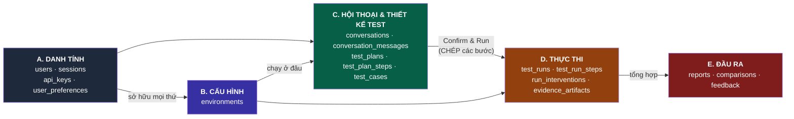
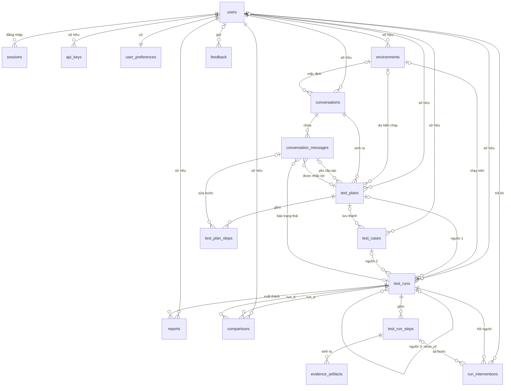

# 🗄️ Giải thích Database — Từng bảng và quan hệ giữa chúng

> **Dự án:** AI Agent Tester · **Hệ quản trị:** PostgreSQL · **Số bảng:** 17
>
> Tài liệu này giải thích **bằng lời** ý nghĩa của từng bảng và cách các bảng nối với nhau. Câu lệnh `CREATE TABLE` đầy đủ (kiểu dữ liệu, ràng buộc, index) nằm ở `BACKEND_STRUCTURE_PLAN.md` **mục 10.4**, và đó là nguồn chuẩn. Khi hai tài liệu lệch nhau thì sửa theo mục 10.4.

**Mục lục**
1. Khái niệm cần biết trước
2. Bức tranh tổng thể (5 nhóm bảng)
3. Giải thích từng bảng (17 bảng)
4. Tổng hợp toàn bộ quan hệ
5. Ví dụ: một lần test đi qua các bảng như thế nào
6. Những gì cố ý KHÔNG lưu

---

## 1. Khái niệm cần biết trước

| Thuật ngữ | Nghĩa | Ví dụ trong dự án |
|---|---|---|
| **Bảng (table)** | Một loại dữ liệu, giống một sheet Excel. Mỗi dòng là một bản ghi | Bảng `test_runs`: mỗi dòng là 1 lần chạy test |
| **Khoá chính (PK)** | Cột định danh duy nhất của mỗi dòng, không trùng, không rỗng | `test_runs.id = 'RUN-9421'` |
| **Khoá ngoại (FK)** | Cột trỏ tới khoá chính của bảng khác. Đây là thứ tạo ra "quan hệ" | `test_runs.owner_id` trỏ tới `users.id` → run này của ai |
| **Quan hệ 1–1** | 1 dòng bên A ứng với đúng 1 dòng bên B | 1 user có đúng 1 dòng cài đặt `user_preferences` |
| **Quan hệ 1–N** | 1 dòng bên A có nhiều dòng bên B | 1 run có nhiều step |
| **Quan hệ tự trỏ** | Bảng có FK trỏ về chính nó | Run chạy lại trỏ về run gốc (`rerun_of`) |
| **Bắt buộc / tuỳ chọn** | FK có `NOT NULL` thì bắt buộc phải có, còn không thì được để trống | Run **bắt buộc** có chủ, nhưng **không bắt buộc** có plan (có thể đến từ test case) |
| **`ON DELETE CASCADE`** | Xoá dòng cha thì các dòng con **bị xoá theo** | Xoá run → xoá luôn các step của nó |
| **`ON DELETE SET NULL`** | Xoá dòng cha thì dòng con **giữ lại**, chỉ xoá liên kết | Xoá environment → run cũ vẫn còn, `environment_id` thành trống |
| **JSONB** | Cột lưu dữ liệu dạng JSON, cấu trúc linh hoạt, vẫn truy vấn được | `test_runs.config = {"max_steps": 30, "headless": false}` |

**Quy ước ID:** mọi khoá chính là chuỗi có tiền tố cho dễ đọc: `USR-` (user), `ENV-` (environment), `CNV-` (phiên chat), `MSG-` (tin nhắn), `PLN-` (plan), `TC-` (test case), `RUN-` (lần chạy), `RPT-` (báo cáo), `CMP-` (so sánh). Frontend đang hiện trực tiếp các ID dạng `RUN-9421`, `RPT-2201`.

**Cách đọc ký hiệu quan hệ trong tài liệu này:**
- `A 1 ── N B`: 1 dòng A có nhiều dòng B.
- `A 1 ── 1 B`: 1 dòng A có đúng 1 dòng B.
- `A 0..1 ── N B`: dòng B có thể có hoặc không có A (FK tuỳ chọn).

---

## 2. Bức tranh tổng thể

17 bảng chia thành 5 nhóm, đi theo đúng thứ tự người dùng thao tác trên giao diện:

| Nhóm | Trả lời câu hỏi | Dữ liệu có sửa được không? |
|---|---|---|
| **A. Danh tính** | Ai đang dùng hệ thống? Họ cài đặt gì? | Có |
| **B. Cấu hình** | Test chạy trên website nào, trình duyệt nào, LLM nào? | Có |
| **C. Hội thoại & thiết kế** | User đã chat gì với AI? AI sinh ra kịch bản test nào? | Có (riêng tin nhắn thì chỉ ghi thêm) |
| **D. Thực thi** | Test **đã thực sự chạy** ra sao? Bước nào pass, bước nào fail, có bằng chứng gì? | **Không.** Chạy xong là thành lịch sử cố định |
| **E. Đầu ra** | Kết quả được xuất báo cáo, so sánh, góp ý thế nào? | Có |

**Hai ý quan trọng nhất của cả thiết kế:**
1. **Mọi dữ liệu đều có chủ.** Hầu hết bảng có cột `owner_id` trỏ về `users`. Nhờ vậy user A không bao giờ thấy dữ liệu của user B.
2. **Nhóm C (bản thiết kế) tách hẳn khỏi nhóm D (lịch sử).** Khi bấm *Confirm & Run*, các bước được **chép** từ plan sang run. Sau đó user có sửa hay xoá plan thì lịch sử run cũ vẫn nguyên vẹn. Giống như chụp ảnh lại bản vẽ trước khi thi công.

---

## 3. Giải thích từng bảng

Mỗi bảng được giải thích theo cùng một khuôn: **Là gì**, **Dùng ở màn hình nào**, **Các cột quan trọng**, **Quan hệ**, **Ví dụ dữ liệu**.

---

### Nhóm A — Danh tính

#### 1. `users` — Tài khoản người dùng

**Là gì:** mỗi dòng là một người dùng. Đây là bảng **gốc** của cả database, gần như mọi bảng khác đều trỏ về đây.

**Dùng ở:** form Sign In / Sign Up (`AuthModal`), chữ "User: admin123" trên header, tab Settings › Profile.

| Cột | Ý nghĩa |
|---|---|
| `id` | Mã user, ví dụ `USR-7F3A21C4` |
| `email` | Email đăng nhập, không trùng, lưu chữ thường |
| `username` | Tên đăng nhập ngắn (`admin123`), không trùng |
| `display_name` | Tên hiển thị, lấy từ ô "Full Name" khi đăng ký |
| `password_hash` | Mật khẩu **đã băm** bằng Argon2id. **Không bao giờ lưu mật khẩu gốc** |
| `is_active` | `false` = tài khoản bị khoá. Hệ thống không xoá user, chỉ khoá |

**Quan hệ:**
- `users 1 ── N sessions`: một người đăng nhập trên nhiều máy.
- `users 1 ── 1 user_preferences`: mỗi người có một bộ cài đặt.
- `users 1 ── N` gần như mọi bảng khác (`api_keys`, `environments`, `conversations`, `test_plans`, `test_cases`, `test_runs`, `reports`, `comparisons`) qua cột `owner_id`.
- Xoá user thì **mọi thứ của họ bị xoá theo** (CASCADE). Riêng `feedback` vẫn giữ lại (SET NULL), vì góp ý vẫn có giá trị với nhóm phát triển.

**Ví dụ:** `USR-7F3A21C4 | admin123@example.com | admin123 | Administrator | $argon2id$… | true`

---

#### 2. `sessions` — Phiên đăng nhập

**Là gì:** mỗi lần đăng nhập thành công tạo ra 1 dòng. Trình duyệt giữ một token trong cookie, còn DB chỉ lưu **bản băm** của token đó.

**Dùng ở:** đăng nhập, nút Log Out, và kiểm tra "user này đã đăng nhập chưa" ở mỗi request.

| Cột | Ý nghĩa |
|---|---|
| `user_id` | Phiên này của ai |
| `token_hash` | Hash của token. Lỡ lộ DB thì kẻ gian cũng không dùng được token |
| `expires_at` | Hết hạn lúc nào (ví dụ sau 7 ngày) |
| `revoked_at` | Có giá trị = user đã bấm Log Out, phiên không còn dùng được |
| `user_agent` | Trình duyệt/thiết bị đã đăng nhập |

**Quan hệ:** `users 1 ── N sessions` (bắt buộc có user). Xoá user thì các phiên bị xoá theo.

**Vì sao không lưu token gốc?** Giống mật khẩu: DB chỉ cần kiểm tra "token gửi lên có khớp không", không cần biết token gốc là gì.

---

#### 3. `api_keys` — API key LLM của từng user

**Là gì:** key để gọi Gemini, OpenAI, Anthropic… mà user nhập ở Settings › API Keys. Mỗi user có tối đa **1 key cho mỗi provider**.

**Dùng ở:** tab Settings › API Keys (hiện "Configured / Not configured"), và agent đọc key này khi chạy test.

| Cột | Ý nghĩa |
|---|---|
| `owner_id` | Key của ai |
| `provider` | Một trong 7 giá trị: `google`, `openai`, `anthropic`, `openrouter`, `deepseek`, `azure`, `hub1` |
| `encrypted_key` | Key **đã mã hoá** (Fernet). Khoá giải mã nằm trong biến môi trường, không nằm trong DB |
| `last4` | 4 ký tự cuối để UI hiện `sk-…abcd` |
| `config` | JSONB cho cấu hình thêm, ví dụ Azure cần `endpoint` và `deployment` |

**Quan hệ:** `users 1 ── N api_keys`. Cặp (`owner_id`, `provider`) không được trùng.

**Khác gì với mật khẩu?** Mật khẩu chỉ cần băm vì không bao giờ cần lấy lại. API key thì phải **mã hoá**, vì hệ thống cần giải mã ra để gọi LLM. API không bao giờ trả key gốc về frontend.

---

#### 4. `user_preferences` — Cài đặt cá nhân

**Là gì:** các tuỳ chọn giao diện và thông báo của một user.

**Dùng ở:** nút đổi theme ☀️/🌙 trên header, Settings › Appearance và Notifications.

| Cột | Ý nghĩa |
|---|---|
| `user_id` | Vừa là khoá chính vừa là khoá ngoại, vì mỗi user chỉ có đúng 1 dòng |
| `theme` | `light` hoặc `dark`. Mặc định `light`, giống `App.tsx` |
| `notifications` | JSONB, ví dụ `{"email_on_fail": true}` |

**Quan hệ:** `users 1 ── 1 user_preferences`. Đây là quan hệ **1–1 duy nhất** trong database. Dòng này được tạo tự động khi user đăng ký.

**Vì sao không gộp vào `users`?** Để bảng `users` chỉ chứa thông tin đăng nhập, gọn và ít thay đổi. Sau này muốn thêm tuỳ chọn thì chỉ đụng tới bảng này.

---

### Nhóm B — Cấu hình

#### 5. `environments` — Môi trường chạy test

**Là gì:** mô tả **chạy test ở đâu và bằng gì**: website nào, trình duyệt nào, có hiện cửa sổ không, dùng LLM nào.

**Dùng ở:** trang Environments (bảng danh sách, form Add/Edit, nút Test Connection).

| Cột | Ý nghĩa |
|---|---|
| `owner_id` | Môi trường của ai |
| `name` | Tên, ví dụ "Staging". Không trùng tên trong cùng một user |
| `base_url` | Địa chỉ website cần test, ví dụ `https://test.com` |
| `browser` | `chromium`, `firefox`, `webkit` hoặc `headless_node` |
| `headless` | `true` = chạy ẩn, `false` = hiện cửa sổ trình duyệt |
| `viewport_width/height` | Kích thước màn hình giả lập, mặc định 1920×1080 |
| `llm_provider`, `llm_model` | LLM mặc định, ví dụ `google` / `gemini-2.0-flash` |
| `last_check_status`, `last_checked_at` | Kết quả lần bấm **Test Connection** gần nhất (`connected` / `error`) |

**Quan hệ:**
- `users 1 ── N environments`.
- `environments 0..1 ── N conversations`: phiên chat có thể chọn sẵn môi trường mặc định.
- `environments 0..1 ── N test_plans` và `environments 0..1 ── N test_runs`.
- Xoá environment thì plan và run **vẫn còn** (SET NULL). Run cũ vẫn hiện đúng tên môi trường, vì `test_runs` đã tự chép lại `environment_name` và `browser` lúc chạy (xem bảng 11).

---

### Nhóm C — Hội thoại & thiết kế test

Nhóm này phục vụ toàn bộ trang **New Test**: khung chat bên trái, bảng plan bên phải, sidebar Session History.

#### 6. `conversations` — Phiên chat với AI

**Là gì:** một **phiên làm việc** trên trang New Test. Mỗi mục trong sidebar Session History là 1 dòng ở bảng này. Đây là **gốc** của nhóm C: tin nhắn và plan đều thuộc về một phiên.

**Dùng ở:** chữ "Session #482" ở đầu khung chat, sidebar Session History (nhóm Today / Yesterday / Older, ô tìm kiếm).

| Cột | Ý nghĩa |
|---|---|
| `id` | `CNV-…`. Chính là `session_id` mà `api.ts` đang gửi lên |
| `owner_id` | Phiên của ai |
| `seq_no` | Số thứ tự hiển thị ("Session **#482**"), đếm riêng cho từng user |
| `title` | Tên phiên, ví dụ "Forgot Password E2E Flow". AI tự đặt từ prompt đầu, user sửa được |
| `environment_id` | Môi trường mặc định của phiên (tuỳ chọn) |
| `llm_provider`, `llm_model` | LLM dùng cho các lần chat trong phiên |
| `last_message_at` | Thời điểm tin nhắn cuối, dùng để xếp vào Today / Yesterday / Older |
| `archived_at` | Có giá trị = ẩn khỏi sidebar nhưng **không xoá** lịch sử |

**Quan hệ:**
- `users 1 ── N conversations`.
- `conversations 1 ── N conversation_messages`: các tin nhắn trong phiên.
- `conversations 1 ── N test_plans`: các **phiên bản** plan sinh ra trong phiên.
- Xoá phiên thì tin nhắn và plan bị xoá theo. **Run đã chạy thì vẫn giữ lại**, xem quy tắc ở bảng 11.

---

#### 7. `conversation_messages` — Từng tin nhắn trong phiên

**Là gì:** mỗi bong bóng chat là 1 dòng: tin của user, tin của "Planner Agent", tin hệ thống như "Test status: completed".

**Dùng ở:** khung Conversation ở trang New Test. Khi mở lại một phiên cũ, backend đọc bảng này theo đúng thứ tự để hiện lại cuộc trò chuyện và gửi làm ngữ cảnh cho AI.

| Cột | Ý nghĩa |
|---|---|
| `conversation_id` | Thuộc phiên nào |
| `seq` | Thứ tự trong phiên: 1, 2, 3… Không trùng trong cùng phiên |
| `role` | `user` (người gõ), `assistant` (AI trả lời) hoặc `system` (thông báo tự động) |
| `agent` | Agent nào nói, để hiện nhãn "Planner Agent". Trống nếu `role='user'` |
| `kind` | Loại tin: `text`, `plan_created` (thẻ "📋 Created: …"), `plan_updated`, `run_started`, `run_status` |
| `content` | Nội dung tin nhắn |
| `plan_id` | Tin này nói về plan nào (tuỳ chọn) |
| `run_id` | Tin này nói về run nào (tuỳ chọn) |
| `llm_provider`, `llm_model`, `prompt_tokens`, `completion_tokens`, `latency_ms` | Chỉ có ở tin do AI sinh, dùng để theo dõi chi phí và tốc độ |

**Quan hệ:**
- `conversations 1 ── N conversation_messages` (bắt buộc, CASCADE).
- `conversation_messages N ── 0..1 test_plans` qua `plan_id`: ví dụ tin "📋 Created: Verify Forgot Password" trỏ tới plan vừa tạo.
- `conversation_messages N ── 0..1 test_runs` qua `run_id`: ví dụ tin "Test status: completed" trỏ tới run tương ứng.
- **Quan hệ hai chiều với `test_plans`:** plan cũng trỏ ngược về tin nhắn đã yêu cầu tạo ra nó (`test_plans.source_message_id`). Vì hai bảng trỏ lẫn nhau nên khi tạo bảng, FK này phải khai báo **sau cùng** (`ALTER TABLE … ADD CONSTRAINT`).

**Quy tắc:** tin nhắn **chỉ ghi thêm**, không sửa, không xoá từng tin. Lịch sử chat là bằng chứng AI đã được yêu cầu những gì.

---

#### 8. `test_plans` — Kịch bản test do AI sinh

**Là gì:** một **phiên bản** kịch bản test. Mỗi lần AI sinh lại (bấm "Run Again" hoặc yêu cầu sửa lớn qua chat) sẽ tạo phiên bản mới, `version` tăng 1. Phiên bản cũ vẫn được giữ.

**Dùng ở:** khung "AI Generated Structured Test Plan" trên trang New Test.

| Cột | Ý nghĩa |
|---|---|
| `id` | `PLN-…` |
| `owner_id` | Của ai |
| `conversation_id` | Sinh ra trong phiên chat nào (bắt buộc) |
| `version` | Phiên bản 1, 2, 3… Không trùng trong cùng phiên |
| `source_message_id` | Tin nhắn của user đã yêu cầu sinh plan này |
| `environment_id` | Môi trường dự kiến chạy (tuỳ chọn) |
| `objective` | Mục tiêu, ví dụ "Verify Forgot Password flow" |
| `target_url` | URL cần test |
| `preconditions` | JSONB, danh sách điều kiện trước khi chạy |
| `test_data` | JSONB, dữ liệu test, ví dụ `{"email": "user@test.com"}` |
| `llm_provider`, `llm_model` | AI nào đã sinh plan này |
| `status` | `draft` (đang soạn, còn sửa được) hoặc `approved` (đã bấm Confirm & Run) |

**Quan hệ:**
- `conversations 1 ── N test_plans`.
- `test_plans 1 ── N test_plan_steps`: các bước của plan.
- `test_plans 0..1 ── N test_cases`: plan được "Save as Test Case".
- `test_plans 0..1 ── N test_runs`: một plan có thể được chạy nhiều lần.

**Vì sao cần phiên bản?** Để biết chính xác **run nào đã chạy theo bản plan nào**. Nếu chỉ ghi đè lên plan cũ thì sau khi sửa sẽ không còn biết lần chạy hôm qua dùng những bước gì.

---

#### 9. `test_plan_steps` — Các bước trong kịch bản

**Là gì:** mỗi dòng trong bảng plan (#, Action, Selector, Expected) là 1 dòng ở bảng này.

**Dùng ở:** bảng plan trên trang New Test, gồm các thao tác Edit Directly, + Add Step và xoá bước.

| Cột | Ý nghĩa |
|---|---|
| `plan_id` | Thuộc plan nào |
| `step_no` | Thứ tự bước: 1, 2, 3… Không trùng trong cùng plan |
| `action` | Hành động, ví dụ "Click Element" |
| `selector` | Phần tử cần thao tác, ví dụ `#forgot-password-link` |
| `expected` | Kết quả mong đợi |
| `source` | Nguồn gốc bước, ứng với cột **Source** trên UI: `original` (AI sinh), `chat_edit` (sửa qua chat), `manual` (user tự sửa) |
| `source_message_id` | Tin nhắn chat nào đã sửa bước này (nếu `source='chat_edit'`) |

**Quan hệ:**
- `test_plans 1 ── N test_plan_steps` (bắt buộc, CASCADE).
- `conversation_messages 0..1 ── N test_plan_steps`: bước được sửa bởi tin nhắn nào.

**Quy tắc:** chỉ sửa được khi plan còn `draft`. Plan đã `approved` thì bị khoá, muốn sửa phải tạo phiên bản mới.

---

#### 10. `test_cases` — Test case lưu để dùng lại

**Là gì:** plan được bấm **"Save as Test Case"** để chạy lại nhiều lần, như một thư viện kịch bản mẫu.

**Dùng ở:** nút Save as Test Case trên trang New Test, và trang Test Cases (hiện đang "Coming Soon").

| Cột | Ý nghĩa |
|---|---|
| `id` | `TC-…` |
| `owner_id` | Của ai |
| `source_plan_id` | Được lưu từ plan nào (tuỳ chọn) |
| `name` | Tên test case |
| `suite` | Nhóm, ví dụ "Authentication", "E-Commerce" |
| `tags` | Mảng nhãn, ví dụ `{login, smoke}` |
| `steps` | JSONB, **bản chụp** các bước tại thời điểm lưu |

**Quan hệ:**
- `users 1 ── N test_cases`.
- `test_plans 0..1 ── N test_cases`. Xoá plan thì test case **vẫn còn** (SET NULL), vì các bước đã được chép vào cột `steps`.
- `test_cases 0..1 ── N test_runs`: chạy một test case sẽ tạo run mới.

**Vì sao chép `steps` thay vì trỏ tới `test_plan_steps`?** Để test case sống độc lập. Plan gốc có bị sửa hay xoá theo phiên chat thì test case vẫn nguyên.

---

### Nhóm D — Thực thi

Nhóm này ghi lại **chuyện gì đã thực sự xảy ra** khi test chạy. Dữ liệu ở đây là **lịch sử**: chạy xong thì không ai sửa nữa.

#### 11. `test_runs` — Một lần chạy test ⭐

**Là gì:** mỗi lần bấm **Confirm & Run**, **Re-run** hoặc chạy một test case sẽ tạo 1 dòng. Đây là bảng **trung tâm** của cả hệ thống, và `id` của nó chính là `task_id` mà frontend đang dùng.

**Dùng ở:** trang Test Runs (bảng, bộ lọc, phân trang), Recent Runs và 5 thẻ số liệu trên Dashboard, phần Execution của New Test, RunDetailModal.

| Cột | Ý nghĩa |
|---|---|
| `id` | `RUN-…` |
| `owner_id` | Của ai |
| `plan_id` | Chạy từ plan nào (nguồn 1, tuỳ chọn) |
| `test_case_id` | Chạy từ test case nào (nguồn 2, tuỳ chọn) |
| `rerun_of` | Chạy lại từ run nào (nguồn 3, tuỳ chọn, **trỏ về chính bảng này**) |
| `environment_id` | Chạy trên môi trường nào (tuỳ chọn) |
| `name`, `suite` | **Chép lại** lúc chạy, là cột NAME và SUITE trên bảng Test Runs |
| `environment_name`, `browser` | **Chép lại** lúc chạy, là cột ENV và BROWSER |
| `config` | JSONB: `max_steps`, `headless`, LLM, simulator… đúng như lúc bấm chạy |
| `status` | `queued` → `running` → `completed` / `failed` / `cancelled`, có thể qua `paused` và `waiting_human_input`. Chỉ được đổi theo state machine (mục 9.5 của plan) |
| `current_step` | Đang ở bước mấy, dùng cho dòng "Executing Step 3 of 6" |
| `error_message` | Lỗi nếu `failed` |
| `created_at`, `started_at`, `finished_at` | Lúc tạo, lúc worker bắt đầu, lúc kết thúc |

**Quan hệ:**
- `users 1 ── N test_runs`.
- **3 nguồn gốc, đều tuỳ chọn:** `test_plans 0..1 ── N test_runs`, `test_cases 0..1 ── N test_runs`, `test_runs 0..1 ── N test_runs` (qua `rerun_of`).
- `environments 0..1 ── N test_runs`.
- `test_runs 1 ── N test_run_steps`, `test_runs 1 ── N run_interventions`: con của run, bị xoá theo run.
- `test_runs 1 ── N reports`, `test_runs 1 ── N comparisons`: đầu ra, cũng bị xoá theo run.
- `test_runs 0..1 ── N conversation_messages`: tin "Test status" trong chat.

**Hai quyết định thiết kế quan trọng:**
1. **Vì sao chép `name`, `environment_name`, `browser`?** Nếu chỉ lưu `environment_id` thì khi environment "Staging" bị đổi tên hoặc xoá, bảng Test Runs sẽ hiện sai hoặc trống. Chép lại lúc chạy thì lịch sử luôn đúng với thực tế lúc đó.
2. **Vì sao xoá plan thì run vẫn còn?** Vì run là **lịch sử**. Xoá phiên chat là dọn dẹp bản nháp, còn kết quả test đã chạy thì phải giữ lại cho Reports, Comparisons và Dashboard.

---

#### 12. `test_run_steps` — Kết quả từng bước của một lần chạy

**Là gì:** khi run được tạo, các bước được **chép** từ plan (hoặc test case) vào bảng này. Sau đó worker điền kết quả vào từng dòng khi chạy.

**Dùng ở:** Execution Timeline (✓ Passed / ⚡ Running / Pending), ô "Agent Observation", cột STEPS P/F ở Test Runs, timeline trong RunDetailModal.

| Cột | Ý nghĩa |
|---|---|
| `run_id` | Thuộc run nào |
| `step_no` | Thứ tự bước |
| `action`, `selector`, `expected` | **Chép** từ plan lúc bắt đầu chạy |
| `status` | `pending` → `running` → `passed` / `failed` / `skipped` |
| `observation` | Agent quan sát thấy gì, hiện ở ô "AGENT OBSERVATION" |
| `started_at`, `duration_ms` | Bắt đầu lúc nào, mất bao lâu |

**Quan hệ:**
- `test_runs 1 ── N test_run_steps` (bắt buộc, CASCADE).
- `test_run_steps 1 ── N evidence_artifacts`: mỗi bước có nhiều bằng chứng.
- `test_run_steps 0..1 ── N run_interventions`: agent hỏi user ở bước nào.

**Vì sao không dùng luôn `test_plan_steps`?** Đây chính là "tách bản thiết kế khỏi lịch sử". Nếu run trỏ thẳng vào bước của plan, thì khi user sửa plan, kết quả run cũ sẽ bị gắn với những bước chưa từng chạy.

---

#### 13. `run_interventions` — Những lần AI dừng lại hỏi người

**Là gì:** mỗi lần agent cần con người giúp (nhập OTP, xác nhận một thao tác) là 1 dòng. Bảng này lưu cả câu hỏi và câu trả lời.

**Dùng ở:** khung vàng **"⚠️ HUMAN INTERVENTION REQUIRED"** trên trang New Test, cùng nút Submit.

| Cột | Ý nghĩa |
|---|---|
| `run_id` | Thuộc run nào |
| `step_id` | Hỏi ở bước nào (tuỳ chọn) |
| `kind` | `input` (cần nhập chữ, ví dụ OTP) hoặc `approval` (cần đồng ý/từ chối) |
| `question` | Câu hỏi hiện trong khung vàng |
| `answer` | Câu trả lời. **Bị che** nếu là bí mật, ví dụ OTP thành `••••56` |
| `decision` | `approved` / `rejected`, chỉ dùng khi `kind='approval'` |
| `answered_by` | Ai đã trả lời |
| `asked_at`, `answered_at` | Lúc hỏi, lúc trả lời. `answered_at` trống = **đang chờ** |

**Quan hệ:**
- `test_runs 1 ── N run_interventions` (CASCADE).
- `test_run_steps 0..1 ── N run_interventions`.
- `users 0..1 ── N run_interventions` qua `answered_by`.

**Ràng buộc đặc biệt:** mỗi run **chỉ được có 1 câu hỏi đang chờ** tại một thời điểm. Điều này được đảm bảo bằng một unique index có điều kiện `WHERE answered_at IS NULL`.

---

#### 14. `evidence_artifacts` — Bằng chứng của từng bước

**Là gì:** các bằng chứng thu được khi chạy một bước. Có 5 loại, ứng với đúng 5 tab của **Evidence Inspector**.

**Dùng ở:** Evidence Inspector trên trang New Test và trong RunDetailModal. Comparisons cũng đọc bảng này để so sánh 2 run.

| Cột | Ý nghĩa |
|---|---|
| `step_id` | Thuộc bước nào |
| `kind` | Loại bằng chứng (bảng dưới) |
| `storage_key` | Đường dẫn file lớn (ảnh, video) trên ổ đĩa hoặc S3 |
| `payload` | JSONB chứa dữ liệu nhỏ, cấu trúc tuỳ theo `kind` |

Phải có ít nhất một trong hai cột `storage_key` hoặc `payload`.

| `kind` | Tab trên UI | Lưu gì |
|---|---|---|
| `network` | API Validation | `payload`: method, URL, status code, thời gian, expected vs actual, body |
| `screenshot` | Screenshot | File ảnh (`storage_key`) và selector được highlight (`payload`) |
| `agent_log` | Agent Log | `payload`: các dòng log có thời gian và mức INFO/TRACE/ACTION/SUCCESS |
| `console` | Console | `payload`: các dòng console của trình duyệt |
| `visual_diff` | Visual Diff | Ảnh diff (`storage_key`) và % khác biệt so với baseline (`payload`) |

**Quan hệ:** `test_run_steps 1 ── N evidence_artifacts` (CASCADE). Bảng này **chỉ ghi thêm**, không sửa.

**Vì sao ảnh không lưu trong DB?** Ảnh và video rất nặng. Nhét vào DB sẽ làm DB phình to, backup chậm và truy vấn chậm theo. DB chỉ giữ đường dẫn, còn file nằm trên ổ đĩa hoặc S3.

---

### Nhóm E — Đầu ra

#### 15. `reports` — Báo cáo xuất từ một run

**Là gì:** file báo cáo (Markdown hoặc PDF) được tạo từ một run, kèm link chia sẻ nếu có.

**Dùng ở:** trang Reports (bảng, nút + Generate Report, Download, Share).

| Cột | Ý nghĩa |
|---|---|
| `id` | `RPT-…` |
| `owner_id` | Của ai |
| `run_id` | Báo cáo cho run nào (**bắt buộc**) |
| `name` | Tên báo cáo |
| `format` | `markdown` hoặc `pdf` |
| `storage_key` | Đường dẫn file đã xuất |
| `share_token` | Mã chia sẻ. Trống = chưa chia sẻ |

**Quan hệ:** `test_runs 1 ── N reports` (CASCADE). Một run có thể xuất nhiều báo cáo, ví dụ một bản MD và một bản PDF.

**Lưu ý:** phần "Report Detail" (Result, Duration, Failed Step) **không lưu** ở bảng này mà đọc thẳng từ run liên kết, để không bị lệch với dữ liệu gốc.

---

#### 16. `comparisons` — Cặp run được lưu để so sánh

**Là gì:** một cặp **Run A (Baseline)** và **Run B (Candidate)** mà user muốn lưu lại hoặc chia sẻ.

**Dùng ở:** trang Comparisons.

| Cột | Ý nghĩa |
|---|---|
| `id` | `CMP-…` |
| `owner_id` | Của ai |
| `run_a_id` | Run gốc để so (Baseline) |
| `run_b_id` | Run cần kiểm tra (Candidate) |
| `name`, `share_token` | Tên và mã chia sẻ (tuỳ chọn) |

**Quan hệ:** bảng này có **2 khoá ngoại cùng trỏ về `test_runs`**:
- `test_runs 1 ── N comparisons` qua `run_a_id`.
- `test_runs 1 ── N comparisons` qua `run_b_id`.

**Ràng buộc:** `run_a_id` phải khác `run_b_id` (không so một run với chính nó), và mỗi user không lưu trùng cùng một cặp.

**Lưu ý:** bấm **Compare** **không ghi** gì vào DB. Toàn bộ kết quả (Time Difference, Changed Steps, Step Differences, API Diff) được **tính ngay** từ `test_run_steps` và `evidence_artifacts` của 2 run. Bảng này chỉ dùng khi user muốn **lưu hoặc chia sẻ** một lần so sánh.

---

#### 17. `feedback` — Góp ý của người dùng

**Là gì:** góp ý gửi từ form Feedback ở cuối Dashboard.

**Dùng ở:** form "Help us improve your testing workflow" trên Dashboard.

| Cột | Ý nghĩa |
|---|---|
| `user_id` | Ai gửi. **Tuỳ chọn**, vì hiện chưa có đăng nhập thật |
| `rating` | Số sao 1–5 |
| `category` | `Product experience`, `Bug report`, `Feature request` hoặc `Other` |
| `message` | Nội dung, từ 1 đến 500 ký tự, khớp với `maxLength` của ô nhập |

**Quan hệ:** `users 0..1 ── N feedback` (SET NULL). Xoá user thì góp ý vẫn được giữ lại.

**Hiện trạng code:** backend đang ghi feedback ra file `backend/data/feedback.jsonl`. Khi có PostgreSQL thì chuyển sang bảng này.

---

## 4. Tổng hợp toàn bộ quan hệ

### 4.1 Sơ đồ quan hệ (chỉ hiện khoá)

Cách đọc ký hiệu: `||` = đúng 1, `|o` = 0 hoặc 1, `o{` = 0 hoặc nhiều.

### 4.2 Bảng tất cả khoá ngoại

| # | Bảng con › cột | Trỏ tới | Kiểu | Bắt buộc? | Khi xoá bảng cha |
|:-:|---|---|:-:|:-:|---|
| 1 | `sessions.user_id` | `users` | 1–N | ✅ | Xoá theo |
| 2 | `api_keys.owner_id` | `users` | 1–N | ✅ | Xoá theo |
| 3 | `user_preferences.user_id` | `users` | **1–1** | ✅ | Xoá theo |
| 4 | `environments.owner_id` | `users` | 1–N | ✅ | Xoá theo |
| 5 | `conversations.owner_id` | `users` | 1–N | ✅ | Xoá theo |
| 6 | `conversations.environment_id` | `environments` | 1–N | — | Giữ lại, để trống |
| 7 | `conversation_messages.conversation_id` | `conversations` | 1–N | ✅ | Xoá theo |
| 8 | `conversation_messages.plan_id` | `test_plans` | 1–N | — | Giữ lại, để trống |
| 9 | `conversation_messages.run_id` | `test_runs` | 1–N | — | Giữ lại, để trống |
| 10 | `test_plans.owner_id` | `users` | 1–N | ✅ | Xoá theo |
| 11 | `test_plans.conversation_id` | `conversations` | 1–N | ✅ | Xoá theo |
| 12 | `test_plans.source_message_id` | `conversation_messages` | 1–N | — | Giữ lại, để trống |
| 13 | `test_plans.environment_id` | `environments` | 1–N | — | Giữ lại, để trống |
| 14 | `test_plan_steps.plan_id` | `test_plans` | 1–N | ✅ | Xoá theo |
| 15 | `test_plan_steps.source_message_id` | `conversation_messages` | 1–N | — | Giữ lại, để trống |
| 16 | `test_cases.owner_id` | `users` | 1–N | ✅ | Xoá theo |
| 17 | `test_cases.source_plan_id` | `test_plans` | 1–N | — | Giữ lại, để trống |
| 18 | `test_runs.owner_id` | `users` | 1–N | ✅ | Xoá theo |
| 19 | `test_runs.plan_id` | `test_plans` | 1–N | — | **Giữ lại** (run là lịch sử) |
| 20 | `test_runs.test_case_id` | `test_cases` | 1–N | — | **Giữ lại** |
| 21 | `test_runs.rerun_of` | `test_runs` (chính nó) | 1–N | — | Giữ lại, để trống |
| 22 | `test_runs.environment_id` | `environments` | 1–N | — | Giữ lại, để trống |
| 23 | `test_run_steps.run_id` | `test_runs` | 1–N | ✅ | Xoá theo |
| 24 | `run_interventions.run_id` | `test_runs` | 1–N | ✅ | Xoá theo |
| 25 | `run_interventions.step_id` | `test_run_steps` | 1–N | — | Giữ lại, để trống |
| 26 | `run_interventions.answered_by` | `users` | 1–N | — | Giữ lại, để trống |
| 27 | `evidence_artifacts.step_id` | `test_run_steps` | 1–N | ✅ | Xoá theo |
| 28 | `reports.owner_id` | `users` | 1–N | ✅ | Xoá theo |
| 29 | `reports.run_id` | `test_runs` | 1–N | ✅ | Xoá theo |
| 30 | `comparisons.owner_id` | `users` | 1–N | ✅ | Xoá theo |
| 31 | `comparisons.run_a_id` | `test_runs` | 1–N | ✅ | Xoá theo |
| 32 | `comparisons.run_b_id` | `test_runs` | 1–N | ✅ | Xoá theo |
| 33 | `feedback.user_id` | `users` | 1–N | — | Giữ lại, để trống |

### 4.3 Quy luật xoá, tóm gọn thành 3 câu
1. **Xoá "cha sở hữu" thì xoá hết con.** Xoá user → mất toàn bộ dữ liệu của user. Xoá run → mất step, evidence, câu hỏi, report, comparison của run đó.
2. **Xoá "nguồn tham khảo" thì con vẫn sống.** Xoá environment, plan hay test case thì run đã chạy vẫn còn, chỉ mất liên kết.
3. **Lịch sử không bao giờ bị xoá gián tiếp.** Cách duy nhất để mất một run là xoá chính run đó (hoặc xoá user sở hữu nó).

---

## 5. Ví dụ: một lần test đi qua các bảng như thế nào

Kịch bản: user `admin123` vào New Test, gõ *"Test the password reset feature on test.com"*, sửa 1 bước, bấm Confirm & Run. Tới bước 4 thì trang yêu cầu OTP, user nhập OTP, test chạy xong. Sau đó user xuất báo cáo PDF.

| # | Thao tác trên UI | Bảng bị ghi | Dữ liệu |
|:-:|---|---|---|
| 1 | Mở New Test, gõ prompt, bấm Send | `conversations` | `CNV-01`, owner `USR-01`, `seq_no=482`, title "Password reset" |
| | | `conversation_messages` | `MSG-01`, seq 1, role `user`, content "Test the password reset…" |
| 2 | AI sinh plan 6 bước | `test_plans` | `PLN-01`, `CNV-01`, `version=1`, `source_message_id=MSG-01`, status `draft` |
| | | `test_plan_steps` | 6 dòng, `source='original'` |
| | | `conversation_messages` | `MSG-02`, seq 2, role `assistant`, agent `planner`, kind `plan_created`, `plan_id=PLN-01` |
| 3 | Edit Directly, sửa selector bước 3 | `test_plan_steps` | Bước 3 đổi `selector`, `source='manual'` |
| 4 | Bấm Confirm & Run | `test_plans` | `PLN-01` chuyển `approved` (bị khoá, không sửa được nữa) |
| | | `test_runs` | `RUN-01`, `plan_id=PLN-01`, status `queued`, chép `name`, `environment_name`, `browser`, `config` |
| | | `test_run_steps` | **Chép** 6 bước từ `test_plan_steps`, tất cả `pending` |
| | | `conversation_messages` | `MSG-03`, kind `run_started`, `run_id=RUN-01` |
| 5 | Worker chạy bước 1 → 3 | `test_runs` | status `running`, `current_step` tăng dần |
| | | `test_run_steps` | Bước 1–3 `passed`, có `observation`, `duration_ms` |
| | | `evidence_artifacts` | Mỗi bước vài dòng: `screenshot`, `agent_log`, `network`… |
| 6 | Bước 4 cần OTP, khung vàng hiện | `test_runs` | status `waiting_human_input` |
| | | `run_interventions` | `kind='input'`, question "Enter the OTP sent to email", `answered_at` trống |
| 7 | User nhập OTP, bấm Submit | `run_interventions` | `answer='••••56'` (đã che), `answered_by=USR-01`, có `answered_at` |
| | | `test_runs` | status quay lại `running` |
| 8 | Bước 4 → 6 chạy xong | `test_run_steps`, `evidence_artifacts` | Các bước còn lại `passed` kèm bằng chứng |
| | | `test_runs` | status `completed`, có `finished_at` |
| | | `conversation_messages` | `MSG-04`, kind `run_status`, "Test status: completed" |
| 9 | Vào Reports, Generate Report PDF | `reports` | `RPT-01`, `run_id=RUN-01`, format `pdf`, `storage_key` |
| 10 | Vào Test Runs, bấm Re-run | `test_runs` | `RUN-02`, `rerun_of=RUN-01`, các bước **chép từ `RUN-01`** (không phải từ plan hiện tại) |

**Sau đó, nếu user xoá phiên chat `CNV-01`:**
- Bị xoá: `conversation_messages` (MSG-01…04), `test_plans` (PLN-01), `test_plan_steps`.
- **Vẫn còn:** `RUN-01`, `RUN-02` cùng toàn bộ step, evidence và `RPT-01`. Chỉ có `test_runs.plan_id` bị để trống.

---

## 6. Những gì cố ý KHÔNG lưu

Nhiều con số trên giao diện **không có cột riêng** mà được tính mỗi lần đọc. Lưu vào DB thì sẽ có lúc số đã lưu lệch với dữ liệu gốc.

| Hiển thị trên UI | Tính từ |
|---|---|
| Duration của run | `finished_at − started_at` (đang chạy thì `now() − started_at`) |
| STEPS P/F | Đếm `test_run_steps` theo `status = 'passed'` / `'failed'` |
| 5 thẻ Dashboard, "+12% this week", Pass Rate Trend | Gom nhóm `test_runs` theo ngày/tuần |
| Trạng thái Passed/Failed và "N steps" trong Session History | Run mới nhất và plan có `version` lớn nhất của phiên |
| Câu hỏi đang chờ trong khung Human Intervention | `run_interventions` có `answered_at` trống |
| Report Detail (Result, Duration, Failed Step) | Run được liên kết |
| Toàn bộ kết quả Comparisons | `test_run_steps` và `evidence_artifacts` của 2 run |

Những thứ chỉ là trạng thái giao diện (tab đang mở, bộ lọc, trang hiện tại, sidebar đóng/mở, checkbox chọn nhiều run) cũng **không lưu** lên server.

**Để sau:** Settings › Team & Members và Integrations chưa có bảng, vì chưa chốt mô hình phân quyền và tích hợp. Chi tiết ở `BACKEND_STRUCTURE_PLAN.md` mục 10.6.
