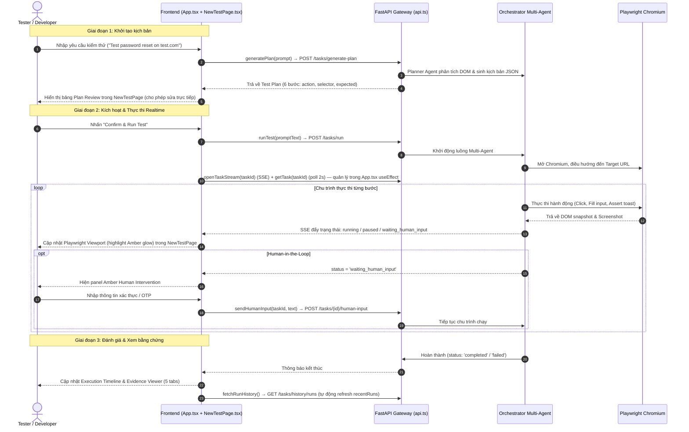
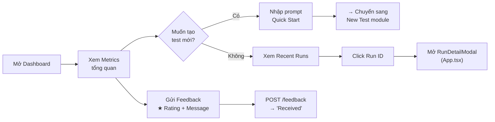
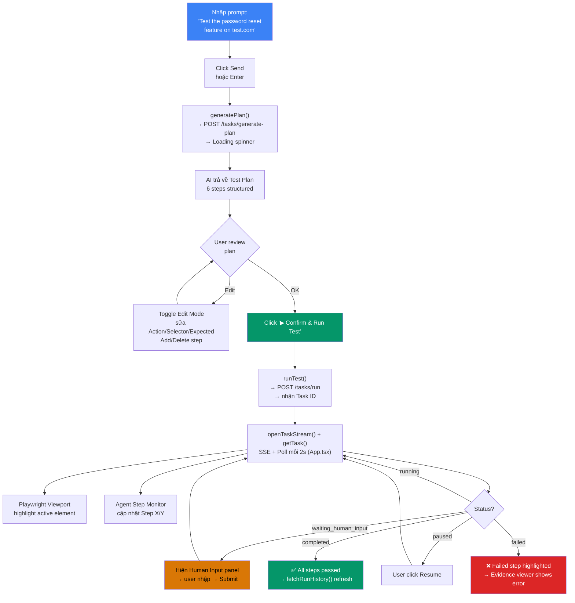
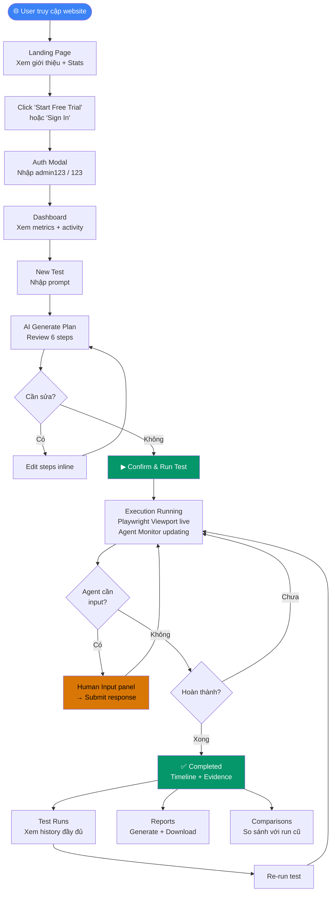

# 🎯 Mục tiêu, Luồng Hệ thống & Kết quả Đầu ra — AI Agent Tester Frontend

> **Dự án**: AI Agent Tester — Autonomous AI Testing Platform
> **Version**: v2.0.0
> **Tech Stack**: React 18 · TypeScript · Vite · Tailwind CSS · Framer Motion
> **Backend**: FastAPI · Python · SSE Realtime
> **Ngày lập**: 26/09/2026 · **Cập nhật cấu trúc frontend**: 27/09/2026
>
> Tài liệu này hợp nhất `IMPLEMENTATION_PLAN.md` (mục tiêu & tiêu chí nghiệm thu từng module) và `LUONG_TONG_QUAT.md` (sơ đồ kiến trúc & luồng vận hành) thành một nguồn tham chiếu duy nhất.

---

## I. Tổng quan Kiến trúc Hệ thống

```mermaid
flowchart TB
    subgraph PUBLIC["🌐 1. PUBLIC ZONE (Chưa đăng nhập)"]
        direction LR
        LP["Landing Page<br/>Hero + Video + Stats + Partner logos"]
        AUTH["Auth Modal (Trượt 2 ô)<br/>Login: admin123 / 123 · Quick-fill demo"]
        LP -->|Click CTA / Sign In| AUTH
    end

    subgraph DASHBOARD["🔒 2. DASHBOARD WORKSPACE (Đã xác thực)"]
        direction TB
        NAV["Top Navigation Bar<br/>Dashboard | New Test | Test Runs | Test Cases | Comparisons | Reports | Environments | Settings<br/>☀️/🌙 Theme Toggle · User Menu"]

        subgraph CORE_MODULES["⚡ KHỐI TÁC VỤ CỐT LÕI"]
            direction LR
            M_DASH["Dashboard<br/>Metrics + Quick Start + Agent Activity"]
            M_NEW["New Test ⭐<br/>Chat → Plan → Run → Viewport → Evidence"]
            M_RUNS["Test Runs<br/>History + Filters + Detail Modal"]
        end

        subgraph SUPPORT_MODULES["📊 KHỐI HỖ TRỢ & ĐÁNH GIÁ"]
            direction LR
            M_CASES["Test Cases<br/>Kho kịch bản mẫu (chưa build)"]
            M_COMPARE["Comparisons<br/>Run A vs Run B"]
            M_REPORTS["Reports<br/>Markdown/PDF export"]
        end

        subgraph CONFIG_MODULES["⚙️ KHỐI CẤU HÌNH"]
            direction LR
            M_ENV["Environments<br/>Target URLs + Browser + LLM"]
            M_SET["Settings<br/>Profile + API Keys"]
        end
    end

    subgraph BACKEND_ENGINE["🤖 3. MULTI-AGENT BACKEND & PLAYWRIGHT ENGINE (FastAPI)"]
        direction TB
        ORCH["Orchestrator Manager"]
        AG_PLAN["1. Planner Agent<br/>Phân tích prompt, sinh sub-goals"]
        AG_EXEC["2. Browser Executor<br/>Playwright thao tác UI DOM"]
        AG_SIM["3. User Simulator<br/>Điền form & đóng vai người dùng"]
        AG_EVAL["4. Evaluator Agent<br/>Tổng hợp log & sinh báo cáo"]

        ORCH --> AG_PLAN
        ORCH --> AG_EXEC
        ORCH --> AG_SIM
        ORCH --> AG_EVAL
    end

    AUTH -->|Đăng nhập thành công| NAV
    NAV --> CORE_MODULES
    NAV --> SUPPORT_MODULES
    NAV --> CONFIG_MODULES

    M_NEW <-->|POST /tasks/generate-plan| AG_PLAN
    M_NEW <-->|POST /tasks/run + SSE stream| ORCH
    M_NEW <-->|POST /tasks/{id}/human-input| AG_SIM
    M_RUNS <-->|GET /tasks/history/runs| BACKEND_ENGINE
    M_DASH <-->|POST /feedback| BACKEND_ENGINE

    style PUBLIC fill:#1e293b,color:#fff
    style CORE_MODULES fill:#065f46,color:#fff
    style SUPPORT_MODULES fill:#92400e,color:#fff
    style CONFIG_MODULES fill:#3730a3,color:#fff
    style BACKEND_ENGINE fill:#111827,color:#34d399
```

### Cấu trúc thư mục frontend hiện tại (đã tách khỏi `main.tsx`)

`main.tsx` gốc (2.340 dòng, `@ts-nocheck`) đã được tách thành các file theo đúng quy ước **"1 module = 1 file"** trong skill `ai-agent-tester-frontend`:

```text
frontend/src/
├── main.tsx                 # 16 dòng — chỉ import App + ReactDOM.render (đã bỏ @ts-nocheck)
├── App.tsx                  # Theme/Auth state, DashboardWorkspace (nav + state dùng chung + SSE/polling)
├── api.ts                   # API_BASE + toàn bộ hàm fetch (generatePlan, runTest, getTask, openTaskStream,
│                             #  cancelTask, pauseTask, resumeTask, sendHumanInput, submitFeedback, fetchRunHistory)
├── api/
│   └── contract.ts          # TypeScript types: TaskStatus, TestStep, TestPlan, TaskStatusResponse, RunHistoryItem
├── mockData.ts               # InitialTestPlanData, InitialRecentRuns, FallbackPlanSteps, InitialChatHistory,
│                             #  InitialEnvironments, InitialReports
├── components/
│   ├── Icons.tsx             # Toàn bộ icon SVG (named exports)
│   ├── AuthModal.tsx         # Modal đăng nhập/đăng ký trượt 2 ô
│   └── FadingVideo.tsx       # Video nền crossfade — dùng chung bởi LandingPage & AuthModal
└── pages/
    ├── LandingPage.tsx       # LandingNavbar + LandingHero (Public)
    ├── DashboardPage.tsx     # Metrics + Quick Start + Recent Runs + Agent Activity + Feedback
    ├── NewTestPage.tsx       # Chat → Plan → Run → Viewport → Agent Monitor → Timeline → Evidence
    ├── TestRunsPage.tsx      # Bảng lịch sử run + filters + phân trang + RunDetailModal (export riêng)
    └── ExtraModules.tsx      # Environments + Settings + Reports + Comparisons (tạm gộp, chưa có backend riêng)
```

> **Lưu ý trạng thái refactor**: `main.tsx` và `api/contract.ts` đã bỏ `@ts-nocheck`; 11 file còn lại (`App.tsx`, `api.ts`, `mockData.ts`, toàn bộ `components/` và `pages/`) vẫn còn `@ts-nocheck` — cần dọn tiếp để đạt tiêu chí "TypeScript strict mode" ở mục VII/VIII. Hiện chưa áp dụng `React.lazy`/code-splitting theo module — toàn bộ vẫn build ra **1 chunk JS duy nhất** (~370 KB / ~106 KB gzip).

---

## II. Luồng Hành trình Người dùng E2E (Sequence Diagram)



---

## III. Ma trận Trạng thái Tất cả Module

| # | Module | ID điều hướng | Backend | Data Source | File frontend | UI Done | Chức năng hoàn thiện |
|:-:|--------|:---:|:-------:|:-----------:|:--|:-------:|:-------------------:|
| 0 | **Landing Page** | N/A (Public) | ❌ | Local Frontend | `pages/LandingPage.tsx` | ✅ 100% | ✅ Hero, Video, Stats, CTA |
| 1 | **Auth Modal** | N/A (Modal) | ❌ | Hardcode `admin123/123` | `components/AuthModal.tsx` | ✅ 100% | ⚠️ Chỉ login local, chưa register |
| 2 | **Dashboard** | `dashboard` | 🟢 Partial | API + Hardcode metrics | `pages/DashboardPage.tsx` | ✅ 100% | ⚠️ Metrics số cứng, chart placeholder |
| 3 | **New Test** ⭐ | `new-test` | 🟢 Full | API realtime + SSE | `pages/NewTestPage.tsx` | ✅ 100% | ✅ Flow đầy đủ E2E |
| 4 | **Test Runs** | `test-runs` | 🟢 Full | API `/history/runs` | `pages/TestRunsPage.tsx` | ✅ 100% | ⚠️ Re-run không truyền đúng prompt |
| 5 | **Test Cases** | `test-cases` | ❌ | — | *(chưa có file riêng)* | ❌ 0% | 🏗️ "Coming Soon" |
| 6 | **Comparisons** | `comparisons` | ❌ | Hardcode mock | `pages/ExtraModules.tsx` | ✅ 90% | ⚠️ Dữ liệu giả, placeholder charts |
| 7 | **Reports** | `reports` | ❌ | Hardcode mock | `pages/ExtraModules.tsx` | ✅ 90% | ⚠️ Không download thật, preview placeholder |
| 8 | **Environments** | `environments` | ❌ | Local state | `pages/ExtraModules.tsx` | ✅ 100% | ⚠️ Save chỉ local, Test Connection giả |
| 9 | **Settings** | `settings` | ❌ | Local state | `pages/ExtraModules.tsx` | ✅ 80% | ⚠️ 4/6 tabs chưa implement |

> Theo quy tắc skill `ai-agent-tester-frontend`: **ExtraModules.tsx là tạm thời** — khi Environments/Reports/Comparisons/Settings có API backend riêng thì tách ra `pages/EnvironmentsPage.tsx`, `pages/ReportsPage.tsx`, v.v.

---

## IV. Chi tiết Mục tiêu & Kết quả Đầu ra Từng Module

---

### MODULE 0 · Landing Page — Trang giới thiệu

**File**: `pages/LandingPage.tsx` (dùng `components/FadingVideo.tsx`, `components/Icons.tsx`)

#### 🎯 Mục tiêu
Tạo ấn tượng chuyên nghiệp đầu tiên — showcase năng lực AI Testing Platform với hiệu ứng cao cấp.

#### 📦 Kết quả đầu ra

| Deliverable | Mô tả chi tiết |
|-------------|-----------------|
| **Hero Section** | Tiêu đề "Autonomous Testing Powered by AI" với hiệu ứng `BlurText` word-by-word animation |
| **Background Video** | Video CDN crossfade loop (`FadingVideo` — nay tách riêng trong `components/FadingVideo.tsx`, dùng chung với AuthModal) |
| **Stats Cards** | 2 card glass: **99.8% Test Coverage** + **10x Release Velocity** |
| **CTA Buttons** | "Start Free Trial" + "Watch AI Demo" → mở Auth Modal |
| **Partner Logos** | GitHub, GitLab, Playwright, Cypress, Jira, Jenkins |
| **Theme Support** | Dark mode (default) + Light mode — chuyển đổi mượt mà |

#### ✅ Tiêu chí nghiệm thu
- [ ] Video background load < 3s, tự loop không giật
- [ ] BlurText animation trigger khi scroll vào viewport
- [ ] Responsive: mobile (< 768px), tablet, desktop
- [ ] CTA click → Auth Modal mở đúng mode "signin"
- [ ] Light/Dark theme chuyển đổi không flash trắng

---

### MODULE 1 · Auth Modal — Đăng nhập / Đăng ký

**File**: `components/AuthModal.tsx` (dùng `components/FadingVideo.tsx`, `components/Icons.tsx`)

#### 🎯 Mục tiêu
Xác thực người dùng với trải nghiệm mượt mà — sliding card animation physics-based.

#### 📦 Kết quả đầu ra

| Deliverable | Mô tả chi tiết |
|-------------|-----------------|
| **Sliding Auth Card** | Modal 2 nửa — khi chuyển Login ↔ Register, thẻ trượt mượt với Framer Motion spring (`stiffness: 220, damping: 26`) |
| **Login Form** | Fields: Username, Password + nút "Fill Demo: admin123 / 123" |
| **Register Form** | Fields: Full Name, Email, Password, Confirm Password |
| **Validation** | Hardcode: `admin123` / `123` → login thành công → redirect Dashboard |
| **Demo Quick-fill** | Nút 1-click điền tài khoản demo |

#### ✅ Tiêu chí nghiệm thu
- [ ] Animation trượt không lag (spring physics smooth 60fps)
- [ ] Login `admin123/123` → vào Dashboard < 500ms
- [ ] Login sai → hiển thị lỗi "Invalid username or password"
- [ ] Modal đóng khi click overlay hoặc nút Close
- [ ] Register form validate: password match, email format
- [ ] Nút "Fill Demo" tự điền đúng credentials

---

### MODULE 2 · Dashboard — Trang tổng quan

**File**: `pages/DashboardPage.tsx` (state execution/feedback quản lý ở `App.tsx`, truyền qua props)

#### 🎯 Mục tiêu
Cung cấp cái nhìn tổng quan tức thì về trạng thái hệ thống test — metrics, activity, quick actions.

#### 📦 Kết quả đầu ra

| Deliverable | Mô tả chi tiết |
|-------------|-----------------|
| **Metrics Overview** | 5 glass cards: Total Runs · Passed (%) · Failed (%) · In Progress (live) · Avg Duration |
| **Quick Start** | Input prompt + nút "New Test" → chuyển sang module New Test |
| **Recent Runs Table** | Bảng 4 runs gần nhất: Run ID (link) · Name · Status badge · Duration · Started |
| **Agent Activity Panel** | 4 agents: Planner · Browser Executor · User Simulator · Evaluator — trạng thái Active/Idle realtime |
| **Pass Rate Chart** | Placeholder "7 days trend" (cần implement chart thật) |
| **Feedback Form** | Rating ★1-5 + Category select + Message textarea → `submitFeedback()` (`api.ts`) → `POST /feedback` |

#### 🔄 Luồng tương tác (User Flow)



#### ✅ Tiêu chí nghiệm thu
- [ ] Metrics **tính tự động** từ `recentRuns` data (không hardcode)
- [ ] "In Progress" count = số runs có `status === 'running'` (realtime)
- [ ] Agent badges chuyển Active/Idle đúng theo `executionStatus`
- [ ] Feedback gửi thành công → hiện "Thanks! Feedback received"
- [ ] Feedback validation: phải chọn rating + nhập message (max 500 ký tự)
- [ ] Click prompt input → auto-focus và chuyển sang New Test

---

### MODULE 3 · New Test — Tạo & Chạy Test ⭐ (Module quan trọng nhất)

**File**: `pages/NewTestPage.tsx` — state chạy test (`executionStatus`, `testPlan`, `activeTaskId`, SSE/polling) sống ở `App.tsx` để không bị huỷ khi chuyển module; `NewTestPage` chỉ giữ state cục bộ (`isEditingPlan`, `isChatHistoryOpen`, `chatHistorySearch`).

#### 🎯 Mục tiêu
Luồng chính của sản phẩm — từ prompt ngôn ngữ tự nhiên → AI sinh kịch bản → review/edit → chạy test realtime → xem bằng chứng.

#### 📦 Kết quả đầu ra

| # | Deliverable | Mô tả chi tiết |
|:-:|-------------|-----------------|
| 1 | **Session History Sidebar** | Slide-in panel từ trái, search theo name/prompt, nhóm Today/Yesterday/Older (`mockData.InitialChatHistory`), click → load prompt |
| 2 | **AI Conversation Panel** | Chat bubbles: User message (phải) → Planner Agent response (trái) + Plan summary card |
| 3 | **Prompt Input** | Input + Send button + quick actions: "Add Step", "Run Again", "Save as Test Case" |
| 4 | **Plan Review Panel** | Bảng structured: # · Action · Selector · Expected · Source — với inline editing |
| 5 | **Plan Edit Mode** | Toggle "Edit Directly" → input fields inline cho mỗi step, nút Delete + Add Step |
| 6 | **Playwright Viewport** | Canvas 1920×1080 mô phỏng browser thật — hiệu ứng highlight DOM element đang active (amber glow) |
| 7 | **Execution Controls** | Nút: ▶ Confirm & Run · ⏸ Pause/Resume · ⏹ Stop — gọi `pauseTask`/`resumeTask`/`cancelTask` (`api.ts`) |
| 8 | **Agent Step Monitor** | 4 agent badges (Planner/Browser/Simulator/Evaluator) + Current Step card + Observation card + Next Step |
| 9 | **Human-in-the-Loop** | Panel amber khi `waiting_human_input`: input text + Submit → `sendHumanInput()` → `POST /tasks/{id}/human-input` |
| 10 | **Execution Timeline** | Timeline vertical: mỗi step = card with ✓ Passed / ⚡ Running / Pending — click để xem evidence |
| 11 | **Evidence Viewer** | 5 tabs: API Validation (JSON response) · Screenshot · Agent Log · Console · Visual Diff |
| 12 | **SSE Realtime Stream** | `openTaskStream()` (EventSource) + `getTask()` polling 2s, quản lý trong `App.tsx` → cập nhật status: running → completed/failed |

#### 🔄 Luồng tương tác chính (Core User Flow)



#### ✅ Tiêu chí nghiệm thu
- [ ] Prompt → Generate Plan: response trong < 5s (có loading spinner)
- [ ] Plan Review: hiện đủ `objective`, `target_url`, `preconditions`, `test_data`, `steps[]`
- [ ] Edit Mode: sửa action/selector/expected → state cập nhật real-time
- [ ] Add Step: thêm row mới cuối bảng, ID auto-increment
- [ ] Delete Step: xóa row, các step còn lại reindex
- [ ] Confirm & Run: gửi `POST /tasks/run` với payload đúng format API contract
- [ ] SSE stream + polling: status chuyển đúng (running → paused → waiting_human_input → completed)
- [ ] Playwright Viewport: highlight DOM element theo `currentStepIdx` (amber glow shadow)
- [ ] Human Input: hiện panel khi `waiting_human_input`, submit → status chuyển `running`
- [ ] Pause/Resume/Stop: gọi đúng API endpoint, UI update tức thì
- [ ] Timer: đếm giây chính xác khi `running`
- [ ] Evidence Viewer: 5 tabs hiển thị đúng dữ liệu cho step đang chọn
- [ ] Fallback offline: khi backend offline → simulation chạy local (step-by-step 2.5s interval, `mockData.FallbackPlanSteps`)

---

### MODULE 4 · Test Runs — Lịch sử chạy test

**File**: `pages/TestRunsPage.tsx` — export cả `TestRunsPage` và `RunDetailModal` (modal này được `App.tsx` mount ở top-level vì Dashboard cũng cần mở nó).

#### 🎯 Mục tiêu
Quản lý toàn bộ lịch sử test runs — tìm kiếm, lọc, phân trang, xem chi tiết, chạy lại.

#### 📦 Kết quả đầu ra

| Deliverable | Mô tả chi tiết |
|-------------|-----------------|
| **Data Table** | Full-width table: Checkbox · Run ID · Name · Suite · Env · Browser · Status · Duration · Steps P/F · Started · Actions |
| **Search** | Tìm theo Run ID hoặc Name (case-insensitive) |
| **5 Filters** | Status (All/completed/failed/running) · Suite · Environment · Browser · Date Range (All/24h/7d/30d) |
| **Pagination** | 8 runs/page · Prev/Next · "Showing 1-8 / 24" counter |
| **Multi-select** | Checkbox header (select all visible) + checkbox mỗi row |
| **Row Actions** | "View" → mở `RunDetailModal` · "Re-run" → chạy lại test |
| **Run Detail Modal** | Full-screen modal: Run info + Step Timeline + Evidence Viewer (5 tabs) |

#### ✅ Tiêu chí nghiệm thu
- [ ] Data load từ `fetchRunHistory()` → `GET /tasks/history/runs` (gọi ở `App.tsx` on mount)
- [ ] Search filter real-time (debounce hoặc instant)
- [ ] 5 bộ lọc hoạt động kết hợp (AND logic)
- [ ] Pagination reset về page 1 khi thay đổi filter
- [ ] "View" mở modal với thông tin đúng của run đó
- [ ] "Re-run" phải truyền prompt gốc của run đó (hiện đang bug — vẫn gọi `handleConfirmAndRun()` với `promptText` hiện tại, không phải prompt gốc của run được chọn)
- [ ] Empty state: "No test runs match the selected filters."
- [ ] Status badges: `completed` = xanh, `running` = vàng, `failed` = đỏ

---

### MODULE 5 · Test Cases — Kho test case (Chưa implement) 🏗️

**File**: chưa có — hiện rơi vào nhánh "Coming Soon" mặc định trong `App.tsx` (`!['dashboard','new-test','test-runs','environments','settings','reports','comparisons'].includes(activeModule)`).

#### 🎯 Mục tiêu
Lưu trữ và tái sử dụng các test case đã tạo — template library cho team.

#### 📦 Kết quả đầu ra kỳ vọng

| Deliverable | Mô tả chi tiết |
|-------------|-----------------|
| **Test Case List** | Bảng: ID · Name · Steps count · Created · Last Run · Status · Tags |
| **Save from New Test** | Nút "Save as Test Case" ở New Test → tạo test case từ plan hiện tại |
| **Test Case Detail** | View full plan: objective, steps, preconditions, test data |
| **Quick Run** | Nút "Run" → chuyển sang New Test với plan pre-loaded |
| **CRUD** | Create (from plan) · Read (list + detail) · Update (edit steps) · Delete |
| **Tags/Categories** | Gắn tag: Authentication, E-Commerce, API, UI... |

#### ✅ Tiêu chí nghiệm thu
- [ ] Cần backend endpoint: `GET/POST/PUT/DELETE /test-cases`
- [ ] Tạo `pages/TestCasesPage.tsx` mới (theo quy tắc 1 module = 1 file) khi bắt đầu implement
- [ ] "Save as Test Case" từ New Test → case xuất hiện trong danh sách
- [ ] Click "Run" → chuyển sang New Test với plan đúng
- [ ] Search + filter theo tag, name
- [ ] Empty state khi chưa có test case

---

### MODULE 6 · Comparisons — So sánh 2 lần chạy

**File**: `pages/ExtraModules.tsx` → `ComparisonsPage` (tách ra `pages/ComparisonsPage.tsx` khi có backend riêng).

#### 🎯 Mục tiêu
So sánh chi tiết 2 test runs — phát hiện regression, visual diff, API response diff.

#### 📦 Kết quả đầu ra

| Deliverable | Mô tả chi tiết |
|-------------|-----------------|
| **Run Selector** | 2 dropdown: "Run A (Baseline)" + "Run B (Candidate)" → chọn từ `recentRuns` |
| **Comparison Metrics** | 4 metric cards: Result (Pass→Pass) · Time Difference · Changed Steps · Visual Difference |
| **Step Diff Table** | Bảng: # · Action · Run A result · Run B result · Status (No change / ⚠ Difference) |
| **Visual Diff Panel** | Overlay 2 screenshots — highlight vùng khác biệt |
| **API Response Diff** | JSON diff — highlight changed fields (red/green) |

#### ✅ Tiêu chí nghiệm thu
- [ ] Chọn 2 runs khác nhau → click "Compare" → hiện kết quả
- [ ] Metrics tính đúng từ data thực (không hardcode)
- [ ] Step diff highlight chính xác các step khác biệt
- [ ] Visual Diff: cần screenshot data từ backend
- [ ] API Diff: cần response data từ backend
- [ ] Không cho compare cùng 1 run (validation)

---

### MODULE 7 · Reports — Xuất báo cáo

**File**: `pages/ExtraModules.tsx` → `ReportsPage` (tách ra `pages/ReportsPage.tsx` khi có backend riêng).

#### 🎯 Mục tiêu
Tạo, xem, và xuất báo cáo test — hỗ trợ Markdown và PDF.

#### 📦 Kết quả đầu ra

| Deliverable | Mô tả chi tiết |
|-------------|-----------------|
| **Reports Table** | Report ID · Linked Run · Format (Markdown/PDF) · Created · Actions |
| **Filters** | Search + Format filter + Suite filter + Date range |
| **Generate Report** | Nút "+ Generate Report" → tạo report từ run gần nhất (`mockData.InitialReports`) |
| **Report Detail** | Panel: Result (Passed/Failed) · Duration · Failed Step · Download PDF · Share link |
| **Report Preview** | Markdown renderer hiển thị nội dung report (summary + evidence) |
| **Download** | Tải file Markdown (.md) hoặc PDF (.pdf) |
| **Share** | Copy link → clipboard |

#### ✅ Tiêu chí nghiệm thu
- [ ] Generate report tạo entry mới trong bảng
- [ ] Report preview hiển thị Markdown formatted (không phải placeholder)
- [ ] Download tải file thật (cần backend endpoint)
- [ ] Share copy link vào clipboard + toast notification
- [ ] Filter hoạt động kết hợp (search + format + suite + date)

---

### MODULE 8 · Environments — Cấu hình môi trường

**File**: `pages/ExtraModules.tsx` → `EnvironmentsPage` (tách ra `pages/EnvironmentsPage.tsx` khi có backend riêng).

#### 🎯 Mục tiêu
Quản lý các môi trường test target — URL, browser, LLM provider.

#### 📦 Kết quả đầu ra

| Deliverable | Mô tả chi tiết |
|-------------|-----------------|
| **Environments Table** | Name · Base URL · Browser · LLM Provider · Status badge · Edit button |
| **Add/Edit Form** | Fields: Name · Base URL · Browser (Chromium/Firefox/WebKit/Headless) · Headless (On/Off) · LLM Provider (7 options) |
| **Test Connection** | Nút "Test Connection" → ping URL → hiện Connected/Error |
| **Save** | Lưu environment (hiện tại local state, `mockData.InitialEnvironments`) |
| **Delete** | Xóa environment khỏi danh sách (chưa có nút) |

#### ✅ Tiêu chí nghiệm thu
- [ ] Add environment mới → xuất hiện trong bảng
- [ ] Edit click → form pre-fill đúng data
- [ ] Test Connection thực sự ping URL (cần backend)
- [ ] Status badge: Connected = xanh, Error = đỏ
- [ ] Delete environment (cần thêm nút + confirm dialog)
- [ ] Persist data (cần backend API, hiện mất khi refresh)

---

### MODULE 9 · Settings — Cài đặt hệ thống

**File**: `pages/ExtraModules.tsx` → `SettingsPage` (tách ra `pages/SettingsPage.tsx` khi có backend riêng).

#### 🎯 Mục tiêu
Cấu hình cá nhân, API keys, team, và tùy chỉnh hệ thống.

#### 📦 Kết quả đầu ra

| Tab | Deliverable | Trạng thái |
|-----|-------------|:----------:|
| **Profile** | Form: Username · Email · New Password · Confirm Password · "Save Changes" | ✅ UI done, ❌ chưa persist |
| **API Keys & LLM** | 4 keys: GOOGLE_API_KEY · OPENAI · ANTHROPIC · HUB1 — Configured/Not configured badges | ✅ UI done, ❌ hardcode |
| **Team & Members** | Quản lý thành viên team, phân quyền | ❌ Placeholder |
| **Notifications** | Cấu hình email/push notifications | ❌ Placeholder |
| **Appearance** | Theme, font size, language preferences | ❌ Placeholder |
| **Integrations** | Kết nối GitHub, GitLab, Jira, Jenkins, Slack | ❌ Placeholder |

#### ✅ Tiêu chí nghiệm thu
- [ ] Profile Save → persist thật (cần backend API)
- [ ] API Keys hiển thị đúng trạng thái từ backend
- [ ] Thêm form nhập/cập nhật API key (masked input)
- [ ] 4 tabs còn lại cần UI hoàn chỉnh (không chỉ placeholder)

---

## V. Luồng Người dùng E2E Chính (High-level Flowchart)



---

## VI. KPI Hiệu năng Kỹ thuật

| Metric | Target | Hiện tại (27/09/2026) |
|--------|:------:|:--------:|
| **First Contentful Paint (FCP)** | < 1.5s | ~2s (video nặng) |
| **Largest Contentful Paint (LCP)** | < 2.5s | ~4s |
| **Time to Interactive (TTI)** | < 3s | ~3.5s |
| **Bundle Size (JS)** | < 200KB gzip | ~106 KB gzip / 370 KB raw — **1 chunk duy nhất**, chưa code-split |
| **Component Re-render** | Chỉ module active | ❌ Toàn bộ app (chưa `React.memo`/lazy) |
| **TypeScript Coverage** | 100% | ⚠️ 2/13 file đã bỏ `@ts-nocheck` (`main.tsx`, `api/contract.ts`) |
| **Code Splitting** | Lazy load per module | ❌ Chưa dùng `React.lazy` — mọi `pages/*` vẫn import tĩnh trong `App.tsx` |
| **1 module = 1 file** | Theo skill quy ước | ✅ Đã tách xong (`main.tsx` từ 2.340 dòng → 16 dòng); `ExtraModules.tsx` còn gộp 4 module tạm thời |
| **Lighthouse Score** | > 90 | Chưa đo |
| **API Response (Generate Plan)** | < 5s | Phụ thuộc LLM (tối ưu bằng Gemini Flash / GPT-4o-mini) |
| **SSE Latency** | < 500ms | ~2s (polling) — SSE hiện chỉ xử lý `completed`/`failed`, chưa đẩy step progress chi tiết |
| **Tỷ lệ kiểm thử tự động thành công** | > 99.0% | Cần cơ chế self-healing selector (chưa có) |

---

## VII. Checklist Nghiệm thu Tổng thể

### 🟢 Functional Requirements
- [ ] Landing Page render đúng trên mọi viewport (320px → 1920px+)
- [ ] Login `admin123/123` → Dashboard < 1s
- [ ] Prompt → Generate Plan → AI response trong < 5s
- [ ] Run Test → SSE realtime status update
- [ ] Playwright Viewport highlight đúng element đang active
- [ ] Human-in-the-Loop: input → resume execution đúng
- [ ] Pause/Resume/Stop hoạt động đúng qua API
- [ ] Test Runs load data từ backend, filter + search + pagination hoạt động
- [ ] Feedback submit → `POST /feedback` → confirmation
- [ ] Dark/Light theme chuyển đổi mượt trên TẤT CẢ module

### 🔵 Non-Functional Requirements
- [ ] Không có `@ts-nocheck` — TypeScript strict mode (2/13 file xong, còn 11 file)
- [x] Mỗi module là 1 file riêng (không 2.340 dòng trong 1 file) — `main.tsx` đã tách xong theo cấu trúc mục I
- [ ] `ExtraModules.tsx` tách thành `EnvironmentsPage.tsx` / `SettingsPage.tsx` / `ReportsPage.tsx` / `ComparisonsPage.tsx` khi có backend riêng
- [ ] Code splitting: lazy load module khi navigate (`React.lazy` + `Suspense`)
- [ ] Error boundaries: crash 1 module không crash cả app
- [ ] Loading states: skeleton UI cho mọi API call
- [ ] Empty states: message rõ ràng khi không có data
- [ ] Toast notifications: thành công (xanh), lỗi (đỏ), warning (vàng)
- [ ] Keyboard navigation: Tab order hợp lý, Enter submit
- [ ] `aria-label` và `role` cho accessibility
- [ ] Console không có warning/error
